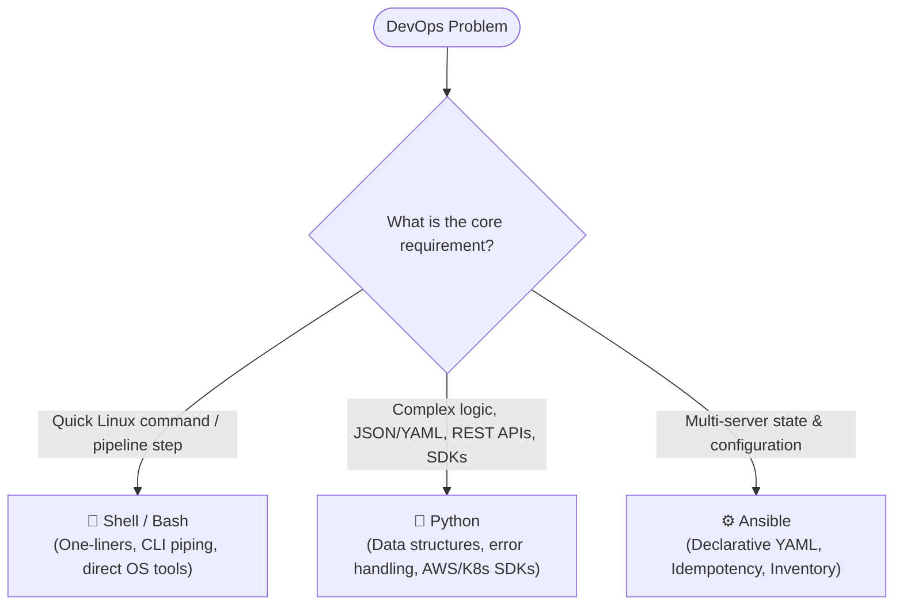

# Lesson 00 — Shell vs Python vs Ansible: The Automation Landscape

## 🎯 What will I learn?
In this lesson, you will learn the core differences between **Shell (Bash)**, **Python**, and **Ansible**. You will understand why each tool exists, what it does best, where it struggles, and how to choose the right tool for any DevOps problem.

---

## 🤔 Why does a DevOps engineer need this?
A junior engineer tries to do everything in Bash until the script becomes an unreadable 500-line spaghetti monster. Another tries to write custom Python scripts to install Nginx across 200 servers, reinventing SSH connection pools and idempotency.

A **Senior DevOps Engineer** instantly knows:

- *"This is a 2-line pipeline step -> Use Shell."*
- *"This requires parsing a nested JSON API and retrying with backoff -> Use Python."*
- *"This is multi-node configuration and baseline security hardening -> Use Ansible."*

---

## 🧠 Mental model



---

## 📖 Concept: Understanding the Trio

### 1. Shell (Bash)
- **What is it?** A command language and interpreter that interacts directly with the Linux kernel and installed CLI utilities (`grep`, `awk`, `sed`, `curl`, `systemctl`).
- **Core strength:** Zero setup; executes host tools directly.
- **Weakness:** Error handling is crude; data structures (nested maps, lists) are painful; REST APIs and JSON manipulation are brittle.

### 2. Python
- **What is it?** A full-featured, readable, high-level programming language with extensive standard libraries and third-party SDKs (`requests`, `boto3`, `kubernetes`).
- **Core strength:** Rich data structures, native JSON/YAML handling, structured exception handling (`try/except`), testability (`pytest`).
- **Weakness:** Requires the Python runtime and dependencies; not declarative for server state management.

### 3. Ansible
- **What is it?** A declarative configuration management and orchestration tool that operates over SSH without remote agents.
- **Core strength:** **Idempotency** (running a playbook 10 times produces the same desired state without re-doing completed actions).
- **Weakness:** Poor fit for algorithmic logic, complex API data transformations, or real-time event streaming.

---

## 💻 Simple example: Checking Server Hostname

### Shell
```bash
hostname
```

### Python
```python
import platform
print(platform.node())
```

### Ansible
```yaml
- name: Get hostname
  ansible.builtin.debug:
    var: ansible_hostname
```

---

## 🔧 Real DevOps example: Health Check with REST API Alert

Let's look at a realistic task: Check if free memory is below 15%, and if so, send a JSON alert payload to an endpoint.

### 🐍 Python Approach (`example.py`)

```python
"""
DevOps Script: Memory Health Check & Webhook Alert
Demonstrates why Python excels at structured logic, data checking, and HTTP APIs.
"""
import sys
import platform

def check_memory_threshold(mock_free_percent=12.5, threshold=15.0):
    server = platform.node() or "localhost"
    print(f"[*] Auditing memory on server: {server}")
    print(f"[*] Free Memory: {mock_free_percent}% (Threshold: {threshold}%)")
    
    if mock_free_percent < threshold:
        alert_payload = {
            "server": server,
            "metric": "memory",
            "free_percent": mock_free_percent,
            "status": "CRITICAL",
            "action_required": "Investigate high memory usage immediately"
        }
        print(f"[!] ALERT TRIGGERED: {alert_payload}")
        return False
    
    print("[+] System memory is healthy.")
    return True

if __name__ == "__main__":
    is_healthy = check_memory_threshold()
    if not is_healthy:
        sys.exit(1)
    sys.exit(0)
```

---

## 🖥️ Expected output

```text
$ python example.py
[*] Auditing memory on server: prod-app-01
[*] Free Memory: 12.5% (Threshold: 15.0%)
[!] ALERT TRIGGERED: {'server': 'prod-app-01', 'metric': 'memory', 'free_percent': 12.5, 'status': 'CRITICAL', 'action_required': 'Investigate high memory usage immediately'}
```

---

## 🔍 Line-by-line explanation
- `import sys, platform`: Loads Python's built-in system interface modules.
- `def check_memory_threshold(...)`: Defines a reusable function with default parameters.
- `alert_payload = { ... }`: Creates a native Python dictionary that effortlessly serializes to JSON.
- `sys.exit(1)`: Sets standard Linux exit code `1` (indicating failure/alert) so CI/CD pipelines or monitoring agents can detect it.

---

## 🐚 Shell equivalent

```bash
#!/usr/bin/env bash
FREE_MEM=$(free | grep Mem | awk '{print ($4/$2)*100}')
THRESHOLD=15.0

# Floating point comparison in Bash requires external tools like bc or awk
IS_LOW=$(awk -v free="$FREE_MEM" -v thresh="$THRESHOLD" 'BEGIN {print (free < thresh)}')

if [ "$IS_LOW" -eq 1 ]; then
    echo "ALERT: Free memory is ${FREE_MEM}%"
    curl -X POST -H "Content-Type: application/json" \
         -d "{\"server\":\"$(hostname)\",\"status\":\"CRITICAL\",\"free_mem\":$FREE_MEM}" \
         https://alerts.internal.net/webhook
    exit 1
fi
```
*Why this gets risky in Shell:* Escaping JSON strings in Bash (`\"server\":\"$(hostname)\"`) is prone to quotation bugs and command injection if variables contain special characters.

---

## ⚙️ Ansible equivalent

```yaml
- name: Check free memory on managed hosts
  hosts: all
  tasks:

    - name: Fail if memory is critically low
      ansible.builtin.fail:
        msg: "Server {{ inventory_hostname }} memory free is below 15%!"
      when: (ansible_memfree_mb / ansible_memtotal_mb) * 100 < 15
```
*When Ansible shines here:* Checking this simultaneously across 500 servers defined in an inventory file.

---

## 🏆 Which one should I use?

| Scenario | Shell | Python | Ansible | Best Choice |
| :--- | :--- | :--- | :--- | :--- |
| Simple 1-liner to tail or grep logs | ✅ Native | ❌ Too slow to write | ❌ Overkill | **Shell** |
| Parse complex JSON from AWS/K8s and trigger conditional actions | ❌ Brittle | ✅ Native & robust | ❌ Awkward | **Python** |
| Install Docker, copy configs, and start service on 50 nodes | ❌ No idempotency | ⚠️ High effort | ✅ Declarative | **Ansible** |
| Custom CLI tool for engineering team | ❌ Hard to test | ✅ Full featured | ❌ Not a CLI framework | **Python** |
| CI/CD build script (`docker build && docker push`) | ✅ Direct | ⚠️ Verbose | ❌ Unnecessary | **Shell** |

---

## ⚠️ Common mistakes
1. **Writing 500-line Bash scripts with complex loops:** Bash scripts become unmaintainable when handling multi-branch logical workflows.
2. **Reinventing Ansible in Python:** Don't write Python scripts with `paramiko` to SSH into 50 servers and run `apt-get install`. Use Ansible.
3. **Ignoring Exit Codes:** In DevOps, scripts must return `0` on success and non-zero (`1-255`) on error so orchestrators know the outcome.

---

## 🧪 Practice (Exercise)

Open `exercise.py`. Your task is to write a Python script that evaluates the status of 3 microservice URLs (simulated as a dictionary) and prints an alert summary.

---

## 💡 Hint
Iterate through the dictionary using a `for` loop, check if `status != 200`, and collect failed services into a list.

---

## ✅ Solution

Check `solution.py` after you have attempted `exercise.py`.

---

## 🎯 Interview questions

### Q1: "Why would you choose Python over Bash for infrastructure scripts?"
> **Interviewer Focus:** Testing your real-world architectural judgment and understanding of script maintainability.

### Q2: "What is idempotency and how does it affect the choice between Python and Ansible?"
> **Interviewer Focus:** Testing whether you understand configuration drift and when declarative state management is superior to imperative scripts.

---

## 🗣️ How to answer in an interview

### Natural Senior DevOps Answer for Q1:
> *"I use Bash for quick, linear tasks directly on a host—like running a sequence of CLI commands or piping tools in a CI step. But whenever a script requires structured data parsing (like JSON or YAML), interacting with REST APIs, handling network retries, or complex error handling, I switch to Python. Python gives us readable code, proper unit testing via pytest, and rich SDKs like boto3 and the Kubernetes client, making production automation much more reliable."*

---

## 📝 What I should remember
- **Shell** = Direct command execution & quick pipelines.
- **Python** = Complex logic, API automation, data processing, and custom CLI tools.
- **Ansible** = Multi-host configuration management and idempotent state enforcement.
