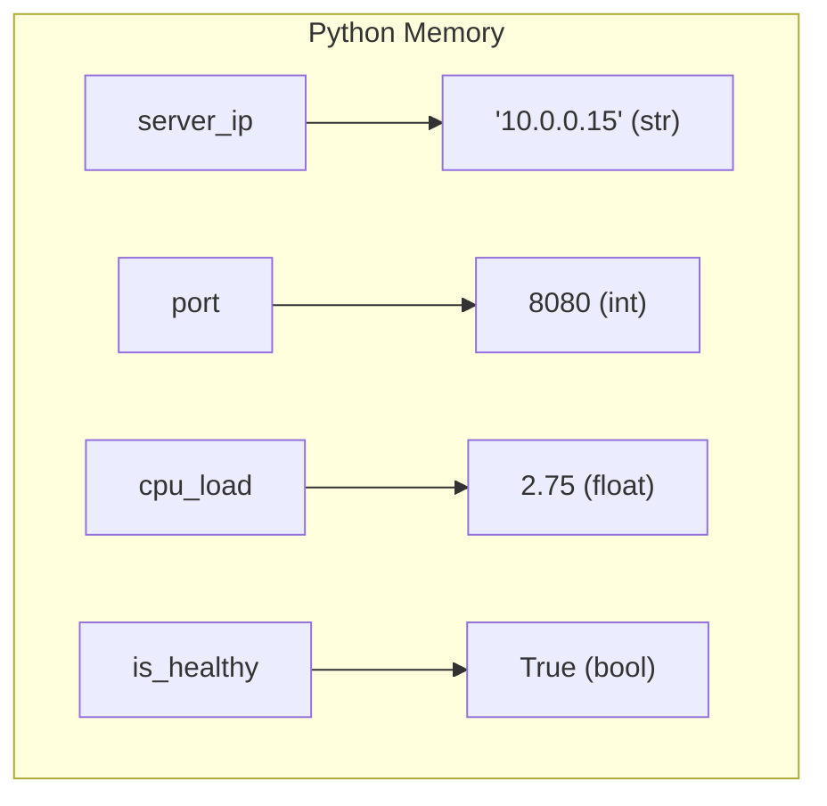

# Lesson 01 — Variables and Data Types in DevOps

## 🎯 What will I learn?
You will learn what variables are, how Python stores data in memory, and the core data types you will encounter in every DevOps script: **Strings**, **Integers**, **Floats**, and **Booleans**.

---

## 🤔 Why does a DevOps engineer need this?
In DevOps automation, everything you interact with is a data type:
- An IP address (`"192.168.1.100"`) is a **String**.
- A listening port (`8080`) or CPU count (`4`) is an **Integer**.
- A disk usage percentage (`87.4%`) or load average (`1.25`) is a **Float**.
- A server health status (`is_running = True`) or deployment success flag is a **Boolean**.

If you mix types incorrectly (e.g. adding the string `"8080"` to an integer `1`), your deployment automation script will crash with a `TypeError`.

---

## 🧠 Mental model



---

## 📖 Concept

A variable is simply a named label attached to a value in memory. Python is **dynamically typed**, meaning you do not have to declare whether a variable is an integer or string—Python figures it out automatically at runtime.

### The 4 Fundamental DevOps Data Types

| Type | Python Name | DevOps Example | Code Snippet |
| :--- | :--- | :--- | :--- |
| **String** | `str` | Hostname, IP, container name | `hostname = "web-prod-01"` |
| **Integer** | `int` | Port number, process ID (PID), replica count | `port = 443`, `replicas = 3` |
| **Float** | `float` | CPU utilization, disk percentage, memory GB | `cpu_usage = 78.6`, `mem_gb = 15.5` |
| **Boolean** | `bool` | Server status flag, TLS enabled check | `is_healthy = True`, `tls_enabled = False` |

---

## 💻 Simple example

```python
# Variables and types
cluster_name = "production-k8s-east"   # String
node_count = 12                       # Integer
memory_usage_gb = 45.8                 # Float
is_in_maintenance = False             # Boolean

print(type(cluster_name))     # <class 'str'>
print(type(node_count))       # <class 'int'>
print(type(memory_usage_gb))  # <class 'float'>
print(type(is_in_maintenance))# <class 'bool'>
```

---

## 🔧 Real DevOps example (`example.py`)

```python
"""
DevOps Script: Server Inventory Metadata Collector
Demonstrates variable declaration, type inspection, and type conversion.
"""

# 1. Defining Server Attributes
hostname = "k8s-worker-node-04"
ssh_port = 22
memory_used_pct = 74.2
is_draining = False

# 2. Type Inspection
print("========================================")
print("       NODE CONFIGURATION AUDIT         ")
print("========================================")
print(f"Hostname      : {hostname} (Type: {type(hostname).__name__})")
print(f"SSH Port      : {ssh_port} (Type: {type(ssh_port).__name__})")
print(f"Memory Usage  : {memory_used_pct}% (Type: {type(memory_used_pct).__name__})")
print(f"Draining Mode : {is_draining} (Type: {type(is_draining).__name__})")

# 3. Real DevOps Challenge: Converting String to Integer from Environment / Config
port_str = "8080"
# port_num = port_str + 1  # ❌ TypeError! Cannot add str and int
port_num = int(port_str) + 1  # ✅ Correct type casting
print(f"Next Available Port: {port_num}")
print("========================================")
```

---

## 🖥️ Expected output

```text
$ python example.py
========================================
       NODE CONFIGURATION AUDIT         
========================================
Hostname      : k8s-worker-node-04 (Type: str)
SSH Port      : 22 (Type: int)
Memory Usage  : 74.2% (Type: float)
Draining Mode : False (Type: bool)
Next Available Port: 8081
========================================
```

---

## 🔍 Line-by-line explanation
- `type(hostname).__name__`: Extracts the readable name of the data type (`str`, `int`, etc.).
- `port_str = "8080"`: Simulates reading a configuration file where all numbers start as text strings.
- `int(port_str)`: **Type casting** converts the string `"8080"` into the integer `8080` so we can perform math on it.

---

## 🐚 Shell equivalent

```bash
HOSTNAME="k8s-worker-node-04"
SSH_PORT=22
MEMORY_USED=74.2

# In Bash, everything is fundamentally treated as a string!
echo "Node: $HOSTNAME, Port: $SSH_PORT"
```
*Key difference:* In Shell, variables have no strict data types; everything is a string, which often leads to hidden bugs when doing floating-point arithmetic.

---

## ⚙️ Ansible equivalent

```yaml
- name: Display host variables
  hosts: all
  vars:
    hostname: "k8s-worker-node-04"
    ssh_port: 22
    is_draining: false
  tasks:
    - name: Debug variable types
      ansible.builtin.debug:
        msg: "Host {{ hostname }} on port {{ ssh_port }}"
```

---

## 🏆 Which one should I use?
- Use **Python** when you need strict typing, mathematical validation, and conversions between raw text inputs and numeric calculations.
- Use **Shell** when you just need quick string interpolations in terminal scripts.

---

## ⚠️ Common mistakes

### 1. The Concatenation Trap
```python
replicas = "3"
# print("Desired: " + replicas + 2) # ❌ TypeError: can only concatenate str to str
print(int(replicas) + 2)           # ✅ Correct: 5
```

### 2. Case Sensitivity in Booleans
```python
# is_healthy = true   # ❌ NameError: 'true' is not defined
is_healthy = True     # ✅ In Python, True and False MUST be capitalized!
```

---

## 🧪 Practice (Exercise)
Open `exercise.py`. You are given configuration values read from an environment file as raw strings. Convert each to its correct DevOps data type and validate if the cluster has enough nodes for high availability (minimum 3 nodes).

---

## 💡 Hint
Use `int()`, `float()`, and comparison operators (`node_count >= 3`).

---

## ✅ Solution
Check `solution.py` after writing your code.

---

## 🎯 Interview questions

### Q1: "What is dynamic typing in Python, and why should a DevOps engineer care?"
> **Interviewer Focus:** Testing if you understand runtime behavior and the risk of unvalidated inputs from configuration files or environment variables.

---

## 🗣️ How to answer in an interview
> *"Python is dynamically typed, meaning variable types are resolved at runtime rather than compile time. In DevOps scripts, this is important because values read from CLI arguments, environment variables, or HTTP headers are always strings. A DevOps engineer must explicitly cast types—like converting a port string into an integer—to avoid `TypeError` failures in production pipelines."*

---

## 📝 What I should remember
- Python has 4 basic scalar types: `str`, `int`, `float`, `bool`.
- Booleans are capitalized: `True` and `False`.
- Values from OS environment variables or files are always `str`; use `int()` or `float()` to convert them before doing math.
