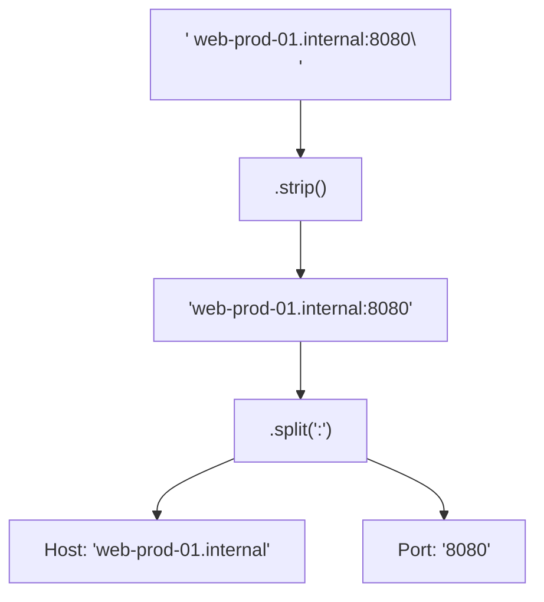

# Lesson 02 — Strings and Formatting in DevOps

## 🎯 What will I learn?
You will master string manipulation in Python: **f-strings**, **string methods** (`.strip()`, `.split()`, `.replace()`, `.lower()`, `.startswith()`, `.endswith()`), string slicing, and building clean terminal tables and alerts.

---

## 🤔 Why does a DevOps engineer need this?
Almost everything in DevOps starts as raw, messy text:

- Parsing command output from `df -h` or `kubectl get pods`.
- Extracting IP addresses from syslog lines.
- Cleaning trailing newlines (`\n`) and whitespace from configuration files.
- Generating Slack webhook messages, deployment URLs, or Docker tags (`myregistry.io/app:v1.2.0`).

---

## 🧠 Mental model



---

## 📖 Concept

A string in Python is an immutable sequence of characters enclosed in single (`'...'`), double (`"..."`), or triple (`"""..."""`) quotes.

### Key String Operations for DevOps

| Method | What it does | DevOps Use Case |
| :--- | :--- | :--- |
| `f"{var}"` | Interpolates expressions into text | Building URLs, log lines, alerts |
| `.strip()` | Removes leading & trailing whitespace/newlines | Cleaning output from shell commands |
| `.split(sep)` | Breaks a string into a list by separator | Parsing CSVs, IP addresses, colon-separated ports |
| `.replace(a, b)` | Replaces substring `a` with `b` | Sanitizing paths, template variables |
| `.startswith(prefix)` | Returns `True` if string starts with prefix | Filtering log lines starting with `ERROR` |
| `.join(iterable)` | Glues list elements together with a delimiter | Building comma-separated host lists |

---

## 💻 Simple example

```python
raw_log = "  2026-08-31 ERROR: Database timeout\n"
clean_log = raw_log.strip()
print(f"Cleaned: '{clean_log}'")

# Split by whitespace
parts = clean_log.split(" ")
print(f"Log Level: {parts[1]}")  # 'ERROR:'
```

---

## 🔧 Real DevOps example (`example.py`)

```python
"""
DevOps Script: Log Line Sanitizer and Docker Tag Generator
"""

# 1. Parsing a raw log entry from standard input / file
raw_syslog_line = "  192.168.1.50 - - [31/Aug/2026] \"GET /api/v1/health HTTP/1.1\" 503 1420 \n"

# Clean up whitespace and newlines
clean_line = raw_syslog_line.strip()
tokens = clean_line.split(" ")

client_ip = tokens[0]
http_method = tokens[5].replace('"', '')
endpoint = tokens[6]
status_code = tokens[8]

print("========================================")
print("           LOG ENTRY PARSER             ")
print("========================================")
print(f"Client IP   : {client_ip}")
print(f"HTTP Request: {http_method} {endpoint}")
print(f"HTTP Status : {status_code}")

# 2. Constructing a Docker Image Repository URI
registry = "registry.internal.net"
service = "payment-gateway"
git_branch = "feature/checkout-fix"
git_sha = "a1b2c3d"

# Sanitize branch name for Docker tag (slashes not allowed in tags)
sanitized_branch = git_branch.replace("/", "-")
docker_tag = f"{registry}/{service}:{sanitized_branch}-{git_sha}"

print(f"Docker Image: {docker_tag}")
print("========================================")
```

---

## 🖥️ Expected output

```text
$ python example.py
========================================
           LOG ENTRY PARSER             
========================================
Client IP   : 192.168.1.50
HTTP Request: GET /api/v1/health
HTTP Status : 503
Docker Image: registry.internal.net/payment-gateway:feature-checkout-fix-a1b2c3d
========================================
```

---

## 🔍 Line-by-line explanation
- `clean_line = raw_syslog_line.strip()`: Strips out the leading spaces and trailing `\n`.
- `tokens = clean_line.split(" ")`: Slices the space-separated log into individual tokens.
- `git_branch.replace("/", "-")`: Replaces `/` in git branch names because Docker tags cannot contain slashes.
- `f"{registry}/{service}:..."`: Assembles the full Docker image string with f-strings.

---

## 🐚 Shell equivalent

```bash
RAW_LINE="  192.168.1.50 - - [31/Aug/2026] \"GET /api/v1/health HTTP/1.1\" 503 1420 "
IP=$(echo "$RAW_LINE" | awk '{print $1}')
STATUS=$(echo "$RAW_LINE" | awk '{print $9}')
echo "Client IP: $IP, Status: $STATUS"
```
*Why Python is better for complex cases:* Shell piping (`awk`, `sed`, `cut`) spawns multiple sub-processes and breaks easily if string fields contain variable numbers of spaces or quotes.

---

## ⚙️ Ansible equivalent

```yaml
- name: Format Docker tag using Jinja2 filters
  ansible.builtin.set_fact:
    docker_tag: "{{ registry }}/{{ service }}:{{ git_branch | replace('/', '-') }}-{{ git_sha }}"
```

---

## 🏆 Which one should I use?
- Use **Python** for granular text sanitation, regex transformations, or when building structured CLI outputs.
- Use **Shell** with `awk`/`grep` for quick terminal one-liners to inspect an active log stream.

---

## ⚠️ Common mistakes
1. **Forgetting that strings are immutable:**
   ```python
   service = "app-service\n"
   service.strip()  # ❌ Does not change `service` in place!
   service = service.strip()  # ✅ Must reassign to save changes
   ```
2. **Old-style formatting (`%` or `.format()`):** Modern DevOps Python uses **f-strings** (`f"{var}"`) for speed and readability.

---

## 🧪 Practice (Exercise)
Open `exercise.py`. You have a list of messy node connection strings from a legacy config file (`"  node01.internal:8080/tcp\n "`). Sanitize each entry and extract the hostname, port, and protocol.

---

## 💡 Hint
Chain `.strip()` and `.split(":")`, then `.split("/")`.

---

## ✅ Solution
See `solution.py` after your attempt.

---

## 🎯 Interview questions

### Q: "How does string immutability in Python impact processing a 5 GB log file, and how do you handle it?"
> **Interviewer Focus:** Testing your memory management awareness and whether you understand not to concatenate strings in large loops.

---

## 🗣️ How to answer in an interview
> *"Because strings in Python are immutable, performing repeated concatenations (`str += chunk`) in a loop creates a new string object in memory on every iteration, leading to O(N^2) memory consumption. When parsing large logs, we stream the file line by line using an iterator and use `.strip()` / `.split()` on individual lines, or collect chunks in a `list` and use `''.join(chunks)` for batch reconstruction."*

---

## 📝 What I should remember
- Use **f-strings** (`f"Server: {host}"`) for all formatting.
- Always `.strip()` raw outputs from shell commands or files.
- `.split()` is the fastest way to tokenize delimited data.
- Strings are immutable: methods return a new string; they do not modify the original in place.
