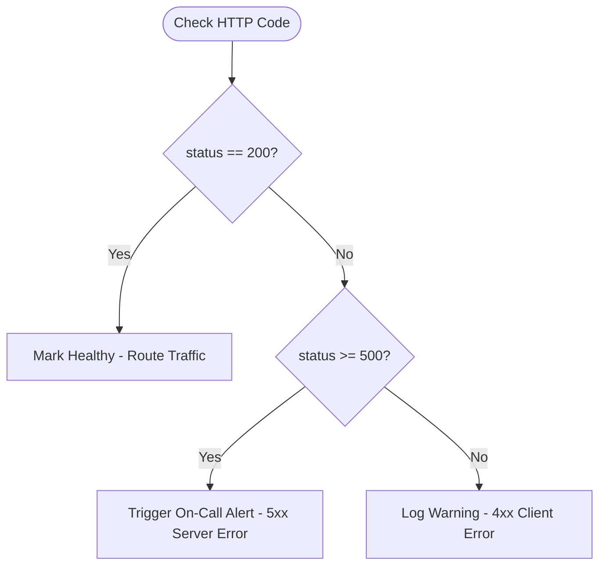

# Lesson 04 — Conditionals (if, elif, else) in DevOps

## 🎯 What will I learn?
You will learn how to make decisions in your scripts using `if`, `elif`, and `else` blocks, boolean comparison operators (`==`, `!=`, `<`, `>`, `<=`, `>=`), and logical operators (`and`, `or`, `not`, `in`).

---

## 🤔 Why does a DevOps engineer need this?
DevOps automation is essentially a series of operational decisions:
- *If* disk usage > 90%, trigger PagerDuty alert; *elif* > 80%, send Slack warning; *else* mark healthy.
- *If* HTTP status is 200 *and* response time < 500ms, route traffic; *else* failover to backup.
- *If* `"ERROR"` is in log line *and not* `"known-flaky-warning"`, increment incident counter.

---

## 🧠 Mental model



---

## 📖 Concept

Conditionals allow your code to take different execution branches based on truth values.

### Comparison & Logical Operators

| Operator | Meaning | Example |
| :--- | :--- | :--- |
| `==` | Equals | `status_code == 200` |
| `!=` | Not equal to | `env != "production"` |
| `<`, `>` | Less / Greater than | `cpu_load > 4.0` |
| `<=`, `>=` | Less / Greater or equal | `free_disk_gb <= 10.0` |
| `and` | True only if BOTH are true | `is_ready and is_running` |
| `or` | True if AT LEAST ONE is true | `status == 502 or status == 504` |
| `not` | Inverts the boolean | `not is_maintenance_window` |
| `in` | Checks containment | `"k8s" in hostname` |

---

## 💻 Simple example

```python
http_status = 503

if http_status == 200:
    print("Service is Healthy")
elif http_status in [502, 503, 504]:
    print("Service Unavailable / Gateway Error")
else:
    print(f"Unexpected status: {http_status}")
```

---

## 🔧 Real DevOps example (`example.py`)

```python
"""
DevOps Script: Microservice Health Evaluator & Traffic Routing Decision
"""

def evaluate_node(node_name, cpu_pct, disk_pct, is_cordoned, active_alerts):
    print(f"[*] Evaluating Node: {node_name}")
    
    # 1. Condition: Is the node explicitly cordoned or under maintenance?
    if is_cordoned:
        status = "MAINTENANCE"
        action = "Do NOT schedule pods. Node is cordoned."
    # 2. Condition: Critical resource exhaustion
    elif cpu_pct >= 90.0 or disk_pct >= 90.0:
        status = "CRITICAL"
        action = f"Drain node immediately! High load (CPU: {cpu_pct}%, Disk: {disk_pct}%)"
    # 3. Condition: Elevated resource warning
    elif cpu_pct >= 75.0 or disk_pct >= 75.0:
        status = "DEGRADED"
        action = "Send warning to Slack channel. Monitor closely."
    # 4. Condition: Healthy and ready
    elif not active_alerts:
        status = "HEALTHY"
        action = "Node is optimal. Ready for workloads."
    else:
        status = "UNKNOWN"
        action = "Investigate unhandled state."
        
    print(f"    Status: [{status}]")
    print(f"    Action: {action}\n")
    return status

if __name__ == "__main__":
    print("========================================")
    print("       K8S NODE HEALTH DECISION         ")
    print("========================================")
    evaluate_node("node-01", cpu_pct=42.0, disk_pct=60.0, is_cordoned=False, active_alerts=[])
    evaluate_node("node-02", cpu_pct=92.5, disk_pct=50.0, is_cordoned=False, active_alerts=[])
    evaluate_node("node-03", cpu_pct=10.0, disk_pct=15.0, is_cordoned=True, active_alerts=[])
    print("========================================")
```

---

## 🖥️ Expected output

```text
$ python example.py
========================================
       K8S NODE HEALTH DECISION         
========================================
[*] Evaluating Node: node-01
    Status: [HEALTHY]
    Action: Node is optimal. Ready for workloads.

[*] Evaluating Node: node-02
    Status: [CRITICAL]
    Action: Drain node immediately! High load (CPU: 92.5%, Disk: 50.0%)

[*] Evaluating Node: node-03
    Status: [MAINTENANCE]
    Action: Do NOT schedule pods. Node is cordoned.

========================================
```

---

## 🔍 Line-by-line explanation
- `if is_cordoned:`: Evaluates the boolean directly (no need to write `if is_cordoned == True:`).
- `elif cpu_pct >= 90.0 or disk_pct >= 90.0:`: Uses `or` so if *either* CPU or Disk breaches 90%, it triggers the `CRITICAL` branch.
- `elif not active_alerts:`: In Python, an empty list `[]` evaluates to `False`. `not []` is `True`.

---

## 🐚 Shell equivalent

```bash
CPU=92
DISK=50
CORDONED="false"

if [ "$CORDONED" = "true" ]; then
    echo "MAINTENANCE"
elif [ "$CPU" -ge 90 ] || [ "$DISK" -ge 90 ]; then
    echo "CRITICAL"
elif [ "$CPU" -ge 75 ] || [ "$DISK" -ge 75 ]; then
    echo "DEGRADED"
else
    echo "HEALTHY"
fi
```
*Why Python is cleaner:* Bash conditional syntax (`[`, `[[`, `-ge`, `-eq`, `&&`, `||`) is full of syntactic pitfalls (spacing errors, unquoted variables). Python reads like structured English.

---

## ⚙️ Ansible equivalent

```yaml
- name: Determine node status
  ansible.builtin.debug:
    msg: "Node is CRITICAL"
  when: (cpu_pct >= 90) or (disk_pct >= 90)
```

---

## 🏆 Which one should I use?
- Use **Python** when decisions involve multiple nested conditions, boolean combinations, and dictionary checks.
- Use **Shell** for simple exit-code checks (`if [ $? -eq 0 ]; then ...`).

---

## ⚠️ Common mistakes
1. **Using `=` instead of `==` in conditions:**
   ```python
   # if status = 200:   # ❌ SyntaxError (assignment inside if)
   if status == 200:     # ✅ Correct equality check
   ```
2. **Comparing types incorrectly:**
   ```python
   status_code = "200"
   if status_code == 200:  # ❌ Evaluates to False! "200" (str) != 200 (int)
   ```

---

## 🧪 Practice (Exercise)
Open `exercise.py`. Write an access control evaluator for a deployment pipeline. Deployments to `"production"` should only be allowed if `environment == "production"`, `user_role == "admin"`, and `tests_passed == True`. Deployments to `"staging"` are allowed for `"admin"` or `"developer"` if tests passed.

---

## 💡 Hint
Use `if environment == "production" and user_role == "admin" and tests_passed:`

---

## ✅ Solution
Check `solution.py` after your attempt.

---

## 🎯 Interview questions

### Q: "What is truthy and falsy in Python, and how does it prevent bugs in DevOps automation?"
> **Interviewer Focus:** Testing your knowledge of how Python evaluates empty strings, empty lists, `0`, and `None` in `if` statements.

---

## 🗣️ How to answer in an interview
> *"In Python, values like `None`, `False`, `0`, `""` (empty string), `[]` (empty list), and `{}` (empty dict) are evaluated as 'Falsy'. Everything else is 'Truthy'. In DevOps scripts, this lets us write concise checks like `if not failed_pods:` instead of `if len(failed_pods) == 0:`. However, we must be careful: if a valid return value is `0` (like exit code `0`), checking `if exit_code:` will evaluate to `False`, so we must explicitly check `if exit_code == 0:`."*

---

## 📝 What I should remember
- Indentation (4 spaces) defines the body of `if/elif/else` blocks.
- Combine conditions using `and`, `or`, and `not`.
- Use `in` to check if an item exists inside a list or string.
- Never compare string numbers to integer numbers without casting.
