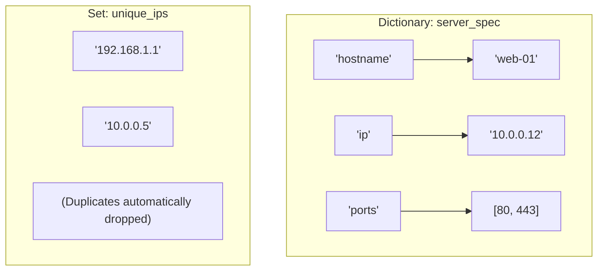

# Lesson 06 — Dictionaries and Sets in DevOps

## 🎯 What will I learn?
You will master Python **Dictionaries** (`{"key": "value"}`) and **Sets** (`{"item1", "item2"}`). You will learn key lookup, `.get()` with default values, iterating `.items()`, `.keys()`, `.values()`, nested dictionaries (JSON equivalents), and using sets for high-speed IP deduplication and difference auditing.

---

## 🤔 Why does a DevOps engineer need this?
1. **Dictionaries** are the backbone of modern infrastructure. Every JSON payload, Kubernetes YAML spec, AWS API response from `boto3`, and Docker inspection output maps directly to a Python dictionary!
2. **Sets** provide unique elements with $O(1)$ lookup time. When analyzing a 10 GB access log, finding all *unique attacker IPs* or comparing *desired vs actual firewall rules* is solved in 2 lines with set operations (`set_a - set_b`).

---

## 🧠 Mental model



---

## 📖 Concept

### 1. Dictionary (`dict`)
- A collection of key-value pairs. Keys must be unique and immutable (strings, integers, tuples).
- **Safe lookup:** `data.get("key", default_value)` avoids `KeyError` if the key doesn't exist!

### 2. Set (`set`)
- An unordered collection of unique elements.
- **Key operations:** Union (`|`), Intersection (`&`), Difference (`-`).

---

## 💻 Simple example

```python
# Server dictionary
server = {
    "hostname": "db-primary",
    "ip": "10.0.0.25",
    "role": "database"
}
# Safe access
print(server.get("environment", "development")) # 'development' (default value)

# Set deduplication
raw_ips = ["1.1.1.1", "8.8.8.8", "1.1.1.1", "8.8.8.8"]
unique_ips = set(raw_ips)
print(unique_ips)  # {'1.1.1.1', '8.8.8.8'}
```

---

## 🔧 Real DevOps example (`example.py`)

```python
"""
DevOps Script: Kubernetes Node Metadata Aggregator & Firewall Drift Auditor
"""

# 1. Nested Dictionaries (simulating K8s API JSON response)
cluster_nodes = {
    "node-east-01": {
        "status": "Ready",
        "cpu_cores": 8,
        "labels": {"zone": "us-east-1a", "tier": "frontend"}
    },
    "node-east-02": {
        "status": "NotReady",
        "cpu_cores": 8,
        "labels": {"zone": "us-east-1b", "tier": "backend"}
    }
}

print("========================================")
print("       CLUSTER NODE HEALTH AUDIT        ")
print("========================================")
for node_name, details in cluster_nodes.items():
    status = details.get("status", "Unknown")
    zone = details.get("labels", {}).get("zone", "unassigned")
    print(f"Node: {node_name:<14} | Status: {status:<8} | Zone: {zone}")

# 2. Sets for Configuration Drift Detection
desired_firewall_ports = {22, 80, 443, 8080}
actual_open_ports = {22, 80, 443, 8080, 3306, 9200}  # 3306 and 9200 should not be open publicly!

# Find unexpected open ports (Security Drift)
unauthorized_ports = actual_open_ports - desired_firewall_ports

# Find missing required ports
missing_ports = desired_firewall_ports - actual_open_ports

print("\n========================================")
print("     FIREWALL SECURITY DRIFT AUDIT      ")
print("========================================")
print(f"Desired Ports : {desired_firewall_ports}")
print(f"Active Ports  : {actual_open_ports}")
if unauthorized_ports:
    print(f"[!] SECURITY ALERT: Unauthorized ports open: {unauthorized_ports}")
if missing_ports:
    print(f"[!] WARNING: Required ports missing: {missing_ports}")
if not unauthorized_ports and not missing_ports:
    print("[+] Firewall rules match desired state.")
print("========================================")
```

---

## 🖥️ Expected output

```text
$ python example.py
========================================
       CLUSTER NODE HEALTH AUDIT        
========================================
Node: node-east-01   | Status: Ready    | Zone: us-east-1a
Node: node-east-02   | Status: NotReady | Zone: us-east-1b

========================================
     FIREWALL SECURITY DRIFT AUDIT      
========================================
Desired Ports : {80, 8080, 443, 22}
Active Ports  : {8080, 3306, 443, 80, 22, 9200}
[!] SECURITY ALERT: Unauthorized ports open: {3306, 9200}
========================================
```

---

## 🔍 Line-by-line explanation
- `details.get("labels", {}).get("zone", "unassigned")`: Defensive lookup. If `labels` key is missing, it safely falls back to `{}` instead of crashing, and then looks for `zone`.
- `unauthorized_ports = actual_open_ports - desired_firewall_ports`: **Set difference**. Computes elements in `actual` that are not in `desired`.

---

## 🐚 Shell equivalent

```bash
# Finding differences in Shell requires sorting and comm:
comm -13 <(sort desired_ports.txt) <(sort active_ports.txt)
```
*Why Python is better:* In Shell, you must write files to disk, sort them, and use `comm` or `grep -vFf`. In Python, `set_a - set_b` runs entirely in memory in microseconds.

---

## ⚙️ Ansible equivalent

```yaml
- name: Find unauthorized ports using Jinja2 difference filter
  ansible.builtin.set_fact:
    unauthorized: "{{ active_ports | difference(desired_ports) }}"
```

---

## 🏆 Which one should I use?
- Use **Python dictionaries and sets** for high-volume log parsing, JSON payload validation, and in-memory drift detection.
- Use **Ansible** when asserting configuration state across hosts from inventory YAML files.

---

## ⚠️ Common mistakes
1. **Direct index lookup causing `KeyError`:**
   ```python
   server = {"ip": "10.0.0.1"}
   # print(server["hostname"])  # ❌ KeyError: 'hostname'
   print(server.get("hostname", "unknown-host"))  # ✅ Safe: returns 'unknown-host'
   ```
2. **Confusing empty set with empty dict:**
   ```python
   d = {}  # This creates an empty dictionary, NOT a set!
   s = set() # ✅ This creates an empty set.
   ```

---

## 🧪 Practice (Exercise)
Open `exercise.py`. You have access logs containing repeated visitor IP addresses and a blacklist set. Extract all unique IPs, count the unique visitors, and identify if any blacklisted IP attempted access.

---

## 💡 Hint
Convert the raw IP list to `set(raw_ips)`. Use set intersection `unique_ips & blacklist` to find blacklisted hits.

---

## ✅ Solution
Check `solution.py` after your attempt.

---

## 🎯 Interview questions

### Q: "Why should you use `.get()` instead of bracket syntax `data['key']` when parsing API responses in Python?"
> **Interviewer Focus:** Testing your defensive programming mindset and resilience against changing API schemas.

---

## 🗣️ How to answer in an interview
> *"In production DevOps automation, external JSON responses from cloud providers or monitoring APIs can change or omit optional fields. Accessing `data['key']` raises an unhandled `KeyError` if the key is missing, causing the pipeline or script to crash. Using `data.get('key', default)` allows us to safely retrieve the value or fall back to a sensible default without halting execution."*

---

## 📝 What I should remember
- Dictionaries map unique keys to values: `{"key": "value"}`.
- Always use `.get(key, default)` for defensive coding.
- Sets contain only unique items: `set([1, 1, 2]) == {1, 2}`.
- Set subtraction (`set_a - set_b`) is the cleanest way to detect configuration drift.
