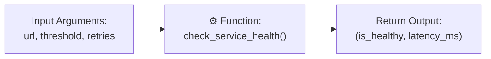

# Lesson 08 — Functions, Scope, and Modularity in DevOps

## 🎯 What will I learn?
You will learn how to write modular, reusable automation code using **Functions** (`def`). You will learn parameter passing, default arguments, return values, type hints, variable scope (Local vs Global), and docstrings.

---

## 🤔 Why does a DevOps engineer need this?
Without functions, DevOps scripts become huge repetitive blocks of copy-pasted code.
With functions:
- You write `check_endpoint(url, timeout=3)` once and call it for 20 microservices.
- You can unit test individual components in isolation with `pytest`.
- Your code is readable, maintainable, and ready for team collaboration.

---

## 🧠 Mental model



---

## 📖 Concept

A function is a named block of code that takes inputs (arguments), performs logic, and returns an output.

### Anatomy of a Production-Ready DevOps Function

```python
def check_disk(mount_point: str, threshold: float = 80.0) -> bool:
    """
    Checks if a mount point exceeds the specified disk threshold.
    Returns True if healthy, False if threshold breached.
    """
    # Logic here
    return True
```

- `mount_point: str`: Type hint indicating input type.
- `threshold: float = 80.0`: Default argument value.
- `-> bool`: Type hint showing the return type.
- `"""Docstring"""`: Standard documentation string for maintainability.

---

## 💻 Simple example

```python
def calculate_ram_gb(bytes_val: int) -> float:
    return round(bytes_val / (1024 ** 3), 2)

server_ram = calculate_ram_gb(17179869184)
print(f"Server RAM: {server_ram} GB")  # 16.0 GB
```

---

## 🔧 Real DevOps example (`example.py`)

```python
"""
DevOps Script: Modular Server Health Audit Toolkit
"""
from typing import Dict, Tuple

def audit_service(name: str, port: int, response_code: int) -> Tuple[bool, str]:
    """
    Audits a microservice based on response code and port binding.
    Returns a tuple of (is_healthy, status_message).
    """
    if response_code == 200:
        return True, f"Service '{name}' on port {port} is operational."
    elif 500 <= response_code <= 599:
        return False, f"Service '{name}' failed with Server Error (HTTP {response_code})."
    else:
        return False, f"Service '{name}' returned unexpected status (HTTP {response_code})."

def run_fleet_audit(service_inventory: Dict[str, Dict[str, int]]) -> int:
    """
    Runs audit over entire service inventory and returns count of failing services.
    """
    print("========================================")
    print("      FLEET MICROSERVICE HEALTH         ")
    print("========================================")
    
    failures = 0
    for svc_name, meta in service_inventory.items():
        healthy, message = audit_service(
            name=svc_name,
            port=meta["port"],
            response_code=meta["code"]
        )
        tag = "[PASS]" if healthy else "[FAIL]"
        print(f"{tag:<7} {message}")
        if not healthy:
            failures += 1
            
    print("========================================")
    print(f"Audit Summary: {len(service_inventory) - failures} Healthy, {failures} Failed")
    print("========================================")
    return failures

if __name__ == "__main__":
    inventory = {
        "auth-api": {"port": 8081, "code": 200},
        "order-api": {"port": 8082, "code": 502},
        "billing-worker": {"port": 8083, "code": 200}
    }
    
    failed_count = run_fleet_audit(inventory)
    # Return code reflects failure count
    exit_code = 1 if failed_count > 0 else 0
```

---

## 🖥️ Expected output

```text
$ python example.py
========================================
      FLEET MICROSERVICE HEALTH         
========================================
[PASS]  Service 'auth-api' on port 8081 is operational.
[FAIL]  Service 'order-api' failed with Server Error (HTTP 502).
[PASS]  Service 'billing-worker' on port 8083 is operational.
========================================
Audit Summary: 2 Healthy, 1 Failed
========================================
```

---

## 🔍 Line-by-line explanation
- `def audit_service(...) -> Tuple[bool, str]:`: Defines a modular pure function that returns a boolean status and a formatted message.
- `healthy, message = audit_service(...)`: Unpacks the returned tuple directly.
- `inventory = { ... }`: Clean separation of data definition from execution logic.

---

## 🐚 Shell equivalent

```bash
audit_service() {
    local name="$1"
    local code="$2"
    if [ "$code" -eq 200 ]; then
        echo "[PASS] $name is operational"
        return 0
    else
        echo "[FAIL] $name failed with HTTP $code"
        return 1
    fi
}
```
*Why Python is better:* Bash functions cannot return rich data structures (like tuples, dicts, or objects)—only integer exit codes (`0-255`) and raw text via `echo`.

---

## ⚙️ Ansible equivalent

Ansible uses **Roles** and **Tasks** rather than traditional functions. Reusable tasks are invoked via `ansible.builtin.include_tasks`.

---

## 🏆 Which one should I use?
- Use **Python functions** whenever you need structured return values, automated unit testing (`pytest`), or reusable utility libraries across multiple automation scripts.

---

## ⚠️ Common mistakes
1. **Using mutable default arguments:**
   ```python
   # ❌ BUG: The same list is shared across all function calls!
   def add_server(host, server_list=[]):
       server_list.append(host)
       return server_list
       
   # ✅ FIX: Use None as default
   def add_server(host, server_list=None):
       if server_list is None:
           server_list = []
       server_list.append(host)
       return server_list
   ```
2. **Forgetting the `return` statement:** Python functions return `None` by default if `return` is omitted.

---

## 🧪 Practice (Exercise)
Open `exercise.py`. Write a reusable function `evaluate_cpu_alert(host, load, core_count)` that computes the normalized load average per core (`load / core_count`). If normalized load > 1.0, return `(True, "OVERLOADED")`. Otherwise, return `(False, "NORMAL")`.

---

## 💡 Hint
`normalized = load / core_count`. Return a tuple `(normalized > 1.0, message)`.

---

## ✅ Solution
Check `solution.py` after your attempt.

---

## 🎯 Interview questions

### Q: "Why is `def func(hosts=[])` dangerous in Python, and how does it cause bugs in automation tools?"
> **Interviewer Focus:** Testing your deep understanding of Python's default parameter evaluation at definition time vs execution time.

---

## 🗣️ How to answer in an interview
> *"In Python, default arguments are evaluated only once when the function is defined, not every time it is called. If you use a mutable object like a list or dictionary as a default argument (`hosts=[]`), modifications like `hosts.append(new_host)` will persist across subsequent function calls in the same process. This creates state pollution bugs. The production best practice is to set default to `None` and initialize a fresh list inside the function body if `hosts is None`."*

---

## 📝 What I should remember
- Functions encapsulate logic and promote code reuse.
- Always use type hints (`param: str -> bool`) for clarity.
- Never use mutable defaults (`[]` or `{}`); use `None`.
- Return structured tuples or dicts to provide rich operational status.
