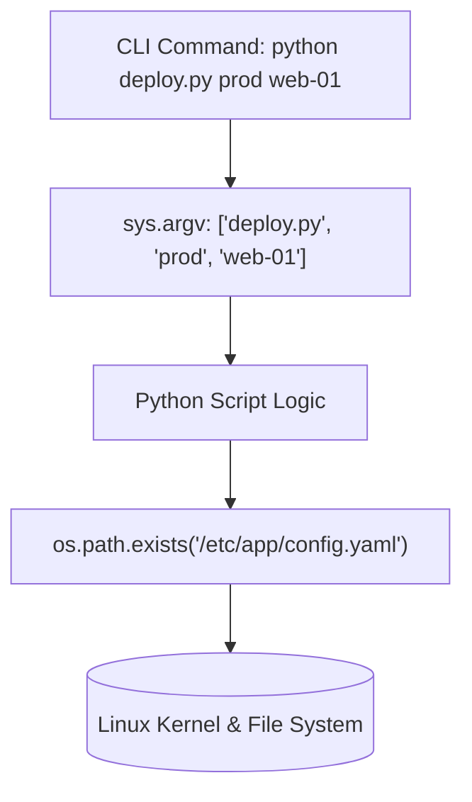

# Lesson 01 — The `sys` and `os` Modules: Interacting with Linux

## 🎯 What will I learn?
You will learn how to interact with the underlying Linux operating system using Python's standard `sys` and `os` modules: reading command-line arguments (`sys.argv`), querying paths (`os.path`), checking file existence, listing directories, and accessing system properties.

---

## 🤔 Why does a DevOps engineer need this?
DevOps automation scripts cannot be static:
- They must accept dynamic target arguments: `python deploy.py --env staging --region us-east-1` (`sys.argv`).
- They must inspect local filesystem structures: verifying that an SSL certificate file exists at `/etc/ssl/certs/app.crt` before starting Nginx (`os.path.exists()`).
- They must navigate paths safely across Linux, macOS, and Windows without hardcoded slash bugs (`os.path.join()`).

---

## 🧠 Mental model



---

## 📖 Concept

### 1. `sys` Module (System-Specific Parameters)
- `sys.argv`: List of command-line arguments passed to the script. `sys.argv[0]` is the script name.
- `sys.exit(code)`: Exits the script immediately with a numeric status code.
- `sys.platform`: Returns the host platform (`linux`, `darwin`, `win32`).

### 2. `os` and `os.path` Modules (Operating System Interface)
- `os.getcwd()`: Current working directory (equivalent to `pwd`).
- `os.listdir(path)`: Lists directory contents (equivalent to `ls`).
- `os.path.exists(path)`: Returns `True` if file or folder exists.
- `os.path.join("dir", "file")`: Joins paths with correct OS separator (`/` on Linux, `\` on Windows).
- `os.path.getsize(path)`: Returns file size in bytes.

---

## 💻 Simple example

```python
import sys
import os

if len(sys.argv) < 2:
    print("Usage: python script.py <filename>")
    sys.exit(1)

target_file = sys.argv[1]
if os.path.exists(target_file):
    print(f"File '{target_file}' exists! Size: {os.path.getsize(target_file)} bytes")
else:
    print(f"File '{target_file}' NOT found.")
    sys.exit(1)
```

---

## 🔧 Real DevOps example (`example.py`)

```python
"""
DevOps Script: Configuration & Certificate Pre-Flight Auditor
Accepts a directory path argument and validates critical production assets.
"""
import sys
import os

def audit_directory_assets(base_dir):
    print("========================================")
    print("      CONFIG & CERTIFICATE AUDIT        ")
    print("========================================")
    print(f"Auditing Directory: {os.path.abspath(base_dir)}")
    
    if not os.path.exists(base_dir):
        print(f"[!] ERROR: Target directory '{base_dir}' does not exist!")
        return False
        
    required_files = ["app.conf", "tls.crt", "tls.key"]
    missing = []
    
    for filename in required_files:
        full_path = os.path.join(base_dir, filename)
        if os.path.exists(full_path):
            size_kb = round(os.path.getsize(full_path) / 1024, 2)
            print(f"[FOUND]   {filename:<12} ({size_kb} KB)")
        else:
            print(f"[MISSING] {filename:<12} (CRITICAL)")
            missing.append(filename)
            
    print("========================================")
    if missing:
        print(f"[!] FAILED: Missing required deployment assets: {missing}")
        return False
        
    print("[+] All configuration assets verified successfully.")
    return True

if __name__ == "__main__":
    # If no argument passed, audit current directory
    target = sys.argv[1] if len(sys.argv) > 1 else "."
    is_valid = audit_directory_assets(target)
    sys.exit(0 if is_valid else 1)
```

---

## 🖥️ Expected output

```text
$ python example.py /etc/app/config
========================================
      CONFIG & CERTIFICATE AUDIT        
========================================
Auditing Directory: /etc/app/config
[FOUND]   app.conf     (2.45 KB)
[FOUND]   tls.crt      (4.12 KB)
[FOUND]   tls.key      (1.68 KB)
========================================
[+] All configuration assets verified successfully.
```

---

## 🔍 Line-by-line explanation
- `sys.argv[1] if len(sys.argv) > 1 else "."`: Gracefully defaults to current working directory if user passes no arguments.
- `os.path.abspath(base_dir)`: Normalizes relative paths (`./config` -> `/home/user/app/config`).
- `os.path.join(base_dir, filename)`: Safely constructs platform-agnostic filepaths.

---

## 🐚 Shell equivalent

```bash
TARGET_DIR="${1:-.}"
if [ ! -d "$TARGET_DIR" ]; then
    echo "Directory does not exist"
    exit 1
fi
for file in "app.conf" "tls.crt" "tls.key"; do
    if [ ! -f "$TARGET_DIR/$file" ]; then
        echo "Missing $file"
        exit 1
    fi
done
```

---

## ⚙️ Ansible equivalent

```yaml
- name: Verify critical files exist
  ansible.builtin.stat:
    path: "/etc/app/config/{{ item }}"
  loop:
    - app.conf
    - tls.crt
    - tls.key
  register: stat_results
  failed_when: not stat_results.stat.exists
```

---

## 🏆 Which one should I use?
- Use **Python `sys`/`os`** when building dynamic CLI tools that must inspect file metadata, size thresholds, and permissions before triggering complex deployments.

---

## ⚠️ Common mistakes
1. **Hardcoding slashes (`/` or `\`):**
   ```python
   # path = base_dir + "/" + filename  # ❌ Brittle on Windows / portable runners
   path = os.path.join(base_dir, filename) # ✅ Safe & portable
   ```
2. **Accessing `sys.argv[1]` without checking length:**
   - Raises `IndexError: list index out of range` if no CLI argument was passed. Always verify `len(sys.argv)` first.

---

## 🧪 Practice (Exercise)
Open `exercise.py`. Write a script that takes a directory path from `sys.argv[1]`. If no argument is provided, print usage and exit with code `2`. If the directory exists, scan it and print all files ending with `.log` along with their file sizes in KB.

---

## 💡 Hint
Use `os.listdir(target_dir)`, filter with `if f.endswith(".log"):`, and calculate size with `os.path.getsize(os.path.join(target_dir, f))`.

---

## ✅ Solution
Check `solution.py` after your attempt.

---

## 🎯 Interview questions

### Q: "Why should you use `os.path.join()` or `pathlib.Path` instead of string formatting for paths in Python?"
> **Interviewer Focus:** Testing cross-platform portability and prevention of double-slash or backslash formatting bugs in CI/CD runners (Linux vs Windows runners).

---

## 🗣️ How to answer in an interview
> *"Hardcoding path separators with string concatenation (`folder + '/' + file`) leads to bugs across operating systems (such as Windows runners in GitHub Actions vs Linux production containers) and often introduces double-slash errors. `os.path.join()` and modern `pathlib.Path` automatically resolve the host OS's native separator and normalize redundant slashes, guaranteeing portable and defensive filesystem operations."*

---

## 📝 What I should remember
- `sys.argv` captures CLI inputs (index 0 is the script name).
- Always check `len(sys.argv)` before indexing.
- Use `os.path.join()` for all path construction.
- `os.path.exists()` checks file or directory presence.
