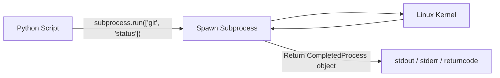

# Lesson 02 — The `subprocess` Module: Executing Linux Commands

## 🎯 What will I learn?
You will master executing Linux shell commands directly from Python using `subprocess.run()`. You will learn how to capture standard output (`stdout`), standard error (`stderr`), handle non-zero exit codes with `check=True`, set command timeouts, and avoid security vulnerabilities (such as `shell=True` injection).

---

## 🤔 Why does a DevOps engineer need this?
DevOps automation often bridges Python logic with existing command-line utilities:

- Checking disk space with `df -h`.
- Querying service states with `systemctl is-active docker`.
- Running CLI tools: `git rev-parse HEAD`, `docker ps`, `kubectl get nodes`.
- Capturing command output to parse and make automated decisions.

---

## 🧠 Mental model



---

## 📖 Concept

Never use the obsolete `os.system()` or `commands` modules in modern Python! Use `subprocess.run()`.

### The Anatomy of `subprocess.run()`

```python
import subprocess

result = subprocess.run(
    ["df", "-h", "/"],         # Command as a LIST of strings (Safe!)
    capture_output=True,       # Capture stdout and stderr
    text=True,                 # Decode bytes to string automatically
    timeout=5,                 # Timeout in seconds to prevent hanging
    check=False                # Do not raise CalledProcessError automatically
)

print(f"Exit Code: {result.returncode}")
print(f"Output   : {result.stdout}")
```

### Why `shell=False` (Default) is Safer than `shell=True`
- When you pass a list `["ls", user_input]`, Python directly executes the binary without passing it to a shell interpreter, making **Command Injection attacks impossible**.
- `shell=True` is dangerous because passing `"; rm -rf /"` in `user_input` will execute the malicious command.

---

## 💻 Simple example

```python
import subprocess

# Run uptime
proc = subprocess.run(["uptime"], capture_output=True, text=True)
print(f"Server Uptime: {proc.stdout.strip()}")
```

---

## 🔧 Real DevOps example (`example.py`)

```python
"""
DevOps Script: Linux System Service & Command Orchestrator
Executes OS commands safely with timeouts and captures stdout/stderr.
"""
import subprocess
import sys

def execute_command(cmd_list, timeout_sec=5):
    """
    Executes a system command safely and returns (success_bool, stdout_str, stderr_str).
    """
    cmd_display = " ".join(cmd_list)
    print(f"[*] Executing: '{cmd_display}' (Timeout: {timeout_sec}s)")
    
    try:
        proc = subprocess.run(
            cmd_list,
            capture_output=True,
            text=True,
            timeout=timeout_sec,
            check=False
        )
        
        if proc.returncode == 0:
            return True, proc.stdout.strip(), ""
        else:
            return False, proc.stdout.strip(), proc.stderr.strip()
            
    except subprocess.TimeoutExpired:
        return False, "", f"Command timed out after {timeout_sec} seconds."
    except FileNotFoundError:
        return False, "", f"Executable '{cmd_list[0]}' was not found on host PATH."

if __name__ == "__main__":
    print("========================================")
    print("     SUBPROCESS COMMAND EXECUTION       ")
    print("========================================")
    
    # 1. Test standard command (Python version)
    ok, out, err = execute_command([sys.executable, "--version"])
    if ok:
        print(f"[SUCCESS] Python Runtime: {out}")
    else:
        print(f"[FAILED]  Error: {err}")
        
    # 2. Test disk check command (platform-aware)
    disk_cmd = ["df", "-h"] if sys.platform != "win32" else ["cmd", "/c", "dir"]
    ok, out, err = execute_command(disk_cmd)
    if ok:
        first_line = out.split("\n")[0]
        print(f"[SUCCESS] Disk Probe Header: {first_line}")
    else:
        print(f"[FAILED]  Disk check failed: {err}")
        
    # 3. Test non-existent command handling
    ok, out, err = execute_command(["non_existent_devops_tool"])
    print(f"[DEFENSE] Non-existent tool handled safely: {err}")
    print("========================================")
```

---

## 🖥️ Expected output

```text
$ python example.py
========================================
     SUBPROCESS COMMAND EXECUTION       
========================================
[*] Executing: '/usr/bin/python3 --version' (Timeout: 5s)
[SUCCESS] Python Runtime: Python 3.11.8
[*] Executing: 'df -h' (Timeout: 5s)
[SUCCESS] Disk Probe Header: Filesystem      Size  Used Avail Use% Mounted on
[*] Executing: 'non_existent_devops_tool' (Timeout: 5s)
[DEFENSE] Non-existent tool handled safely: Executable 'non_existent_devops_tool' was not found on host PATH.
========================================
```

---

## 🔍 Line-by-line explanation
- `capture_output=True`: Captures both `stdout` and `stderr` on the returned object.
- `text=True`: Returns strings instead of raw byte streams (`b'...'`), avoiding the need for manual `.decode('utf-8')`.
- `except subprocess.TimeoutExpired`: Catches stuck commands (e.g. hanging network mounts or slow SSH connections) and recovers gracefully.
- `except FileNotFoundError`: Catches missing binaries without crashing the Python script.

---

## 🐚 Shell equivalent

```bash
OUTPUT=$(df -h 2>/dev/null)
EXIT_CODE=$?
if [ $EXIT_CODE -ne 0 ]; then
    echo "Command failed"
fi
```

---

## ⚙️ Ansible equivalent

```yaml
- name: Execute command on managed host
  ansible.builtin.command:
    cmd: df -h
  register: disk_output
  failed_when: disk_output.rc != 0
```

---

## 🏆 Which one should I use?

| Approach | When to use? |
| :--- | :--- |
| **Python API/SDK** (e.g., `docker-py`, `boto3`, `kubernetes`) | **Always prefer SDKs!** Direct API interaction is faster, cleaner, and avoids string parsing. |
| **`subprocess.run()`** | Use when no Python SDK exists, or when calling a specific CLI utility (like `terraform plan` or `git`). |
| **Shell directly** | Simple sequential shell build scripts without complex error branches. |

---

## ⚠️ Common mistakes
1. **Using `shell=True` with user inputs:**
   ```python
   # ❌ DANGEROUS: Command Injection Vulnerability!
   # subprocess.run(f"cat {user_file}", shell=True)
   
   # ✅ SAFE: List arguments bypass shell interpreter
   subprocess.run(["cat", user_file], capture_output=True, text=True)
   ```
2. **Forgetting `text=True`:**

   - Without `text=True`, `result.stdout` will be bytes (`b'hello\n'`), causing type errors if compared to regular strings.

---

## 🧪 Practice (Exercise)
Open `exercise.py`. Write a function `check_git_branch()` that runs `git rev-parse --abbrev-ref HEAD` using `subprocess.run()`. If inside a git repository, return the branch name. If not in a git repo or git is missing, catch the error gracefully and return `"UNKNOWN"`.

---

## 💡 Hint
Check `proc.returncode == 0` and strip stdout. Handle `FileNotFoundError`.

---

## ✅ Solution
Check `solution.py` after your attempt.

---

## 🎯 Interview questions

### Q: "Why is `os.system()` deprecated in favor of `subprocess.run()` in DevOps scripting?"
> **Interviewer Focus:** Testing your knowledge of standard library evolution, security, stdout capturing, and process isolation.

---

## 🗣️ How to answer in an interview
> *"`os.system()` is deprecated for production automation because it simply forwards the command to the subshell and only returns the exit status. It does not allow you to capture `stdout` or `stderr` programmatically into variables, cannot set execution timeouts, and is vulnerable to shell injection. `subprocess.run()` provides complete control over process streams, exit codes, environment variables, timeouts, and execution security by passing arguments as a list."*

---

## 📝 What I should remember
- Always use `subprocess.run(["cmd", "arg1", "arg2"], capture_output=True, text=True)`.
- Avoid `shell=True` whenever possible to prevent command injection.
- Always specify a `timeout` for production commands to prevent pipeline hangs.
- Handle `subprocess.TimeoutExpired` and `FileNotFoundError`.
