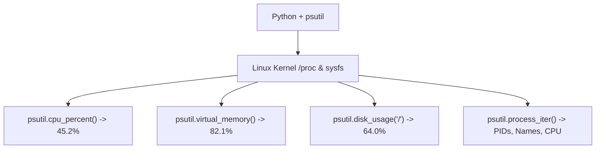

# Lesson 03 — Process Management and System Metrics with `psutil`

## 🎯 What will I learn?
You will learn how to monitor and manage Linux system resources using Python's industry-standard `psutil` library: querying CPU percentage, memory utilization, disk partitions, network statistics, inspecting running processes (PIDs), and safely terminating runaway processes.

---

## 🤔 Why does a DevOps engineer need this?
Monitoring agents (like Datadog, New Relic, and Prometheus exporters) and auto-remediation scripts rely on real-time OS metrics:
- Identifying memory leaks in container worker processes.
- Finding the top 5 CPU-consuming processes on a lagging node.
- Automatically killing orphaned worker processes that hold file locks or database connections.
- Cross-platform metric collection (runs identically on Ubuntu, Amazon Linux, and macOS).

---

## 🧠 Mental model



---

## 📖 Concept

`psutil` (Python System and Process Utilities) interfaces directly with the Linux `/proc` filesystem and OS APIs in C, making it hundreds of times faster and more reliable than parsing raw shell output like `top` or `ps aux | grep`.

### Key `psutil` Methods

| Method | What it returns | DevOps Purpose |
| :--- | :--- | :--- |
| `psutil.cpu_percent(interval=1)` | Float % | CPU usage across all cores |
| `psutil.virtual_memory()` | NamedTuple | Total, used, free, and % RAM |
| `psutil.disk_usage('/')` | NamedTuple | Total, used, free disk on mount |
| `psutil.process_iter(['pid', 'name', 'memory_percent'])` | Generator | Iterating through all active OS processes |
| `proc.terminate()` / `proc.kill()` | Action | Sending SIGTERM / SIGKILL to a runaway process |

---

## 💻 Simple example

```python
import psutil

# Check host CPU and Memory
cpu = psutil.cpu_percent(interval=0.5)
mem = psutil.virtual_memory()

print(f"Host CPU Usage: {cpu}%")
print(f"Host RAM Usage: {mem.percent}% (Used: {round(mem.used / (1024**3), 2)} GB)")
```

---

## 🔧 Real DevOps example (`example.py`)

```python
"""
DevOps Script: Top Resource Hog Identifier & Memory Auditor
"""
import psutil

def audit_system_and_top_processes(top_n=3):
    print("========================================")
    print("       HOST RESOURCE HEALTH AUDIT       ")
    print("========================================")
    
    # 1. System Level Metrics
    cpu_pct = psutil.cpu_percent(interval=0.5)
    mem = psutil.virtual_memory()
    disk = psutil.disk_usage('/')
    
    print(f"Total CPU Load : {cpu_pct}%")
    print(f"Memory Usage   : {mem.percent}% ({round(mem.used / (1024**3), 2)} GB / {round(mem.total / (1024**3), 2)} GB)")
    print(f"Root Disk Usage: {disk.percent}% ({round(disk.used / (1024**3), 2)} GB / {round(disk.total / (1024**3), 2)} GB)")
    print("----------------------------------------")
    
    # 2. Querying Active Processes
    processes = []
    for proc in psutil.process_iter(['pid', 'name', 'memory_percent', 'cpu_percent']):
        try:
            info = proc.info
            # Filter out kernel threads without name
            if info['name']:
                processes.append(info)
        except (psutil.NoSuchProcess, psutil.AccessDenied, psutil.ZombieProcess):
            continue
            
    # Sort processes by memory consumption descending
    top_memory = sorted(processes, key=lambda p: p.get('memory_percent') or 0.0, reverse=True)[:top_n]
    
    print(f"Top {top_n} Memory-Consuming Processes:")
    for rank, p in enumerate(top_memory, start=1):
        mem_pct = round(p.get('memory_percent') or 0.0, 2)
        print(f"  {rank}. PID: {p['pid']:<7} | Process: {p['name']:<20} | Mem: {mem_pct:>5}%")
        
    print("========================================")

if __name__ == "__main__":
    audit_system_and_top_processes(top_n=3)
```

---

## 🖥️ Expected output

```text
$ python example.py
========================================
       HOST RESOURCE HEALTH AUDIT       
========================================
Total CPU Load : 18.4%
Memory Usage   : 64.2% (10.27 GB / 16.00 GB)
Root Disk Usage: 48.6% (121.50 GB / 250.00 GB)
----------------------------------------
Top 3 Memory-Consuming Processes:
  1. PID: 1420    | Process: mysqld               | Mem:  8.45%
  2. PID: 3108    | Process: docker-containerd    | Mem:  4.12%
  3. PID: 4921    | Process: python3              | Mem:  2.30%
========================================
```

---

## 🔍 Line-by-line explanation
- `except (psutil.NoSuchProcess, psutil.AccessDenied, psutil.ZombieProcess):`: Defensive handling for processes that terminate or deny access while the script is iterating.
- `key=lambda p: p.get('memory_percent')`: Uses a lambda function to sort dictionaries by their memory usage.

---

## 🐚 Shell equivalent

```bash
ps aux --sort=-%mem | head -n 4 | awk '{print $2, $11, $4"%"}'
```
*Why `psutil` is better:* Shell command outputs differ across Linux flavours and macOS (`ps` on Alpine vs Ubuntu vs BSD). `psutil` provides a unified, cross-platform Python API.

---

## ⚙️ Ansible equivalent

Ansible gathers system facts (`ansible_facts.memory_mb`, `ansible_facts.processor`) during playbook setup, but does not provide dynamic real-time process monitoring.

---

## 🏆 Which one should I use?
- Use **`psutil`** for monitoring agents, health check daemons, and automated remediation scripts (e.g. killing hung processes).

---

## ⚠️ Common mistakes
1. **Calling `cpu_percent()` without an interval or prior call:**
   - Calling `psutil.cpu_percent()` with default `interval=None` on the first line returns `0.0`. Pass `interval=0.5` or `1.0` to calculate delta.
2. **Failing to catch `psutil.NoSuchProcess`:**
   - In a busy Linux environment, processes spawn and terminate constantly. Always wrap `process_iter()` lookups in a `try...except` block.

---

## 🧪 Practice (Exercise)
Open `exercise.py`. Write a process watchdog function `find_processes_by_name(target_name)` that scans all running processes and returns a list of PIDs matching that name.

---

## 💡 Hint
Use `psutil.process_iter(['pid', 'name'])` and check `if target_name.lower() in info['name'].lower():`.

---

## ✅ Solution
Check `solution.py` after your attempt.

---

## 🎯 Interview questions

### Q: "How do you handle transient processes and permission errors when writing an automated process killer in Python?"
> **Interviewer Focus:** Testing defensive systems engineering and handling race conditions in OS process management.

---

## 🗣️ How to answer in an interview
> *"In Linux, processes can terminate between when you query them and when you attempt an action. When writing an automated remediation script with `psutil`, I always catch `psutil.NoSuchProcess` (the process died naturally), `psutil.AccessDenied` (insufficient privileges for root-owned PIDs), and `psutil.ZombieProcess`. For graceful termination, I first send `SIGTERM` (`proc.terminate()`), wait with `psutil.wait_procs()` for a grace period (e.g. 5 seconds), and only escalate to `SIGKILL` (`proc.kill()`) if the process refuses to exit."*

---

## 📝 What I should remember
- `psutil` is the industry standard for Python system monitoring.
- Always handle `NoSuchProcess` and `AccessDenied` exceptions when inspecting processes.
- Give `cpu_percent(interval=1)` an interval to measure actual CPU delta.
