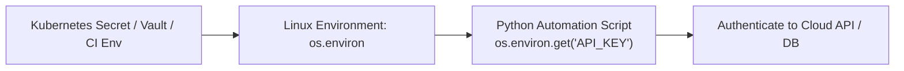

# Lesson 04 — Environment Variables and Secrets Management

## 🎯 What will I learn?
You will learn how to read, validate, and manipulate Linux environment variables in Python using `os.environ`. You will learn how to securely handle API keys, database credentials, CI/CD pipeline secrets (e.g. GitHub Actions, Jenkins), and avoid dangerous hardcoded secrets.

---

## 🤔 Why does a DevOps engineer need this?
The **12-Factor App methodology** dictates that configuration and secrets must be stored in the environment, not in code:

- Reading `AWS_ACCESS_KEY_ID`, `AWS_SECRET_ACCESS_KEY`, and `AWS_REGION`.
- Reading `DATABASE_URL` and `SLACK_WEBHOOK_URL` injected by Kubernetes Secrets or HashiCorp Vault.
- Validating that mandatory environment variables exist before executing a pipeline to prevent silent, partial deployments.

---

## 🧠 Mental model



---

## 📖 Concept

Environment variables are stored in Python's `os.environ` mapping.

### Safe vs Unsafe Variable Retrieval

```python
import os

# 1. Unsafe: Throws KeyError if variable is missing
# api_key = os.environ["API_KEY"]

# 2. Safe with default fallback:
port = int(os.environ.get("APP_PORT", 8080))

# 3. Mandatory secret validator pattern:
def get_required_env(var_name: str) -> str:
    value = os.environ.get(var_name)
    if not value:
        raise ValueError(f"CRITICAL: Missing mandatory environment variable '{var_name}'")
    return value
```

---

## 💻 Simple example

```python
import os

db_host = os.environ.get("DB_HOST", "127.0.0.1")
db_port = int(os.environ.get("DB_PORT", 5432))

print(f"Connecting to {db_host}:{db_port}")
```

---

## 🔧 Real DevOps example (`example.py`)

```python
"""
DevOps Script: CI/CD Pipeline Environment Pre-Flight Validator
Validates mandatory secrets and sanitizes log output (never print secrets!).
"""
import os
import sys

def validate_pipeline_environment():
    print("========================================")
    print("     CI/CD ENVIRONMENT & SECRET AUDIT   ")
    print("========================================")
    
    # 1. Non-sensitive configuration (safe to log)
    environment = os.environ.get("ENVIRONMENT", "staging")
    region = os.environ.get("AWS_REGION", "us-east-1")
    build_id = os.environ.get("BUILD_ID", "local-dev-001")
    
    print(f"Target Environment: {environment}")
    print(f"Deployment Region : {region}")
    print(f"Pipeline Build ID : {build_id}")
    print("----------------------------------------")
    
    # 2. Mandatory Secret Validation (NEVER print raw secrets!)
    required_secrets = ["API_SECRET_KEY", "DATABASE_PASSWORD"]
    missing_secrets = []
    
    for secret_name in required_secrets:
        secret_val = os.environ.get(secret_name)
        if not secret_val:
            print(f"[MISSING] {secret_name:<20} (FAILED)")
            missing_secrets.append(secret_name)
        else:
            # Mask secret in logs for security audit
            masked = secret_val[:2] + "********" + secret_val[-2:] if len(secret_val) > 4 else "********"
            print(f"[LOADED]  {secret_name:<20} -> Masked: {masked}")
            
    print("========================================")
    if missing_secrets:
        print(f"[!] HALTING: Missing mandatory secrets: {missing_secrets}")
        return False
        
    print("[+] Environment pre-flight check passed. Proceeding with deployment.")
    return True

if __name__ == "__main__":
    # Simulate setting one secret for demonstration
    os.environ["API_SECRET_KEY"] = "prod_secret_token_xyz987"
    # DATABASE_PASSWORD is intentionally left unset to show failure handling
    
    is_valid = validate_pipeline_environment()
    sys.exit(0 if is_valid else 1)
```

---

## 🖥️ Expected output

```text
$ python example.py
========================================
     CI/CD ENVIRONMENT & SECRET AUDIT   
========================================
Target Environment: staging
Deployment Region : us-east-1
Pipeline Build ID : local-dev-001
----------------------------------------
[LOADED]  API_SECRET_KEY       -> Masked: pr********87
[MISSING] DATABASE_PASSWORD    (FAILED)
========================================
[!] HALTING: Missing mandatory secrets: ['DATABASE_PASSWORD']
```

---

## 🔍 Line-by-line explanation
- `os.environ.get("ENVIRONMENT", "staging")`: Reads the variable or falls back to `"staging"`.
- `masked = secret_val[:2] + "********" + secret_val[-2:]`: **Secret Masking**. Standard security practice in DevOps pipelines to prove a secret was loaded without leaking it in CI logs.

---

## 🐚 Shell equivalent

```bash
: "${API_SECRET_KEY:?Error: API_SECRET_KEY is not set}"
: "${DATABASE_PASSWORD:?Error: DATABASE_PASSWORD is not set}"
```

---

## ⚙️ Ansible equivalent

```yaml
- name: Verify environment secret is present
  ansible.builtin.assert:
    that:

      - lookup('env', 'API_SECRET_KEY') != ""
    fail_msg: "API_SECRET_KEY environment variable is missing!"
```

---

## 🏆 Which one should I use?
- Use **Python `os.environ`** when writing deployment runners, CLI tools, and microservice entrypoints.
- Always inject secrets via Kubernetes Secrets, AWS Secrets Manager, or CI/CD secret vaults (e.g. GitHub Actions Secrets) rather than embedding them in files or code.

---

## ⚠️ Common mistakes
1. **Hardcoding passwords or tokens in `.py` files:**

   - Git commit history stores hardcoded secrets forever. Always read from `os.environ`.
2. **Printing raw secrets in error tracebacks or logs:**

   - Always mask tokens in output logs (`auth_header[:4] + '...'`).

---

## 🧪 Practice (Exercise)
Open `exercise.py`. Write a configuration loader function `load_aws_config()` that checks for `AWS_ACCESS_KEY_ID`, `AWS_SECRET_ACCESS_KEY`, and `AWS_DEFAULT_REGION` (defaults to `"us-west-2"`). If either key is missing, raise a `ValueError`.

---

## 💡 Hint
Check if `os.environ.get("AWS_ACCESS_KEY_ID")` is `None` or `""`.

---

## ✅ Solution
Check `solution.py` after your attempt.

---

## 🎯 Interview questions

### Q: "How do you securely manage and inject credentials into Python automation scripts running in a CI/CD pipeline or Kubernetes cluster?"
> **Interviewer Focus:** Testing your adherence to 12-factor principles, secret rotation, and preventing credential leaks in logs.

---

## 🗣️ How to answer in an interview
> *"We never hardcode secrets or store them in source repositories. In Kubernetes, secrets are stored in HashiCorp Vault or AWS Secrets Manager and mounted into the pod environment or volume via External Secrets Operator. In GitHub Actions, they are injected as encrypted repository secrets. Inside Python, we read them using `os.environ.get()`, enforce mandatory pre-flight validation, and ensure all logging frameworks explicitly mask or redact secret values before emitting to stdout."*

---

## 📝 What I should remember
- Read variables with `os.environ.get("KEY", "default")`.
- Fail early if mandatory secrets are missing.
- Never log plain-text passwords or API tokens.
