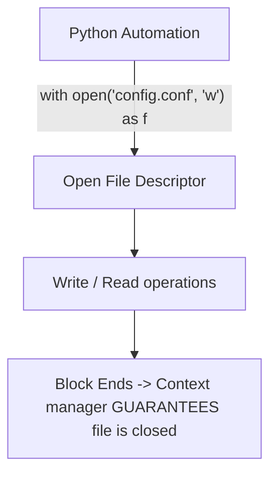

# Lesson 01 — Safe File I/O and Configuration Backups in Python

## 🎯 What will I learn?
You will learn how to read, write, and append files safely using Python's context manager (`with open()`), handle file encodings (`utf-8`), create timestamped configuration backups (`shutil`), and prevent resource leaks.

---

## 🤔 Why does a DevOps engineer need this?
Automating infrastructure requires modifying and creating files constantly:

- Modifying `/etc/hosts` or `/etc/nginx/nginx.conf`.
- Creating automated configuration backups before applying changes (`nginx.conf.bak.2026-08-31`).
- Appending audit logs to `/var/log/automation.log`.
- Ensuring that open file descriptors are closed even if an unexpected exception occurs.

---

## 🧠 Mental model



---

## 📖 Concept

### 1. The Context Manager (`with open()`)
Never use bare `f = open()` because if an exception occurs before `f.close()`, the file descriptor leaks and remains locked by the OS.
Always use `with open(...)`:

```python
# Reading
with open("/etc/app/config.ini", "r", encoding="utf-8") as f:
    content = f.read()

# Writing (overwrites existing content)
with open("deploy.log", "w", encoding="utf-8") as f:
    f.write("Deployment initiated\n")

# Appending (adds to end of file)
with open("deploy.log", "a", encoding="utf-8") as f:
    f.write("Step 1 complete\n")
```

### 2. Backups with `shutil`
```python
import shutil
shutil.copyfile("source.conf", "source.conf.bak")
```

---

## 💻 Simple example

```python
# Write and read a file safely
with open("test_node.txt", "w", encoding="utf-8") as f:
    f.write("node_name=k8s-worker-01\nstatus=ready\n")

with open("test_node.txt", "r", encoding="utf-8") as f:
    for line in f:
        print(f"Read: {line.strip()}")
```

---

## 🔧 Real DevOps example (`example.py`)

```python
"""
DevOps Script: Safe Config File Modifier with Timestamped Backup
Reads a configuration file, creates a backup, and updates a target setting.
"""
import os
import shutil
import time

def update_config_setting(config_path, target_key, new_value):
    print("========================================")
    print("      CONFIG BACKUP & UPDATE UTILITY    ")
    print("========================================")
    
    if not os.path.exists(config_path):
        print(f"[!] ERROR: Target config '{config_path}' not found.")
        return False
        
    # 1. Create a timestamped backup before touching anything
    timestamp = time.strftime("%Y%m%d_%H%M%S")
    backup_path = f"{config_path}.bak.{timestamp}"
    shutil.copyfile(config_path, backup_path)
    print(f"[+] Backup created: {backup_path}")
    
    # 2. Read existing configuration lines
    with open(config_path, "r", encoding="utf-8") as f:
        lines = f.readlines()
        
    updated_lines = []
    found = False
    
    for line in lines:
        if line.strip().startswith(f"{target_key}="):
            updated_lines.append(f"{target_key}={new_value}\n")
            found = True
            print(f"[*] Updated: {line.strip()} -> {target_key}={new_value}")
        else:
            updated_lines.append(line)
            
    if not found:
        # Append new key if not present
        updated_lines.append(f"{target_key}={new_value}\n")
        print(f"[+] Appended new setting: {target_key}={new_value}")
        
    # 3. Write back changes atomically
    with open(config_path, "w", encoding="utf-8") as f:
        f.writelines(updated_lines)
        
    print("[+] Configuration update completed safely.")
    print("========================================")
    return True

if __name__ == "__main__":
    demo_file = "demo_app.conf"
    
    # Create initial demo config
    with open(demo_file, "w", encoding="utf-8") as f:
        f.write("# App Configuration\nPORT=8080\nWORKERS=2\nDEBUG=False\n")
        
    # Update WORKERS from 2 to 4
    update_config_setting(demo_file, "WORKERS", "4")
```

---

## 🖥️ Expected output

```text
$ python example.py
========================================
      CONFIG BACKUP & UPDATE UTILITY    
========================================
[+] Backup created: demo_app.conf.bak.20260831_141400
[*] Updated: WORKERS=2 -> WORKERS=4
[+] Configuration update completed safely.
========================================
```

---

## 🔍 Line-by-line explanation
- `shutil.copyfile(config_path, backup_path)`: Creates an exact duplicate of the file before applying changes.
- `with open(..., "r") as f: lines = f.readlines()`: Reads all lines into a list.
- `with open(..., "w") as f: f.writelines(updated_lines)`: Overwrites the target file with the updated content.

---

## 🐚 Shell equivalent

```bash
# In Bash, creating backups and in-place sed:
cp demo_app.conf "demo_app.conf.bak.$(date +%Y%m%d_%H%M%S)"
sed -i 's/^WORKERS=.*/WORKERS=4/' demo_app.conf
```
*Why Python is safer:* `sed -i` syntax differs between Linux GNU `sed` and macOS BSD `sed` (`sed -i ''` vs `sed -i`), which frequently breaks cross-platform CI pipelines.

---

## ⚙️ Ansible equivalent

```yaml
- name: Update workers in config with backup
  ansible.builtin.lineinfile:
    path: /etc/app/demo_app.conf
    regexp: '^WORKERS='
    line: 'WORKERS=4'
    backup: yes
```

---

## 🏆 Which one should I use?
- Use **Ansible `lineinfile`** when managing configuration files across a fleet of servers.
- Use **Python `with open()`** when dynamically generating configuration files, reports, or data exports during pipeline runs.

---

## ⚠️ Common mistakes
1. **Using `"w"` mode when you intended `"a"` (append):**

   - Opening with `"w"` instantly truncates (wipes) the entire file!
2. **Missing `encoding="utf-8"`:**

   - Causes `UnicodeDecodeError` on Windows runners or minimal Docker images with different default system locales.

---

## 🧪 Practice (Exercise)
Open `exercise.py`. Write a function `append_audit_event(log_file, action, user)` that appends a timestamped entry in the format `[2026-08-31 14:15:00] USER: devops-admin | ACTION: restart_service\n` to the specified log file.

---

## 💡 Hint
Open with `"a"` mode and use `time.strftime("%Y-%m-%d %H:%M:%S")`.

---

## ✅ Solution
Check `solution.py` after your attempt.

---

## 🎯 Interview questions

### Q: "Why is using `with open()` mandatory in production Python scripts compared to manual `open()` and `close()`?"
> **Interviewer Focus:** Testing your understanding of context managers, file descriptor limits (`ulimit -n`), and exception safety.

---

## 🗣️ How to answer in an interview
> *"In Linux, every open file consumes a file descriptor from the process's allocated limit (`ulimit -n`). If a script opens a file manually and an unhandled exception or early return occurs before `.close()`, the file descriptor leaks. The `with open()` context manager implements the `__enter__` and `__exit__` protocol, guaranteeing that the file is safely closed and flushed immediately upon exiting the block, even if a runtime exception is raised."*

---

## 📝 What I should remember
- Always use `with open("path", "mode", encoding="utf-8")`.
- `"r"` = read, `"w"` = overwrite, `"a"` = append.
- Create backups with `shutil.copyfile()` before mutating critical configs.
- Iterate directly over the file object (`for line in f:`) for memory efficiency.
