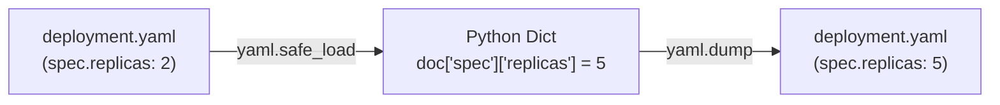

# Lesson 04 — YAML and Configuration Management in DevOps

## 🎯 What will I learn?
You will learn how to read, modify, and generate **YAML (YAML Ain't Markup Language)** files in Python using `PyYAML` (`yaml.safe_load()` and `yaml.dump()`). You will learn how to automate updates to Kubernetes manifests, Docker Compose files, and Helm values.

---

## 🤔 Why does a DevOps engineer need this?
Modern cloud-native configuration is written in YAML:
- **Kubernetes:** Deployments, Services, ConfigMaps, Ingresses.
- **Docker Compose:** `docker-compose.yml` service definitions.
- **CI/CD:** GitHub Actions workflows (`.github/workflows/*.yml`), GitLab CI (`.gitlab-ci.yml`).
- **Ansible:** Playbooks and roles.

Writing Python scripts to programmatically patch container image tags or replica counts across 50 YAML manifests in GitOps repositories saves hours of manual error-prone editing.

---

## 🧠 Mental model



---

## 📖 Concept

Always use `yaml.safe_load()` instead of `yaml.load()` to prevent arbitrary code execution vulnerabilities!

```python
import yaml

# 1. Loading YAML safely from string or file
with open("deployment.yaml", "r", encoding="utf-8") as f:
    config = yaml.safe_load(f)

# 2. Modifying values in Python
config["spec"]["replicas"] = 5

# 3. Dumping back to YAML format
with open("deployment.yaml", "w", encoding="utf-8") as f:
    yaml.dump(config, f, default_flow_style=False, sort_keys=False)
```

---

## 💻 Simple example

```python
import yaml

raw_yaml = """
apiVersion: v1
kind: Service
metadata:
  name: payment-svc
spec:
  ports:
    - port: 80
      targetPort: 8080
"""

doc = yaml.safe_load(raw_yaml)
print(f"Service Name: {doc['metadata']['name']}")
print(f"Target Port : {doc['spec']['ports'][0]['targetPort']}")
```

---

## 🔧 Real DevOps example (`example.py`)

```python
"""
DevOps Script: GitOps CI/CD Image Tag Patcher for Kubernetes Manifests
"""
import yaml

sample_k8s_manifest = """
apiVersion: apps/v1
kind: Deployment
metadata:
  name: auth-service
  namespace: production
spec:
  replicas: 3
  template:
    spec:
      containers:
        - name: auth-container
          image: myregistry.io/auth:v1.0.0
          ports:
            - containerPort: 8080
"""

def patch_manifest_image(manifest_yaml_str, new_image_tag):
    print("========================================")
    print("      KUBERNETES MANIFEST PATCHER       ")
    print("========================================")
    
    # 1. Load YAML safely into dictionary
    doc = yaml.safe_load(manifest_yaml_str)
    
    deployment_name = doc["metadata"]["name"]
    container = doc["spec"]["template"]["spec"]["containers"][0]
    old_image = container["image"]
    
    print(f"Deployment Target : {deployment_name}")
    print(f"Current Image     : {old_image}")
    
    # 2. Patch the image
    container["image"] = new_image_tag
    print(f"Patched Image     : {new_image_tag}\n")
    
    # 3. Serialize back to clean YAML
    updated_yaml = yaml.dump(doc, default_flow_style=False, sort_keys=False)
    
    print("Generated GitOps Manifest:")
    print("----------------------------------------")
    print(updated_yaml)
    print("========================================")
    return updated_yaml

if __name__ == "__main__":
    new_tag = "myregistry.io/auth:v1.1.0-sha.8f2a1b"
    patch_manifest_image(sample_k8s_manifest, new_tag)
```

---

## 🖥️ Expected output

```text
$ python example.py
========================================
      KUBERNETES MANIFEST PATCHER       
========================================
Deployment Target : auth-service
Current Image     : myregistry.io/auth:v1.0.0
Patched Image     : myregistry.io/auth:v1.1.0-sha.8f2a1b

Generated GitOps Manifest:
----------------------------------------
apiVersion: apps/v1
kind: Deployment
metadata:
  name: auth-service
  namespace: production
spec:
  replicas: 3
  template:
    spec:
      containers:
      - name: auth-container
        image: myregistry.io/auth:v1.1.0-sha.8f2a1b
        ports:
        - containerPort: 8080

========================================
```

---

## 🔍 Line-by-line explanation
- `yaml.safe_load(...)`: Reads YAML and handles nested indentations, lists (`-`), and types.
- `default_flow_style=False`: Forces block-style formatting (standard readable YAML) instead of inline JSON-like brackets (`{...}`).
- `sort_keys=False`: Preserves the natural order of YAML keys as written in the manifest.

---

## 🐚 Shell equivalent

```bash
# In Shell, editing YAML requires yq:
yq eval '.spec.template.spec.containers[0].image = "myregistry.io/auth:v1.1.0"' -i deployment.yaml
```

---

## ⚙️ Ansible equivalent

```yaml
- name: Update deployment manifest image
  ansible.builtin.replace:
    path: deployment.yaml
    regexp: 'image: .*'
    replace: 'image: myregistry.io/auth:v1.1.0'
```

---

## 🏆 Which one should I use?
- Use **`yq`** for quick single-value edits in terminal.
- Use **Python with `PyYAML`** when building GitOps promotion automation, validating schema types, or transforming complex multi-document YAML manifests (`yaml.safe_load_all()`).

---

## ⚠️ Common mistakes
1. **Using unsafe `yaml.load(f, Loader=yaml.Loader)`:**
   - Unsafe loader can execute arbitrary Python code embedded in malicious YAML tags (`!!python/object/apply`). Always use `yaml.safe_load()`.
2. **Tab characters in YAML files:**
   - YAML forbids literal tab characters (`\t`). Always use spaces (standard 2 spaces).

---

## 🧪 Practice (Exercise)
Open `exercise.py`. Given a Docker Compose YAML string, write a function that enables health checks on all defined services with `interval: 10s` and `retries: 3`.

---

## 💡 Hint
Iterate over `doc["services"].values()` and assign `service["healthcheck"] = {...}`.

---

## ✅ Solution
Check `solution.py` after your attempt.

---

## 🎯 Interview questions

### Q: "Why is `yaml.load()` considered a major security vulnerability in Python, and how do you protect your automation scripts?"
> **Interviewer Focus:** Testing your understanding of deserialization attacks and secure coding practices in DevOps tooling.

---

## 🗣️ How to answer in an interview
> *"Standard `yaml.load()` in PyYAML is unsafe because it supports full Python object instantiation tags (e.g. `!!python/object/apply:os.system`). If an attacker submits a crafted YAML manifest to an automated CI/CD pipeline or webhook, it can execute arbitrary shell commands on the host. We protect our systems by strictly enforcing `yaml.safe_load()`, which restricts parsing to standard scalar types, lists, and mappings without executing embedded constructors."*

---

## 📝 What I should remember
- Always use `yaml.safe_load()`.
- Use `default_flow_style=False` in `yaml.dump()` for clean block formatting.
- `yaml.safe_load_all()` parses multi-document YAML files separated by `---`.
