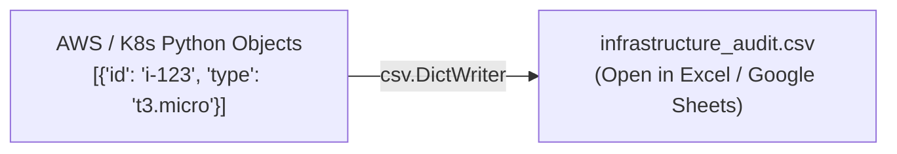

# Lesson 05 — CSV and Audit Reports in DevOps

## 🎯 What will I learn?
You will learn how to read, generate, and export tabular infrastructure audit reports using Python's built-in `csv` module (`csv.reader`, `csv.writer`, `csv.DictReader`, `csv.DictWriter`) for management dashboards and security compliance auditing.

---

## 🤔 Why does a DevOps engineer need this?
Management, security auditors (SOC2/ISO27001), and finance teams require human-readable spreadsheets:

- Exporting monthly AWS EC2 resource and cost audits.
- Generating a weekly list of unpatched servers or open security group ports.
- Ingesting legacy IP allocation tables or datacenter inventory CSV files.

---

## 🧠 Mental model



---

## 📖 Concept

Use `csv.DictWriter` and `csv.DictReader` because they map CSV rows directly to Python dictionaries using header columns.

```python
import csv

# Writing CSV from list of dictionaries
fieldnames = ["server_name", "ip_address", "status"]
rows = [
    {"server_name": "web-01", "ip_address": "10.0.0.1", "status": "active"},
    {"server_name": "db-01", "ip_address": "10.0.0.2", "status": "active"}
]

with open("inventory.csv", "w", newline="", encoding="utf-8") as f:
    writer = csv.DictWriter(f, fieldnames=fieldnames)
    writer.writeheader()
    writer.writerows(rows)
```

---

## 💻 Simple example

```python
import csv

# Reading CSV
with open("inventory.csv", "r", encoding="utf-8") as f:
    reader = csv.DictReader(f)
    for row in reader:
        print(f"Host: {row['server_name']} -> IP: {row['ip_address']}")
```

---

## 🔧 Real DevOps example (`example.py`)

```python
"""
DevOps Script: Multi-Cloud Infrastructure Security & Cost Audit CSV Exporter
"""
import csv
import os

def generate_compliance_csv_report(output_filepath="cloud_security_audit.csv"):
    print("========================================")
    print("     CLOUD SECURITY & COST AUDITOR      ")
    print("========================================")
    
    # Mock aggregated inventory data from AWS/GCP
    infrastructure_records = [
        {"resource_id": "i-0a1b2c3d4e", "resource_type": "EC2 Instance", "region": "us-east-1", "cost_monthly": 142.50, "is_encrypted": True, "status": "COMPLIANT"},
        {"resource_id": "vol-0998877665", "resource_type": "EBS Volume", "region": "us-east-1", "cost_monthly": 24.00, "is_encrypted": False, "status": "NON_COMPLIANT"},
        {"resource_id": "s3-client-backups", "resource_type": "S3 Bucket", "region": "eu-west-1", "cost_monthly": 85.20, "is_encrypted": True, "status": "COMPLIANT"},
        {"resource_id": "rds-postgres-prod", "resource_type": "RDS Instance", "region": "us-west-2", "cost_monthly": 450.00, "is_encrypted": True, "status": "COMPLIANT"}
    ]
    
    fieldnames = ["resource_id", "resource_type", "region", "cost_monthly", "is_encrypted", "status"]
    
    with open(output_filepath, "w", newline="", encoding="utf-8") as f:
        writer = csv.DictWriter(f, fieldnames=fieldnames)
        writer.writeheader()
        writer.writerows(infrastructure_records)
        
    print(f"[+] Audit exported successfully to: {os.path.abspath(output_filepath)}")
    
    # Summary calculations
    total_cost = sum(r["cost_monthly"] for r in infrastructure_records)
    non_compliant = [r for r in infrastructure_records if r["status"] == "NON_COMPLIANT"]
    
    print(f"Total Resources Audited: {len(infrastructure_records)}")
    print(f"Projected Monthly Spend: ${total_cost:.2f}")
    print(f"Non-Compliant Violations: {len(non_compliant)}")
    print("========================================")

if __name__ == "__main__":
    generate_compliance_csv_report()
```

---

## 🖥️ Expected output

```text
$ python example.py
========================================
     CLOUD SECURITY & COST AUDITOR      
========================================
[+] Audit exported successfully to: /home/devops/cloud_security_audit.csv
Total Resources Audited: 4
Projected Monthly Spend: $701.70
Non-Compliant Violations: 1
========================================
```

---

## 🔍 Line-by-line explanation
- `newline=""`: Mandatory parameter in Python's `open()` for CSV files on Windows to prevent blank line insertions between rows.
- `writer.writeheader()`: Automatically writes the top column names (`resource_id`, `region`, etc.).
- `sum(r["cost_monthly"] for r in ...)`: Generator expression to compute total monthly spend effortlessly.

---

## 🐚 Shell equivalent

```bash
# In Shell, writing CSV:
echo "resource_id,resource_type,cost" > audit.csv
echo "i-123,EC2,142.50" >> audit.csv
```
*Why Python is better:* If field values contain commas or quotes (e.g. description fields), raw Shell echo generates broken CSV format. Python's `csv` module handles automatic escaping and quoting.

---

## ⚙️ Ansible equivalent

Ansible uses template rendering (`template: src=audit.j2 dest=audit.csv`) to produce CSV files from host facts.

---

## 🏆 Which one should I use?
- Use **Python `csv.DictWriter`** for automated weekly compliance reports, cost audits, and spreadsheet generation in CI/CD scheduled pipelines.

---

## ⚠️ Common mistakes
1. **Forgetting `newline=""` in `open()`:**

   - Causes an extra empty row after every single line on Windows.
2. **Missing `writeheader()`:**

   - Omits the column names, making the CSV difficult to import into SQL or BI dashboards.

---

## 🧪 Practice (Exercise)
Open `exercise.py`. Write a script that reads an unformatted server inventory list, filters for servers located in `"us-east-1"`, and exports them to `us_east_servers.csv`.

---

## 💡 Hint
Use `csv.DictReader` on the input and `csv.DictWriter` on the output.

---

## ✅ Solution
Check `solution.py` after your attempt.

---

## 🎯 Interview questions

### Q: "Why should you use `csv.DictReader` instead of standard `csv.reader` in automation scripts?"
> **Interviewer Focus:** Testing your defensive coding habits against CSV column reordering.

---

## 🗣️ How to answer in an interview
> *"Standard `csv.reader` returns rows as positional lists (`row[0]`, `row[1]`). If another team or upstream process adds a column or reorders the CSV, index-based code will silently read the wrong data (e.g. reading an IP as a port number). `csv.DictReader` binds values to header column names (`row['ip_address']`), guaranteeing that column order changes will not break our automation logic."*

---

## 📝 What I should remember
- Always set `newline=""` when opening CSV files for writing.
- Use `csv.DictWriter` and `csv.DictReader` to avoid column index errors.
- CSVs are the standard bridge between DevOps automation and business stakeholders.
