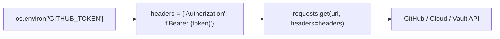

# Lesson 02 — Authentication, Tokens, and Custom Headers

## 🎯 What will I learn?
You will learn how to authenticate against enterprise REST APIs using **Bearer Tokens (OAuth / JWT)**, **API Keys**, and **HTTP Basic Auth**, configure custom headers (e.g. `User-Agent`, `Accept`, `Content-Type`), and interact securely with GitHub, GitLab, and Jira APIs.

---

## 🤔 Why does a DevOps engineer need this?
Almost every production infrastructure endpoint requires authentication:

- Authenticating to GitHub API with Personal Access Tokens (`ghp_...`) to create releases or query pull requests.
- Interacting with Kubernetes API servers using Bearer ServiceAccount tokens.
- Calling HashiCorp Vault APIs with `X-Vault-Token` headers.
- Setting custom `User-Agent` strings so corporate firewalls and rate-limiters don't block automation scripts.

---

## 🧠 Mental model



---

## 📖 Concept

### 1. Bearer Token Authentication (Most Common)
```python
headers = {
    "Authorization": f"Bearer {token}",
    "Accept": "application/vnd.github.v3+json",
    "User-Agent": "DevOps-Automation-Bot/1.0"
}
response = requests.get(api_url, headers=headers, timeout=5)
```

### 2. HTTP Basic Auth
```python
from requests.auth import HTTPBasicAuth
response = requests.get(api_url, auth=HTTPBasicAuth("jenkins_user", "api_token"), timeout=5)
```

---

## 💻 Simple example

```python
import requests
import os

token = os.environ.get("GITHUB_TOKEN", "dummy_token")
headers = {"Authorization": f"Bearer {token}"}

response = requests.get("https://httpbin.org/bearer", headers=headers, timeout=5)
print(f"Auth Status: {response.status_code}") # 200 if valid bearer passed
```

---

## 🔧 Real DevOps example (`example.py`)

```python
"""
DevOps Script: GitHub Release & Pull Request Audit Client
Demonstrates authenticated REST API requests with headers and error handling.
"""
import requests
import os

def fetch_github_repo_info(owner="kubernetes", repo="kubernetes"):
    print("========================================")
    print("       GITHUB REPO RELEASE AUDITOR      ")
    print("========================================")
    
    token = os.environ.get("GITHUB_TOKEN")
    api_url = f"https://api.github.com/repos/{owner}/{repo}"
    
    headers = {
        "Accept": "application/vnd.github.v3+json",
        "User-Agent": "DevOps-Audit-Script/1.0"
    }
    
    # Inject Bearer token if present in environment
    if token:
        headers["Authorization"] = f"Bearer {token}"
        print("[*] Authenticating with provided GITHUB_TOKEN.")
    else:
        print("[*] Running unauthenticated (subject to lower public rate limits).")
        
    try:
        response = requests.get(api_url, headers=headers, timeout=5)
        
        # Check rate limit headers returned by GitHub
        rate_remaining = response.headers.get("X-RateLimit-Remaining", "N/A")
        print(f"API Rate Limit Remaining: {rate_remaining}")
        
        if response.status_code == 200:
            data = response.json()
            print(f"Repository   : {data['full_name']}")
            print(f"Description  : {data['description']}")
            print(f"Stars Count  : {data['stargazers_count']}")
            print(f"Open Issues  : {data['open_issues_count']}")
            print(f"Default Branch: {data['default_branch']}")
            return True
        elif response.status_code == 401:
            print("[!] AUTHENTICATION ERROR: Invalid or expired GitHub token.")
            return False
        elif response.status_code == 403:
            print("[!] RATE LIMIT REACHED: GitHub API rate limit exceeded.")
            return False
        else:
            print(f"[!] API Error: Received HTTP {response.status_code}")
            return False
            
    except requests.exceptions.RequestException as err:
        print(f"[!] Network Error: {err}")
        return False
        
    print("========================================")

if __name__ == "__main__":
    fetch_github_repo_info("torvalds", "linux")
```

---

## 🖥️ Expected output

```text
$ python example.py
========================================
       GITHUB REPO RELEASE AUDITOR      
========================================
[*] Running unauthenticated (subject to lower public rate limits).
API Rate Limit Remaining: 59
Repository   : torvalds/linux
Description  : Linux kernel source tree
Stars Count  : 178420
Open Issues  : 345
Default Branch: master
```

---

## 🔍 Line-by-line explanation
- `headers["Authorization"] = f"Bearer {token}"`: Standard format for OAuth/JWT tokens.
- `response.headers.get("X-RateLimit-Remaining")`: Reads HTTP response headers to prevent hitting API quotas.
- `User-Agent`: Custom header identifying the automation script.

---

## 🐚 Shell equivalent

```bash
curl -H "Authorization: Bearer $GITHUB_TOKEN" \
     -H "Accept: application/vnd.github.v3+json" \
     https://api.github.com/repos/torvalds/linux
```

---

## ⚙️ Ansible equivalent

```yaml
- name: Query GitHub API
  ansible.builtin.uri:
    url: "https://api.github.com/repos/torvalds/linux"
    headers:
      Authorization: "Bearer {{ lookup('env', 'GITHUB_TOKEN') }}"
```

---

## 🏆 Which one should I use?
- Use **Python `requests`** whenever API interactions require dynamic token refresh, pagination across 50 pages of results, or complex header signing (e.g. AWS SigV4).

---

## ⚠️ Common mistakes
1. **Hardcoding tokens in header dictionaries:**

   - Always read tokens via `os.environ.get("TOKEN_NAME")`.
2. **Missing `Bearer ` prefix:**

   - Many APIs require the word `Bearer` followed by a space before the token string (`f"Bearer {token}"`).

---

## 🧪 Practice (Exercise)
Open `exercise.py`. Write a function `authenticate_to_vault(vault_url, vault_token)` that sends a GET request to `{vault_url}/v1/sys/health` using the header `{"X-Vault-Token": vault_token}`. Return `True` if HTTP status is 200, otherwise `False`.

---

## 💡 Hint
Set headers `headers = {"X-Vault-Token": vault_token}`.

---

## ✅ Solution
Check `solution.py` after your attempt.

---

## 🎯 Interview questions

### Q: "How do you handle API rate limits and token expiry when automating interactions with cloud APIs in Python?"
> **Interviewer Focus:** Testing your understanding of HTTP 429 status codes, exponential backoff, and token caching.

---

## 🗣️ How to answer in an interview
> *"To handle rate limits, I inspect response headers like `X-RateLimit-Remaining` and `Retry-After`. If a request returns HTTP 429 (Too Many Requests), the script parses `Retry-After` and sleeps before retrying with exponential backoff and jitter. For token expiry (like short-lived AWS STS or Vault tokens), I implement a token management helper that caches the token and proactively refreshes it 5 minutes before the `expires_in` epoch timestamp to avoid mid-pipeline authentication failures."*

---

## 📝 What I should remember
- Pass tokens via `headers={"Authorization": f"Bearer {token}"}`.
- Inspect `response.headers` for rate limits and debug information.
- Always load API tokens from environment variables.
