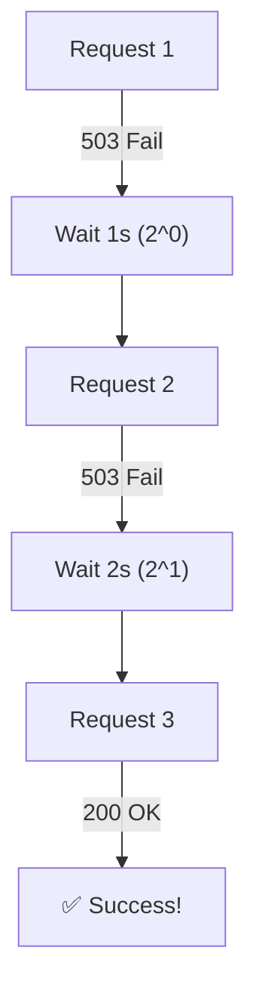

# Lesson 03 — Handling Retries, Exponential Backoff, and Timeouts

## 🎯 What will I learn?
You will learn how to build resilient API automation scripts using **Exponential Backoff**, **Jitter**, and `urllib3.util.Retry` with `requests.Session()`. You will learn how to gracefully survive transient network hiccups, rate-limits (`429`), and server overload errors (`502`, `503`, `504`).

---

## 🤔 Why does a DevOps engineer need this?
Cloud networks and microservices are inherently unreliable:
- AWS or Kubernetes API servers occasionally drop connections or rate-limit requests.
- If a CI/CD pipeline fails immediately on the first transient network timeout, builds fail unnecessarily (flaky pipelines).
- Retrying immediately in a tight loop floods the overloaded server (the **Thundering Herd Problem**).
- Implementing **Exponential Backoff** (waiting 1s, 2s, 4s, 8s...) gives the backend server time to recover.

---

## 🧠 Mental model



---

## 📖 Concept

### 1. The Production-Grade `requests.Session` with Built-in Retries

Using `urllib3.util.Retry` mounts an automatic retry strategy directly onto the HTTP session adapter:

```python
import requests
from requests.adapters import HTTPAdapter
from urllib3.util import Retry

def create_resilient_session(retries=3, backoff_factor=1.0):
    session = requests.Session()
    retry_strategy = Retry(
        total=retries,
        backoff_factor=backoff_factor,
        status_forcelist=[429, 500, 502, 503, 504],
        allowed_methods=["HEAD", "GET", "OPTIONS", "POST"]
    )
    adapter = HTTPAdapter(max_retries=retry_strategy)
    session.mount("https://", adapter)
    session.mount("http://", adapter)
    return session
```

---

## 💻 Simple example

```python
import time

def manual_retry(max_attempts=3):
    for attempt in range(1, max_attempts + 1):
        try:
            print(f"Attempt #{attempt}...")
            # Simulate network call
            break
        except Exception:
            delay = 2 ** attempt
            print(f"Failed. Sleeping {delay}s...")
            time.sleep(delay)
```

---

## 🔧 Real DevOps example (`example.py`)

```python
"""
DevOps Script: Resilient Cloud API Poller with Exponential Backoff
"""
import requests
from requests.adapters import HTTPAdapter
from urllib3.util import Retry
import time

def get_resilient_session(max_retries=3, backoff=0.5):
    session = requests.Session()
    retry_strategy = Retry(
        total=max_retries,
        backoff_factor=backoff,
        status_forcelist=[429, 500, 502, 503, 504],
        raise_on_status=False
    )
    adapter = HTTPAdapter(max_retries=retry_strategy)
    session.mount("https://", adapter)
    session.mount("http://", adapter)
    return session

def poll_microservice_readiness(url, max_attempts=4):
    print("========================================")
    print("     RESILIENT API POLLING SERVICE      ")
    print("========================================")
    
    session = get_resilient_session(max_retries=2, backoff=0.3)
    
    for attempt in range(1, max_attempts + 1):
        print(f"[*] [Probe {attempt}/{max_attempts}] Querying: {url}")
        try:
            # Setting separate connect and read timeouts: (connect_timeout, read_timeout)
            response = session.get(url, timeout=(2.0, 5.0))
            print(f"    Response Status: HTTP {response.status_code}")
            
            if response.status_code == 200:
                print("[+] Service reached READY state.")
                return True
            else:
                print(f"    Service in degraded state (HTTP {response.status_code}).")
                
        except requests.exceptions.RequestException as err:
            print(f"    [!] Connection error: {err}")
            
        # Exponential backoff delay: 1s, 2s, 4s...
        delay = 2 ** (attempt - 1)
        print(f"    Backing off for {delay} seconds...\n")
        time.sleep(delay)
        
    print("[!] TIMEOUT: Service failed readiness probes.")
    print("========================================")
    return False

if __name__ == "__main__":
    poll_microservice_readiness("https://httpbin.org/status/200", max_attempts=2)
```

---

## 🖥️ Expected output

```text
$ python example.py
========================================
     RESILIENT API POLLING SERVICE      
========================================
[*] [Probe 1/2] Querying: https://httpbin.org/status/200
    Response Status: HTTP 200
[+] Service reached READY state.
```

---

## 🔍 Line-by-line explanation
- `status_forcelist=[429, 500, 502, 503, 504]`: Specifies exactly which HTTP status codes trigger automatic retries (transient errors and rate limits).
- `backoff_factor=0.5`: Automatically calculates sleep interval: `backoff_factor * (2 ** (retry_number - 1))`.
- `timeout=(2.0, 5.0)`: Sets 2 seconds for TCP socket handshake, 5 seconds for receiving response bytes.

---

## 🐚 Shell equivalent

```bash
# In Bash, curl has built-in retry flags:
curl --retry 3 --retry-delay 2 --retry-connrefused https://api.internal.net/health
```

---

## ⚙️ Ansible equivalent

```yaml
- name: Query API with retries and delay
  ansible.builtin.uri:
    url: https://api.internal.net/health
    status_code: 200
  register: result
  until: result.status == 200
  retries: 5
  delay: 3
```

---

## 🏆 Which one should I use?
- Use **Python `requests.Session` with `HTTPAdapter`** for high-volume API automation, metric scrapers, and cloud SDK tools where connection pooling (`keep-alive`) and structured retry policies are mandatory.

---

## ⚠️ Common mistakes
1. **Retrying non-idempotent `POST` requests blindly:**
   - Retrying a failed `POST /charge-credit-card` without idempotency keys might charge the customer multiple times. Only retry safe idempotent verbs (`GET`, `PUT`, `DELETE`) unless an idempotency key is included.
2. **Retrying on 4xx Client Errors (`400`, `401`, `404`):**
   - Retrying a 404 Not Found or 401 Unauthorized is pointless—it will never succeed without changing the request. Only retry 429 and 5xx.

---

## 🧪 Practice (Exercise)
Open `exercise.py`. Write a retry decorator or function `fetch_with_backoff(url, retries=3)` that retries a request with exponential backoff (`delay = 2 ** attempt`), catching `requests.exceptions.Timeout` and `requests.exceptions.ConnectionError`.

---

## 💡 Hint
Loop `for attempt in range(retries):`, call `time.sleep(2 ** attempt)` inside the `except` block.

---

## ✅ Solution
Check `solution.py` after your attempt.

---

## 🎯 Interview questions

### Q: "What is exponential backoff and jitter, and why is it critical when communicating with AWS or Kubernetes APIs?"
> **Interviewer Focus:** Testing your understanding of distributed systems failure recovery and the thundering herd problem.

---

## 🗣️ How to answer in an interview
> *"Exponential backoff doubles the wait time between successive failed attempts (1s, 2s, 4s, 8s), preventing client scripts from hammering an already struggling backend service. Adding 'jitter' (a random interval variance) ensures that if 100 worker pods lose connectivity simultaneously, they don't all retry at the exact same sub-second interval. This de-synchronizes traffic spikes, allowing the backend API or database to recover gracefully."*

---

## 📝 What I should remember
- Use `urllib3.util.Retry` with `HTTPAdapter` on `requests.Session()`.
- Only retry transient status codes: `429`, `500`, `502`, `503`, `504`.
- Never retry `400 Bad Request` or `401 Unauthorized`.
- Separate connect timeout from read timeout: `timeout=(3.0, 10.0)`.
