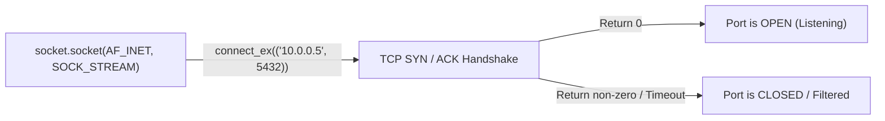

# Lesson 04 — Sockets, TCP Port Probing, and Network Reachability

## 🎯 What will I learn?
You will learn low-level TCP network automation using Python's built-in `socket` module (`socket.socket()`, `connect_ex()`, timeouts). You will learn how to build high-speed port scanners, verify database reachability without installing heavy database client drivers, and audit security firewall rules.

---

## 🤔 Why does a DevOps engineer need this?
Before an application boots, automation scripts must verify that upstream services are reachable:
- Checking if MySQL on port `3306` or PostgreSQL on port `5432` is accepting connections from a newly provisioned container.
- Verifying SSH (`port 22`) or HTTPS (`port 443`) connectivity across a VPC peering connection.
- Auditing security group configurations to ensure unauthorized ports (`8080`, `9200`, `6379`) are closed to the public internet.

---

## 🧠 Mental model



---

## 📖 Concept

Using `socket.connect_ex()` is preferred over `socket.connect()` because it returns an error indicator (`0` for success) instead of raising an unhandled exception.

```python
import socket

def is_port_open(host: str, port: int, timeout_sec: float = 2.0) -> bool:
    with socket.socket(socket.AF_INET, socket.SOCK_STREAM) as s:
        s.settimeout(timeout_sec)
        # connect_ex returns 0 if connection succeeds!
        return s.connect_ex((host, port)) == 0
```

---

## 💻 Simple example

```python
import socket

# Test public DNS port
s = socket.socket(socket.AF_INET, socket.SOCK_STREAM)
s.settimeout(1.5)
result = s.connect_ex(("8.8.8.8", 53))
print(f"Google DNS Port 53 Open: {result == 0}")
s.close()
```

---

## 🔧 Real DevOps example (`example.py`)

```python
"""
DevOps Script: High-Speed Multi-Host TCP Port Scanner & Reachability Auditor
"""
import socket

def audit_infrastructure_ports(target_host, ports_to_scan):
    print("========================================")
    print("      TCP PORT REACHABILITY AUDIT       ")
    print("========================================")
    print(f"Target Host: {target_host}")
    
    # Resolve hostname to IP
    try:
        ip_addr = socket.gethostbyname(target_host)
        print(f"Resolved IP: {ip_addr}\n")
    except socket.gaierror:
        print(f"[!] DNS RESOLUTION ERROR: Unable to resolve '{target_host}'")
        return False
        
    results = {}
    
    for port, label in ports_to_scan.items():
        with socket.socket(socket.AF_INET, socket.SOCK_STREAM) as sock:
            sock.settimeout(1.5)
            # connect_ex returns 0 on successful TCP handshake
            status_code = sock.connect_ex((ip_addr, port))
            
            is_open = status_code == 0
            results[port] = is_open
            
            tag = "[OPEN]  " if is_open else "[CLOSED]"
            print(f"{tag} Port {port:<5} ({label})")
            
    print("========================================")
    open_count = sum(1 for status in results.values() if status)
    print(f"Audit Summary: {open_count}/{len(ports_to_scan)} ports listening.")
    print("========================================")
    return results

if __name__ == "__main__":
    standard_devops_ports = {
        80: "HTTP",
        443: "HTTPS",
        22: "SSH",
        3306: "MySQL",
        5432: "PostgreSQL",
        8080: "App Server"
    }
    
    audit_infrastructure_ports("1.1.1.1", standard_devops_ports)
```

---

## 🖥️ Expected output

```text
$ python example.py
========================================
      TCP PORT REACHABILITY AUDIT       
========================================
Target Host: 1.1.1.1
Resolved IP: 1.1.1.1

[OPEN]   Port 80    (HTTP)
[OPEN]   Port 443   (HTTPS)
[CLOSED] Port 22    (SSH)
[CLOSED] Port 3306  (MySQL)
[CLOSED] Port 5432  (PostgreSQL)
[CLOSED] Port 8080  (App Server)
========================================
Audit Summary: 2/6 ports listening.
========================================
```

---

## 🔍 Line-by-line explanation
- `socket.AF_INET`: Specifies IPv4 addressing.
- `socket.SOCK_STREAM`: Specifies TCP protocol (use `SOCK_DGRAM` for UDP).
- `s.settimeout(1.5)`: Prevents network scans from blocking on dropped packets or firewall tarpits.
- `sock.connect_ex((ip_addr, port))`: Performs the TCP SYN/ACK handshake. Returns `0` if successful.

---

## 🐚 Shell equivalent

```bash
# In Bash, port testing via nc or /dev/tcp:
nc -z -v -w 2 1.1.1.1 443
# or pure bash:
timeout 2 bash -c "</dev/tcp/1.1.1.1/443" && echo "Open" || echo "Closed"
```
*Why Python is better:* `nc` (netcat) has different flags on GNU vs OpenBSD vs BusyBox containers. Bash `/dev/tcp` is often disabled in hardened container shells. Python `socket` works reliably on all environments without external binary dependencies.

---

## ⚙️ Ansible equivalent

```yaml
- name: Wait for database port to become reachable
  ansible.builtin.wait_for:
    host: 10.0.0.5
    port: 5432
    state: started
    timeout: 30
```

---

## 🏆 Which one should I use?
- Use **Ansible `wait_for`** in server provisioning playbooks.
- Use **Python `socket`** inside initialization containers, pre-flight health scripts, and security scanning tools.

---

## ⚠️ Common mistakes
1. **Using `socket.connect()` without try/except:**
   - Raises `ConnectionRefusedError` or `TimeoutError` and crashes. Use `socket.connect_ex()` which cleanly returns an integer error code instead.
2. **Forgetting to set a socket timeout:**
   - Without `sock.settimeout()`, scanning a firewalled IP will hang for the default OS TCP timeout (often 2 minutes).

---

## 🧪 Practice (Exercise)
Open `exercise.py`. Write a pre-flight database dependency checker `wait_for_db(host, port, max_wait_sec=5)` that probes a database port once per second until it becomes open or the maximum wait time is exceeded.

---

## 💡 Hint
Use a `while` loop, track elapsed time with `time.time()`, call `is_port_open()`, and sleep 1 second between attempts.

---

## ✅ Solution
Check `solution.py` after your attempt.

---

## 🎯 Interview questions

### Q: "How would you check if a remote port is reachable from Python without installing third-party packages or CLI tools like telnet or netcat?"
> **Interviewer Focus:** Testing your standard library networking knowledge and container security awareness (minimal container environments without netcat).

---

## 🗣️ How to answer in an interview
> *"I use Python's built-in `socket` module. By creating a standard TCP stream socket (`socket.socket(socket.AF_INET, socket.SOCK_STREAM)`), setting an explicit connection timeout, and calling `socket.connect_ex((host, port))`, we can test TCP reachability directly. `connect_ex` returns `0` if the connection succeeds and an errno on failure without throwing unhandled exceptions. Because this uses only the standard library, it runs seamlessly in zero-dependency distroless or minimal Alpine containers where `nc` or `telnet` are absent."*

---

## 📝 What I should remember
- Use `socket.connect_ex((host, port)) == 0` to check if a TCP port is open.
- Always set `sock.settimeout(seconds)`.
- Use standard library `socket` for zero-dependency container health checks.
