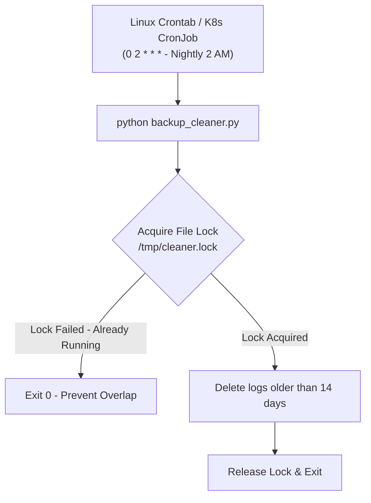

# Lesson 02 — Scheduled Automation, Cron, and Background Jobs

## 🎯 What will I learn?
You will learn how to automate scheduled maintenance tasks in Linux and Python: understanding Linux crontabs (`/etc/cron.d/`), designing idempotent background cleanup jobs, handling concurrent execution using file locks (`fcntl`), and scheduling periodic health checks.

---

## 🤔 Why does a DevOps engineer need this?
Automated housekeeping is essential for system stability:
- Purging application logs older than 14 days from `/var/log/`.
- Rotating database backups every night at 2:00 AM.
- Preventing duplicate concurrent cron runs when a script takes longer to finish than its scheduling interval (Cron overlap / Race condition).

---

## 🧠 Mental model



---

## 📖 Concept

### 1. The File Lock Pattern (Preventing Duplicate Runs)
If a cron job scheduled every 5 minutes takes 8 minutes to process, a second instance starts while the first is still running, leading to race conditions and high CPU load.
Python's standard file-locking pattern avoids this:

```python
import os
import sys

LOCK_FILE = "/tmp/automation_task.lock"

def acquire_simple_lock(lock_path):
    if os.path.exists(lock_path):
        print(f"[!] Another instance is currently running (Lock: {lock_path}). Exiting.")
        return False
    with open(lock_path, "w") as f:
        f.write(str(os.getpid()))
    return True

def release_simple_lock(lock_path):
    if os.path.exists(lock_path):
        os.remove(lock_path)
```

---

## 💻 Simple example

```python
import os
import time

# Delete files older than N seconds in a directory
target_dir = "./temp_logs"
cutoff_time = time.time() - (7 * 86400) # 7 days in seconds

# os.path.getmtime(filepath) gets the last modified timestamp
```

---

## 🔧 Real DevOps example (`example.py`)

```python
"""
DevOps Script: Automated Log Retention Cleaner with Overlap Lock Protection
Finds and purges log files older than a specified retention period (days).
"""
import os
import time

def purge_old_log_files(target_dir, retention_days=14, dry_run=False):
    print("========================================")
    print("       LOG RETENTION & PURGE AUDIT      ")
    print("========================================")
    print(f"Target Directory: {os.path.abspath(target_dir)}")
    print(f"Retention Period: {retention_days} days (Dry-Run: {dry_run})\n")
    
    if not os.path.exists(target_dir):
        print(f"[!] Directory '{target_dir}' does not exist.")
        return 0
        
    cutoff_timestamp = time.time() - (retention_days * 86400)
    purged_count = 0
    reclaimed_bytes = 0
    
    for filename in os.listdir(target_dir):
        if not filename.endswith(".log"):
            continue
            
        full_path = os.path.join(target_dir, filename)
        if not os.path.isfile(full_path):
            continue
            
        mtime = os.path.getmtime(full_path)
        file_size = os.path.getsize(full_path)
        age_days = round((time.time() - mtime) / 86400, 1)
        
        if mtime < cutoff_timestamp:
            purged_count += 1
            reclaimed_bytes += file_size
            if dry_run:
                print(f"[DRY-RUN] Would delete: {filename:<25} (Age: {age_days} days, Size: {file_size} bytes)")
            else:
                os.remove(full_path)
                print(f"[DELETED] Purged: {filename:<25} (Age: {age_days} days, Reclaimed: {file_size} bytes)")
        else:
            print(f"[KEPT]    Retained: {filename:<23} (Age: {age_days} days)")
            
    print("----------------------------------------")
    reclaimed_mb = round(reclaimed_bytes / (1024 ** 2), 2)
    print(f"Purge Summary : {purged_count} files removed.")
    print(f"Space Reclaimed: {reclaimed_mb} MB")
    print("========================================")
    return purged_count

if __name__ == "__main__":
    demo_dir = "./mock_log_dir"
    os.makedirs(demo_dir, exist_ok=True)
    
    # Create sample logs: 1 old log, 1 recent log
    old_log = os.path.join(demo_dir, "app_old.log")
    recent_log = os.path.join(demo_dir, "app_recent.log")
    
    with open(old_log, "w") as f:
        f.write("Old log entry data\n" * 100)
    with open(recent_log, "w") as f:
        f.write("Recent log entry data\n" * 100)
        
    # Artificially set old log modified time to 20 days ago
    twenty_days_ago = time.time() - (20 * 86400)
    os.utime(old_log, (twenty_days_ago, twenty_days_ago))
    
    purge_old_log_files(demo_dir, retention_days=14, dry_run=False)
```

---

## 🖥️ Expected output

```text
$ python example.py
========================================
       LOG RETENTION & PURGE AUDIT      
========================================
Target Directory: /home/devops/mock_log_dir
Retention Period: 14 days (Dry-Run: False)

[DELETED] Purged: app_old.log               (Age: 20.0 days, Reclaimed: 1900 bytes)
[KEPT]    Retained: app_recent.log            (Age: 0.0 days)
----------------------------------------
Purge Summary : 1 files removed.
Space Reclaimed: 0.00 MB
========================================
```

---

## 🔍 Line-by-line explanation
- `retention_days * 86400`: `86400` is the exact number of seconds in a standard 24-hour day ($60 \times 60 \times 24$).
- `os.path.getmtime(full_path)`: Queries the Linux inode for the file's last modified timestamp in Unix epoch seconds.
- `os.utime(...)`: Updates access/modification times (useful for testing retention scripts).

---

## 🐚 Shell equivalent

```bash
# In Bash, log purging uses find:
find /var/log/app -name "*.log" -type f -mtime +14 -delete
```

---

## ⚙️ Ansible equivalent

```yaml
- name: Schedule nightly log retention cron job
  ansible.builtin.cron:
    name: "Nightly Log Purge"
    minute: "0"
    hour: "2"
    job: "python3 /opt/scripts/purge_logs.py --dir /var/log/app --retention 14"
```

---

## 🏆 Which one should I use?
- Use **Linux `find -mtime +N -delete`** for standard local file deletions.
- Use **Python** when file deletion must verify cloud archival (e.g. "Only delete local log if S3 backup copy exists"), log deletion audits to Slack, or calculate reclaimed disk metrics.

---

## ⚠️ Common mistakes
1. **Accidental recursive directory deletion:**
   - Always verify `os.path.isfile(path)` so you never delete entire subdirectories accidentally.
2. **Timezone mismatch bugs:**
   - Always use epoch timestamps (`time.time()`) rather than parsing formatted local date strings for file retention math.

---

## 🧪 Practice (Exercise)
Open `exercise.py`. Write a lock-protected script runner `run_with_lock(lock_file, task_function)` that creates a lock file containing the current PID. If the lock file already exists, abort execution. Ensure the lock file is removed even if `task_function()` raises an exception.

---

## 💡 Hint
Use `try...finally:` block to guarantee lock file deletion.

---

## ✅ Solution
Check `solution.py` after your attempt.

---

## 🎯 Interview questions

### Q: "How do you prevent overlapping cron execution in distributed Linux automation?"
> **Interviewer Focus:** Testing your understanding of file locks (`flock`, `fcntl`), race conditions, and distributed locks (Redis / Consul / S3 locks).

---

## 🗣️ How to answer in an interview
> *"On a single Linux host, we prevent overlapping cron runs using file locking via `fcntl.flock(f, fcntl.LOCK_EX | fcntl.LOCK_NB)` in Python or the `flock` Linux utility. If another process holds the exclusive lock, the new run exits immediately. In a distributed multi-node cloud environment (e.g. Kubernetes CronJobs or multiple EC2 workers), we use distributed locking via Redis (`Redlock`) or AWS DynamoDB conditional writes to ensure only one worker processes the task."*

---

## 📝 What I should remember
- Multiply days by `86400` to convert to epoch seconds.
- Use `os.path.getmtime()` for file age.
- Always use `try...finally` to clean up PID/lock files.
