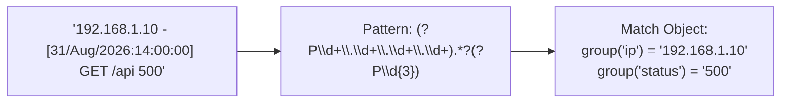

# Lesson 04 — Regular Expressions (`re`) for DevOps Log Parsing

## 🎯 What will I learn?
You will learn the practical subset of **Regular Expressions (Regex)** essential for DevOps engineers using Python's built-in `re` module (`re.search()`, `re.findall()`, `re.compile()`, named capture groups). You will learn how to extract IPv4 addresses, ISO timestamps, HTTP status codes, and container IDs from messy production logs.

---

## 🤔 Why does a DevOps engineer need this?
Log files from legacy applications and unformatted syslogs don't follow clean JSON or CSV standards:

- Extracting IP addresses attacking an Nginx web server: `\b\d{1,3}\.\d{1,3}\.\d{1,3}\.\d{1,3}\b`.
- Parsing stack traces to isolate error classes: `r"Exception in thread .*?: (.*)"`.
- Validating semantic version strings in CI/CD tags: `r"^v\d+\.\d+\.\d+$"`.

---

## 🧠 Mental model



---

## 📖 Concept

### The 6 Essential Regex Patterns for DevOps

| Target | Regex Pattern | Example Match |
| :--- | :--- | :--- |
| **IPv4 Address** | `\b\d{1,3}\.\d{1,3}\.\d{1,3}\.\d{1,3}\b` | `10.0.0.1`, `192.168.1.50` |
| **HTTP Status Code** | `\b[1-5]\d{2}\b` | `200`, `404`, `503` |
| **ISO Timestamp** | `\d{4}-\d{2}-\d{2}T\d{2}:\d{2}:\d{2}` | `2026-08-31T14:18:00` |
| **Semantic Version** | `v?\d+\.\d+\.\d+(-[a-zA-Z0-9.]+)?` | `v1.2.3`, `2.0.0-rc1` |
| **UUID / Trace ID** | `[a-f0-9]{8}-[a-f0-9]{4}-[a-f0-9]{4}-[a-f0-9]{4}-[a-f0-9]{12}` | `550e8400-e29b-41d4-a716-446655440000` |
| **Docker Short SHA** | `\b[a-f0-9]{7,12}\b` | `8f2a1b9c` |

### Named Capture Groups (`(?P<name>pattern)`)
Named groups make regex self-documenting and prevent brittle numerical group index bugs:

```python
import re

log_pattern = re.compile(r"(?P<ip>\d{1,3}\.\d{1,3}\.\d{1,3}\.\d{1,3}) - - \[(?P<timestamp>.*?)\] \"(?P<method>[A-Z]+) (?P<path>.*?)\" (?P<status>\d{3})")
match = log_pattern.search(line)
if match:
    print(match.group("ip"), match.group("status"))
```

---

## 💻 Simple example

```python
import re

text = "Build triggered by git tag v2.4.1 for commit a1b2c3d"
tag_match = re.search(r"v\d+\.\d+\.\d+", text)
if tag_match:
    print(f"Detected Release Tag: {tag_match.group(0)}")  # 'v2.4.1'
```

---

## 🔧 Real DevOps example (`example.py`)

```python
"""
DevOps Script: Nginx Web Server Access Log RegEx Parser
Extracts IP addresses, HTTP methods, endpoints, and error status codes using named groups.
"""
import re

nginx_log_samples = [
    '192.168.1.100 - - [31/Aug/2026:14:10:02 +0000] "GET /api/v1/health HTTP/1.1" 200 45 "-" "curl/7.68.0"',
    '10.0.5.22 - - [31/Aug/2026:14:10:05 +0000] "POST /api/v1/auth/login HTTP/1.1" 401 120 "-" "Mozilla/5.0"',
    '45.33.32.156 - - [31/Aug/2026:14:10:09 +0000] "GET /admin.php HTTP/1.1" 404 180 "-" "ScannerBot/2.0"',
    '192.168.1.105 - - [31/Aug/2026:14:10:14 +0000] "POST /api/v1/checkout HTTP/1.1" 500 512 "-" "AppClient/3.1"'
]

def parse_nginx_logs(logs):
    print("========================================")
    print("      REGEX NGINX ACCESS LOG AUDITOR    ")
    print("========================================")
    
    # Compile regex once for high performance
    pattern = re.compile(
        r'^(?P<client_ip>\d{1,3}(?:\.\d{1,3}){3})\s+-\s+-\s+\[(?P<timestamp>[^\]]+)\]\s+"(?P<method>[A-Z]+)\s+(?P<endpoint>\S+)[^"]*"\s+(?P<status>\d{3})\s+(?P<bytes_sent>\d+)'
    )
    
    for line in logs:
        match = pattern.search(line)
        if match:
            ip = match.group("client_ip")
            method = match.group("method")
            endpoint = match.group("endpoint")
            status = int(match.group("status"))
            
            tag = "[ERROR]  " if status >= 400 else "[OK]     "
            print(f"{tag} IP: {ip:<15} | Status: {status} | Request: {method} {endpoint}")
            
    print("========================================")

if __name__ == "__main__":
    parse_nginx_logs(nginx_log_samples)
```

---

## 🖥️ Expected output

```text
$ python example.py
========================================
      REGEX NGINX ACCESS LOG AUDITOR    
========================================
[OK]      IP: 192.168.1.100   | Status: 200 | Request: GET /api/v1/health
[ERROR]   IP: 10.0.5.22       | Status: 401 | Request: POST /api/v1/auth/login
[ERROR]   IP: 45.33.32.156    | Status: 404 | Request: GET /admin.php
[ERROR]   IP: 192.168.1.105   | Status: 500 | Request: POST /api/v1/checkout
========================================
```

---

## 🔍 Line-by-line explanation
- `re.compile(...)`: Pre-compiles the regular expression pattern, increasing execution speed when iterating through millions of log lines.
- `(?P<client_ip>...)`: Captures the match into a dictionary accessible via `match.group("client_ip")`.
- `\S+`: Matches one or more non-whitespace characters (the URL path).

---

## 🐚 Shell equivalent

```bash
# In Bash, extracting IPs and status codes with grep/sed:
grep -oE '\b[0-9]{1,3}(\.[0-9]{1,3}){3}\b' nginx.log
```

---

## ⚙️ Ansible equivalent

Ansible uses Jinja2 regex filters (`{{ log_line | regex_search('pattern') }}`).

---

## 🏆 Which one should I use?
- Use **`grep -E`** for instant terminal search.
- Use **Python `re`** when you need to extract multiple related fields (IP, status code, latency) into structured dictionary objects for alert pipelines.

---

## ⚠️ Common mistakes
1. **Re-compiling regex inside the loop:**

   - Calling `re.search("pattern", line)` inside a loop over 1 million lines re-compiles the pattern 1 million times. Always call `pattern = re.compile(...)` *outside* the loop.
2. **Greedy matching with `.*`:**

   - `.*` matches as much as possible, causing it to consume everything until the end of the line. Use non-greedy `.*?` or specific character classes (`[^\]]+`).

---

## 🧪 Practice (Exercise)
Open `exercise.py`. Write a semantic version validator function `validate_semver(tag: str) -> bool` that returns `True` if `tag` strictly matches semantic versioning format (`vX.Y.Z` or `X.Y.Z`, e.g. `v1.20.4` or `2.0.1`), and `False` if invalid (e.g. `v1.2` or `latest` or `feature-123`).

---

## 💡 Hint
Use `re.match(r"^v?\d+\.\d+\.\d+$", tag)`.

---

## ✅ Solution
Check `solution.py` after your attempt.

---

## 🎯 Interview questions

### Q: "Why should you pre-compile regular expressions with `re.compile()` in Python log processing tools?"
> **Interviewer Focus:** Testing regex performance optimization and memory efficiency in high-throughput log consumers.

---

## 🗣️ How to answer in an interview
> *"In Python, compiling a regular expression converts the pattern string into an internal byte-code state machine. When processing large log streams with millions of lines, calling `re.search()` repeatedly introduces unnecessary compilation overhead on every iteration. Calling `pattern = re.compile(...)` once outside the loop reuses the cached state machine across all iterations, significantly reducing CPU cycles and increasing parsing throughput."*

---

## 📝 What I should remember
- Use `pattern = re.compile(...)` outside loops for performance.
- Use named groups `(?P<name>...)` for readable, maintainable extraction.
- Use raw strings `r"..."` for all regex patterns to prevent Python backslash escaping conflicts.
