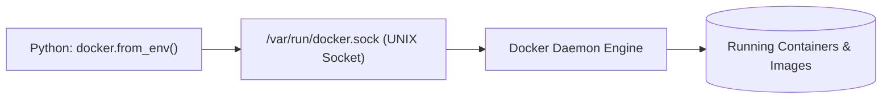

# Lesson 01 — Docker SDK for Python: Connecting and Managing Containers

## 🎯 What will I learn?
You will learn how to interact with the local or remote Docker daemon using Python's official `docker` SDK (`docker-py`). You will learn how to initialize `docker.from_env()`, list running containers, start/stop containers, and inspect health status programmatically.

---

## 🤔 Why does a DevOps engineer need this?
While `docker run` or `docker ps` work in interactive terminal sessions, automating container lifecycles in CI/CD runners or test environments requires a structured SDK:
- Spin up isolated ephemeral test database containers before running `pytest`.
- Audit running containers for memory limits or unapproved image registries.
- Automatically restart crashed worker containers.

---

## 🧠 Mental model



---

## 📖 Concept

### Connecting via `docker-py`

```python
import docker

# Connects automatically to local docker daemon via /var/run/docker.sock
client = docker.from_env()

# List running containers
for container in client.containers.list():
    print(container.name, container.status, container.image.tags)
```

---

## 💻 Simple example

```python
import docker

try:
    client = docker.from_env()
    print("Docker Daemon Ping:", client.ping())
    info = client.info()
    print(f"Containers Total: {info['Containers']}")
except Exception as e:
    print(f"Docker Daemon unreachable: {e}")
```

---

## 🔧 Real DevOps example (`example.py`)

```python
"""
DevOps Script: Docker Container Lifecycle & Health Auditor
Connects to Docker daemon, queries container metrics, and handles offline daemon states safely.
"""
import sys

def audit_docker_containers():
    print("========================================")
    print("      DOCKER CONTAINER FLEET AUDIT      ")
    print("========================================")
    
    try:
        import docker
        client = docker.from_env()
        # Ping the daemon to verify connection
        client.ping()
    except ImportError:
        print("[!] Missing 'docker' package. Install via: pip install docker")
        return False
    except Exception as err:
        print(f"[!] DOCKER DAEMON OFFLINE / UNREACHABLE: {err}")
        print("    Ensure Docker Desktop / dockerd service is running.")
        return False
        
    containers = client.containers.list(all=True)
    print(f"Total Containers Found: {len(containers)}\n")
    
    if not containers:
        print("[*] No active or stopped containers found.")
        print("========================================")
        return True
        
    for c in containers:
        status = c.status.upper()
        tag = "[RUNNING]" if status == "RUNNING" else "[STOPPED]"
        image_tag = c.image.tags[0] if c.image.tags else c.image.short_id
        
        print(f"{tag:<10} ID: {c.short_id} | Name: {c.name:<20} | Image: {image_tag}")
        
    print("========================================")
    return True

if __name__ == "__main__":
    audit_docker_containers()
```

---

## 🖥️ Expected output

```text
$ python example.py
========================================
      DOCKER CONTAINER FLEET AUDIT      
========================================
Total Containers Found: 3

[RUNNING]  ID: a1b2c3d4 | Name: payment-redis-prod   | Image: redis:7-alpine
[RUNNING]  ID: e5f6a7b8 | Name: nginx-reverse-proxy  | Image: nginx:1.25-alpine
[STOPPED]  ID: 9c8b7a6f | Name: batch-migration-job  | Image: python:3.11-slim
========================================
```

---

## 🔍 Line-by-line explanation
- `docker.from_env()`: Reads environment variables (`DOCKER_HOST`, `DOCKER_CERT_PATH`) or defaults to `/var/run/docker.sock` on Linux/macOS and `npipe://` on Windows.
- `client.containers.list(all=True)`: Equivalent to `docker ps -a` (includes stopped/exited containers).
- `c.short_id`: Returns the truncated 12-character container ID.

---

## 🐚 Shell equivalent

```bash
docker ps -a --format "table {{.ID}}\t{{.Names}}\t{{.Status}}\t{{.Image}}"
```

---

## ⚙️ Ansible equivalent

```yaml
- name: Query active docker containers
  community.docker.docker_container_info:
    name: payment-redis-prod
  register: result
```

---

## 🏆 Which one should I use?
- Use **`docker CLI`** in terminal or quick CI/CD build steps (`docker build`, `docker push`).
- Use **Python `docker` SDK** when building custom test harnesses (spinning up ephemeral databases and destroying them in `pytest` fixtures) or container auto-remediation daemons.

---

## ⚠️ Common mistakes
1. **Permission Denied on `/var/run/docker.sock`:**
   - On Linux, running without `sudo` fails if the user is not added to the `docker` group (`sudo usermod -aG docker $USER`).
2. **Forgetting `all=True` in `.list()`:**
   - `client.containers.list()` only returns running containers by default. Exited containers with error exit codes will be missed unless `all=True` is passed.

---

## 🧪 Practice (Exercise)
Open `exercise.py`. Write a function `find_stopped_containers()` using `docker-py`. Return a list of container names where `status != "running"`. Handle daemon connection exceptions defensively.

---

## 💡 Hint
Loop over `client.containers.list(all=True)` and check `if c.status != "running":`.

---

## ✅ Solution
Check `solution.py` after your attempt.

---

## 🎯 Interview questions

### Q: "When should you use the Docker Python SDK (`docker-py`) versus calling `subprocess.run(['docker', ...])`?"
> **Interviewer Focus:** Testing SDK usage, error handling, performance overhead, and structured object returns.

---

## 🗣️ How to answer in an interview
> *"We prefer the Docker Python SDK (`docker-py`) because it communicates directly with the Docker Engine daemon over the UNIX socket via HTTP REST API. It returns strongly-typed Python objects representing containers, volumes, and images, eliminating the need to parse raw string outputs from CLI tables. We only fall back to `subprocess.run(['docker', ...])` for interactive CLI streaming or specialized multi-stage `docker buildx` commands where the SDK might lag behind the newest CLI plugins."*

---

## 📝 What I should remember
- Use `docker.from_env()`.
- Use `all=True` in `client.containers.list()` to view stopped containers.
- SDK communicates directly over `/var/run/docker.sock`.
