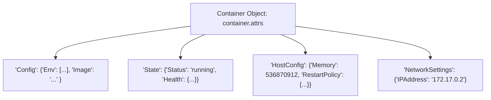

# Lesson 02 — Inspecting Containers, Environment Variables, and Image Tags

## 🎯 What will I learn?
You will learn how to extract granular container metadata using `container.attrs` (the Python equivalent of `docker inspect`): inspecting network IPs, CPU/memory resource limits, mounted storage volumes, restart policies, and environment variable configurations.

---

## 🤔 Why does a DevOps engineer need this?
Automated container governance and security compliance checks require programmatic inspection:
- Auditing whether any production container is running without CPU/Memory limits (noisy neighbor risk).
- Checking if privileged mode (`Privileged: true`) is enabled (security vulnerability).
- Verifying container healthcheck configurations before promoting images in CI/CD.

---

## 🧠 Mental model



---

## 📖 Concept

`container.attrs` returns the complete nested JSON dictionary from the Docker daemon.

```python
# Accessing container metadata
ip_address = container.attrs["NetworkSettings"]["IPAddress"]
memory_limit = container.attrs["HostConfig"]["Memory"] # in bytes
env_vars = container.attrs["Config"]["Env"] # list of "KEY=VAL"
is_privileged = container.attrs["HostConfig"]["Privileged"]
```

---

## 💻 Simple example

```python
# Extracting Environment variables from container
mock_env = ["PORT=8080", "ENV=prod", "DB_HOST=10.0.0.5"]
env_dict = dict(item.split("=", 1) for item in mock_env)
print(env_dict["PORT"])  # '8080'
```

---

## 🔧 Real DevOps example (`example.py`)

```python
"""
DevOps Script: Container Governance & Security Policy Compliance Auditor
"""
import sys

def audit_container_security_spec(container_attrs):
    print("========================================")
    print("     CONTAINER SECURITY AUDIT SPEC      ")
    print("========================================")
    
    name = container_attrs.get("Name", "").lstrip("/")
    state = container_attrs.get("State", {})
    host_config = container_attrs.get("HostConfig", {})
    config = container_attrs.get("Config", {})
    
    # 1. Memory Limit Audit (0 means unlimited / risky)
    mem_bytes = host_config.get("Memory", 0)
    mem_mb = round(mem_bytes / (1024 ** 2), 2) if mem_bytes > 0 else "UNLIMITED (FAIL)"
    
    # 2. Privileged Flag Audit
    is_privileged = host_config.get("Privileged", False)
    
    # 3. Read-Only Root Filesystem
    readonly_root = host_config.get("ReadonlyRootfs", False)
    
    # 4. Restart Policy
    restart_policy = host_config.get("RestartPolicy", {}).get("Name", "no")
    
    print(f"Container Name   : {name}")
    print(f"Status           : {state.get('Status')}")
    print(f"Memory Limit     : {mem_mb} MB")
    print(f"Privileged Mode  : {is_privileged} (Expected: False)")
    print(f"Read-Only RootFS : {readonly_root}")
    print(f"Restart Policy   : {restart_policy}")
    print("----------------------------------------")
    
    violations = []
    if mem_bytes == 0:
        violations.append("Memory limit is not set (OOM / DoS vulnerability)")
    if is_privileged:
        violations.append("Container is running in PRIVILEGED mode (Root breakout risk)")
    if restart_policy == "no":
        violations.append("No automatic restart policy configured")
        
    if violations:
        print("[!] GOVERNANCE VIOLATIONS DETECTED:")
        for v in violations:
            print(f"    - {v}")
        return False
    else:
        print("[+] Container meets all security compliance policies.")
        return True

if __name__ == "__main__":
    # Mock container inspect dictionary for demonstration
    mock_container_attrs = {
        "Name": "/payment-gateway-service",
        "State": {"Status": "running", "Running": True},
        "HostConfig": {
            "Memory": 536870912,  # 512 MB
            "Privileged": False,
            "ReadonlyRootfs": True,
            "RestartPolicy": {"Name": "always"}
        },
        "Config": {"Image": "myregistry.io/payment:v2.0"}
    }
    
    audit_container_security_spec(mock_container_attrs)
```

---

## 🖥️ Expected output

```text
$ python example.py
========================================
     CONTAINER SECURITY AUDIT SPEC      
========================================
Container Name   : payment-gateway-service
Status           : running
Memory Limit     : 512.0 MB
Privileged Mode  : False (Expected: False)
Read-Only RootFS : True
Restart Policy   : always
----------------------------------------
[+] Container meets all security compliance policies.
```

---

## 🔍 Line-by-line explanation
- `container_attrs.get("HostConfig", {})`: Extracts kernel and container resource constraints.
- `mem_bytes == 0`: In Docker, a value of `0` for memory means unbounded host memory access.

---

## 🐚 Shell equivalent

```bash
docker inspect payment-gateway-service --format '{{.HostConfig.Memory}} {{.HostConfig.Privileged}}'
```

---

## ⚙️ Ansible equivalent

```yaml
- name: Inspect container facts
  community.docker.docker_container_info:
    name: payment-gateway-service
  register: container_info
```

---

## 🏆 Which one should I use?
- Use **Python `container.attrs`** when writing automated policy gates in CI/CD (e.g. failing builds if containers exceed limits or fail security baselines).

---

## ⚠️ Common mistakes
1. **Assuming `.attrs` is refreshed automatically:**
   - If a container changes state after retrieval, `container.attrs` retains the old snapshot. Call `container.reload()` to refresh attributes from daemon.

---

## 🧪 Practice (Exercise)
Open `exercise.py`. Write a function `extract_container_env_map(container_attrs)` that parses the `"Config"` -> `"Env"` list (`["KEY1=VAL1", "KEY2=VAL2"]`) and returns a clean Python dictionary `{"KEY1": "VAL1", "KEY2": "VAL2"}`.

---

## 💡 Hint
Split each string on the first `=` using `item.split("=", 1)`.

---

## ✅ Solution
Check `solution.py` after your attempt.

---

## 🎯 Interview questions

### Q: "Why is running Docker containers without explicit memory limits dangerous in multi-tenant environments, and how do you audit it with Python?"
> **Interviewer Focus:** Testing your understanding of Linux cgroups, memory limits, and automated policy enforcement.

---

## 🗣️ How to answer in an interview
> *"By default, Docker allocates unbounded memory to containers. If one container develops a memory leak, it consumes all available host RAM until the Linux kernel OOM Killer triggers, arbitrarily terminating critical system processes or neighboring customer workloads. In Python, we audit this by inspecting `container.attrs['HostConfig']['Memory']`. If the value is `0` (unlimited), our automated compliance script flags the container and fails the pipeline until explicit cgroup memory and CPU limits are declared."*

---

## 📝 What I should remember
- Use `container.attrs` to access `HostConfig`, `State`, `Config`, and `NetworkSettings`.
- Call `container.reload()` to refresh attributes after lifecycle actions.
- Always check that `Memory > 0` and `Privileged == False` for security compliance.
