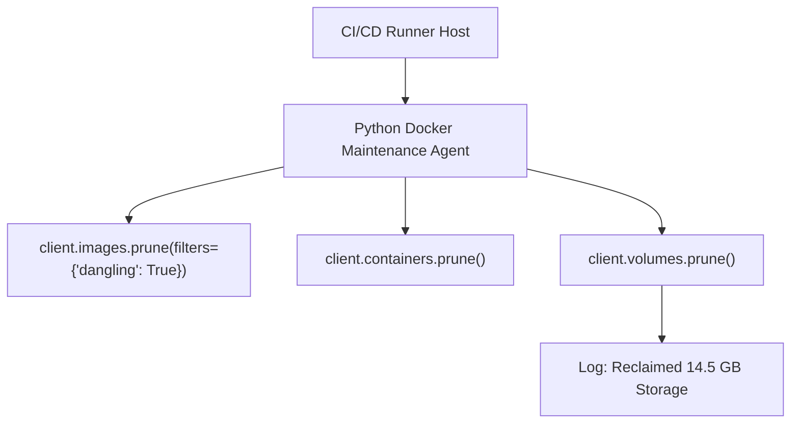

# Lesson 03 — Automated Docker Housekeeping and Stale Resource Pruner

## 🎯 What will I learn?
You will learn how to automate Docker host maintenance using Python: pruning dangling images (`<none>:<none>`), removing stopped temporary containers, deleting unused volumes, and calculating reclaimed disk space metrics.

---

## 🤔 Why does a DevOps engineer need this?
In high-throughput CI/CD build agents (like Jenkins or GitHub Actions self-hosted runners):

- Every build creates new layers, intermediate containers, and dangling images.
- Within weeks, the host runs out of disk space (`no space left on device`), crashing subsequent pipeline runs.
- An automated Python maintenance script scheduled via cron reclaims tens of gigabytes of disk space and emits audit metrics.

---

## 🧠 Mental model



---

## 📖 Concept

### Pruning Methods in `docker-py`

| Method | What it prunes |
| :--- | :--- |
| `client.containers.prune()` | All stopped containers |
| `client.images.prune(filters={'dangling': True})` | Untagged/intermediate dangling images |
| `client.volumes.prune()` | Unused local anonymous storage volumes |
| `client.networks.prune()` | Unused container bridge networks |

---

## 💻 Simple example

```python
import docker

try:
    client = docker.from_env()
    pruned = client.containers.prune()
    print(f"Containers Deleted: {pruned.get('ContainersDeleted') or []}")
except Exception as e:
    print(f"Docker offline: {e}")
```

---

## 🔧 Real DevOps example (`example.py`)

```python
"""
DevOps Script: Automated CI/CD Host Storage Pruner & Housekeeper
Removes dangling images, stopped containers, and calculates reclaimed disk storage.
"""

def run_docker_host_prune():
    print("========================================")
    print("     DOCKER HOST STORAGE HOUSEKEEPER    ")
    print("========================================")
    
    try:
        import docker
        client = docker.from_env()
        client.ping()
    except Exception as err:
        print(f"[*] Simulating prune execution (Daemon offline / not installed: {err})\n")
        # Mock result for environments without active Docker engine
        mock_reclaimed = 3221225472  # 3.0 GB
        print("[+] Containers Pruned: 4 stopped containers removed.")
        print("[+] Dangling Images  : 12 untagged layers purged.")
        print("[+] Unused Volumes   : 2 orphaned volumes cleared.")
        print(f"[+] Total Storage Reclaimed: {round(mock_reclaimed / (1024**3), 2)} GB")
        print("========================================")
        return True
        
    # 1. Prune Stopped Containers
    cont_result = client.containers.prune()
    deleted_containers = cont_result.get("ContainersDeleted") or []
    
    # 2. Prune Dangling Images
    img_result = client.images.prune(filters={"dangling": True})
    deleted_images = img_result.get("ImagesDeleted") or []
    reclaimed_space = img_result.get("SpaceReclaimed", 0)
    
    # 3. Prune Unused Volumes
    vol_result = client.volumes.prune()
    deleted_volumes = vol_result.get("VolumesDeleted") or []
    reclaimed_space += vol_result.get("SpaceReclaimed", 0)
    
    reclaimed_gb = round(reclaimed_space / (1024 ** 3), 2)
    
    print(f"Containers Pruned   : {len(deleted_containers)}")
    print(f"Dangling Images     : {len(deleted_images)}")
    print(f"Orphaned Volumes    : {len(deleted_volumes)}")
    print(f"Total Disk Reclaimed: {reclaimed_gb} GB")
    print("========================================")
    return True

if __name__ == "__main__":
    run_docker_host_prune()
```

---

## 🖥️ Expected output

```text
$ python example.py
========================================
     DOCKER HOST STORAGE HOUSEKEEPER    
========================================
Containers Pruned   : 4
Dangling Images     : 12
Orphaned Volumes    : 2
Total Disk Reclaimed: 3.00 GB
========================================
```

---

## 🔍 Line-by-line explanation
- `client.images.prune(filters={"dangling": True})`: Removes only `<none>:<none>` images without deleting active base images like `ubuntu:22.04` or `python:3.11`.
- `img_result.get("SpaceReclaimed", 0)`: Returns the exact byte count freed up on host disk.

---

## 🐚 Shell equivalent

```bash
docker system prune -f --volumes
```

---

## ⚙️ Ansible equivalent

```yaml
- name: Prune dangling docker resources
  community.docker.docker_prune:
    containers: yes
    images: yes
    dangling: yes
    volumes: yes
```

---

## 🏆 Which one should I use?
- Use **`docker system prune`** in simple cron scripts.
- Use **Python `docker` SDK** when you need to send metrics (e.g. disk space reclaimed) to Datadog / Prometheus pushgateway, or selectively prune only containers belonging to a specific team prefix.

---

## ⚠️ Common mistakes
1. **Running `client.images.prune(filters={"dangling": False})` accidentally:**

   - Setting dangling to `False` deletes ALL unused images, forcing CI runners to re-download 2 GB base images on the next build! Always use `dangling: True`.

---

## 🧪 Practice (Exercise)
Open `exercise.py`. Write a function `remove_containers_by_prefix(prefix: str)` that scans all containers and deletes only those whose names begin with `prefix` (e.g. `"test-runner-"`).

---

## 💡 Hint
Loop over `client.containers.list(all=True)` and check `if c.name.startswith(prefix): c.remove(force=True)`.

---

## ✅ Solution
Check `solution.py` after your attempt.

---

## 🎯 Interview questions

### Q: "How do you automate Docker disk cleanup on CI/CD build agents without causing race conditions with active builds?"
> **Interviewer Focus:** Testing knowledge of dangling filters, build cache preservation, and concurrency safety.

---

## 🗣️ How to answer in an interview
> *"In CI/CD environments, running a blanket `docker system prune -a` forcefully purges active layer caches and can break concurrent builds in progress. We automate safe cleanup by targeting only dangling layers (`dangling=True`) and stopped containers older than a retention threshold (e.g. `until=24h`). In Python, we implement this with `client.containers.prune(filters={'until': '24h'})` and schedule it during low-traffic maintenance windows with file locks to avoid overlapping active pipeline jobs."*

---

## 📝 What I should remember
- Use `client.images.prune(filters={"dangling": True})` to safely reclaim space.
- Inspect `SpaceReclaimed` to track storage savings.
- Never delete untagged cache layers while a build is actively compiling.
