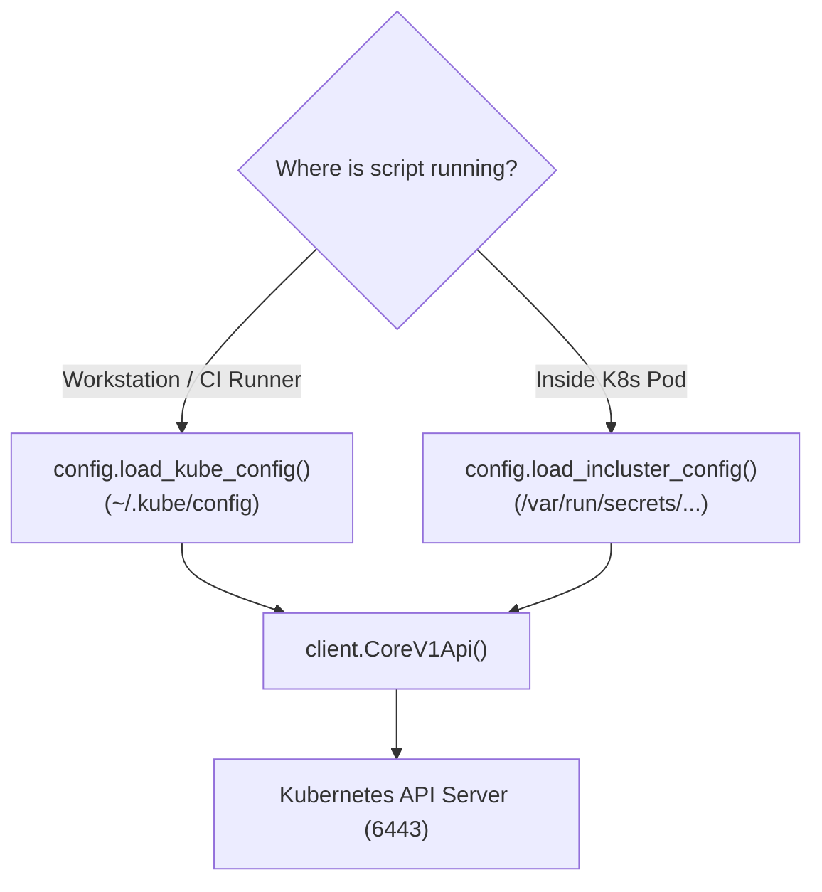

# Lesson 01 — The Official Kubernetes Python Client: Pods and Nodes

## 🎯 What will I learn?
You will learn how to connect to Kubernetes clusters using the official `kubernetes` Python SDK: authenticating with `kubeconfig` (local) vs `incluster_config` (inside a pod), listing pods and nodes across namespaces, and inspecting pod phase states (`Running`, `Pending`, `Failed`).

---

## 🤔 Why does a DevOps engineer need this?
While `kubectl get pods` works well in a terminal, building automated cluster operators, custom controllers, or multi-cluster health dashboards requires the Python SDK:
- Querying 10 different EKS/GKE clusters concurrently.
- Generating a daily audit of unscheduled pods or pending PVCs.
- Building custom admission webhooks and Slack operational bots.

---

## 🧠 Mental model



---

## 📖 Concept

### Loading Authentication Dynamically

```python
from kubernetes import client, config

def init_k8s_client():
    try:
        # 1. Try In-Cluster ServiceAccount token first (when running in a pod)
        config.load_incluster_config()
    except config.ConfigException:
        # 2. Fall back to local ~/.kube/config (when running on laptop/CI)
        config.load_kube_config()
        
    return client.CoreV1Api()
```

---

## 💻 Simple example

```python
from kubernetes import client, config

try:
    config.load_kube_config()
    v1 = client.CoreV1Api()
    nodes = v1.list_node()
    for n in nodes.items:
        print(f"Node: {n.metadata.name}")
except Exception as e:
    print(f"K8s Cluster not reachable: {e}")
```

---

## 🔧 Real DevOps example (`example.py`)

```python
"""
DevOps Script: Kubernetes Namespace & Pod Fleet Health Inspector
Connects to cluster and audits pod phases across all namespaces.
"""

def audit_kubernetes_cluster_pods():
    print("========================================")
    print("     KUBERNETES POD FLEET AUDITOR       ")
    print("========================================")
    
    try:
        from kubernetes import client, config
        try:
            config.load_incluster_config()
            print("[*] Loaded In-Cluster ServiceAccount authentication.")
        except Exception:
            config.load_kube_config()
            print("[*] Loaded local ~/.kube/config authentication.")
            
        v1 = client.CoreV1Api()
        pod_list = v1.list_pod_for_all_namespaces(timeout_seconds=5)
        
        print(f"\nTotal Cluster Pods: {len(pod_list.items)}\n")
        
        for pod in pod_list.items:
            ns = pod.metadata.namespace
            name = pod.metadata.name
            phase = pod.status.phase  # 'Running', 'Pending', 'Failed'
            pod_ip = pod.status.pod_ip or "No IP"
            
            tag = "[RUNNING]" if phase == "Running" else f"[{phase.upper()}]"
            print(f"{tag:<10} NS: {ns:<12} | Pod: {name:<30} | IP: {pod_ip}")
            
    except Exception as err:
        print(f"[*] Simulating K8s API response (Cluster offline: {err})\n")
        # Mock cluster audit for environments without live kubeconfig
        mock_pods = [
            ("production", "payment-api-78bf-x9da", "Running", "10.244.1.15"),
            ("production", "order-worker-55cc-11aa", "Running", "10.244.2.24"),
            ("staging", "auth-canary-99ea-44bb", "Pending", "No IP")
        ]
        for ns, name, phase, ip in mock_pods:
            tag = f"[{phase.upper()}]"
            print(f"{tag:<10} NS: {ns:<12} | Pod: {name:<30} | IP: {ip}")
            
    print("========================================")

if __name__ == "__main__":
    audit_kubernetes_cluster_pods()
```

---

## 🖥️ Expected output

```text
$ python example.py
========================================
     KUBERNETES POD FLEET AUDITOR       
========================================
[*] Loaded local ~/.kube/config authentication.

Total Cluster Pods: 3

[RUNNING]  NS: production   | Pod: payment-api-78bf-x9da         | IP: 10.244.1.15
[RUNNING]  NS: production   | Pod: order-worker-55cc-11aa        | IP: 10.244.2.24
[PENDING]  NS: staging      | Pod: auth-canary-99ea-44bb         | IP: No IP
========================================
```

---

## 🔍 Line-by-line explanation
- `v1 = client.CoreV1Api()`: Instantiates the Core v1 API client (handles Pods, Nodes, Services, Namespaces, ConfigMaps).
- `pod.status.phase`: Standard lifecycle phases: `Pending`, `Running`, `Succeeded`, `Failed`, `Unknown`.

---

## 🐚 Shell equivalent

```bash
kubectl get pods --all-namespaces -o wide
```

---

## ⚙️ Ansible equivalent

```yaml
- name: Query pods using kubernetes.core collection
  kubernetes.core.k8s_info:
    kind: Pod
    namespace: production
  register: pod_list
```

---

## 🏆 Which one should I use?
- Use **`kubectl`** for ad-hoc debugging in the terminal.
- Use **Python `kubernetes` client** when building custom cluster operators, dynamic auto-scalers, or incident alerting bots.

---

## ⚠️ Common mistakes
1. **Calling `config.load_incluster_config()` on your laptop:**
   - Throws `ConfigException` because the ServiceAccount token path `/var/run/secrets/kubernetes.io/serviceaccount/token` does not exist outside a container. Always implement the fallback pattern.

---

## 🧪 Practice (Exercise)
Open `exercise.py`. Write a function `count_pods_by_namespace()` that returns a dictionary mapping `{namespace_name: pod_count}` for all namespaces in the cluster.

---

## 💡 Hint
Iterate over `v1.list_pod_for_all_namespaces().items` and increment counts in a dictionary: `counts[ns] = counts.get(ns, 0) + 1`.

---

## ✅ Solution
Check `solution.py` after your attempt.

---

## 🎯 Interview questions

### Q: "How do you authenticate a Python script to a Kubernetes cluster when running locally versus inside a Kubernetes Pod?"
> **Interviewer Focus:** Testing knowledge of in-cluster ServiceAccounts vs kubeconfig contexts.

---

## 🗣️ How to answer in an interview
> *"We use the dual-loading strategy. In Python, we first attempt `config.load_incluster_config()`, which reads the injected ServiceAccount JWT token and CA cert from `/var/run/secrets/kubernetes.io/serviceaccount/`. If that raises a `ConfigException` (meaning we are running outside the cluster on a workstation or CI runner), we fall back to `config.load_kube_config()`, which uses the local `~/.kube/config` and active context. This makes the automation script seamlessly portable across local dev, CI/CD runners, and in-cluster CronJobs."*

---

## 📝 What I should remember
- Use `CoreV1Api` for Pods, Nodes, Services.
- Use the `incluster_config` -> `load_kube_config` fallback pattern.
- Inspect `pod.status.phase` and `pod.metadata.namespace`.
