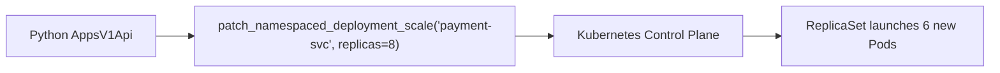

# Lesson 02 — Deployments, Replica Scaling, and Image Rolling Updates

## 🎯 What will I learn?
You will learn how to manage Kubernetes **Deployments** using the `AppsV1Api` in Python: inspecting desired vs available replicas, scaling replica counts up/down dynamically based on external queue depths or traffic, and triggering rolling updates by updating image tags programmatically.

---

## 🤔 Why does a DevOps engineer need this?
Automated scaling and progressive delivery scripts need to adjust deployments on the fly:
- Scaling worker deployments from 2 to 20 replicas during midnight batch ETL workloads and scaling back down at 6:00 AM.
- Triggering automated canary rollouts during CI/CD promotions.
- Checking rollout completion status programmatically in pipeline gate scripts.

---

## 🧠 Mental model



---

## 📖 Concept

Use `client.AppsV1Api()` for Deployments, StatefulSets, and DaemonSets.

### Scaling a Deployment in Python

```python
from kubernetes import client

apps_v1 = client.AppsV1Api()

# Scale payload
body = {"spec": {"replicas": 5}}

apps_v1.patch_namespaced_deployment_scale(
    name="payment-service",
    namespace="production",
    body=body
)
```

---

## 💻 Simple example

```python
from kubernetes import client, config

try:
    config.load_kube_config()
    apps_v1 = client.AppsV1Api()
    dep = apps_v1.read_namespaced_deployment("nginx-dep", "default")
    print(f"Replicas: {dep.spec.replicas}")
except Exception as e:
    print(f"Cluster offline: {e}")
```

---

## 🔧 Real DevOps example (`example.py`)

```python
"""
DevOps Script: Kubernetes Autoscaling & Rollout Status Inspector
Checks deployment replica health and demonstrates patch scaling.
"""

def audit_and_scale_deployment(deployment_name="payment-api", namespace="production", target_replicas=4):
    print("========================================")
    print("     K8S DEPLOYMENT CONTROLLER AUDIT    ")
    print("========================================")
    print(f"Target: {namespace}/{deployment_name}\n")
    
    try:
        from kubernetes import client, config
        try:
            config.load_incluster_config()
        except Exception:
            config.load_kube_config()
            
        apps_v1 = client.AppsV1Api()
        
        # 1. Read current deployment spec
        deployment = apps_v1.read_namespaced_deployment(name=deployment_name, namespace=namespace)
        current_replicas = deployment.spec.replicas
        available_replicas = deployment.status.available_replicas or 0
        container_image = deployment.spec.template.spec.containers[0].image
        
        print(f"Active Image      : {container_image}")
        print(f"Configured Replicas: {current_replicas}")
        print(f"Available Replicas: {available_replicas}")
        
        # 2. Patch scale if target differs
        if current_replicas != target_replicas:
            print(f"[*] Scaling deployment from {current_replicas} -> {target_replicas} replicas...")
            scale_body = {"spec": {"replicas": target_replicas}}
            apps_v1.patch_namespaced_deployment_scale(
                name=deployment_name,
                namespace=namespace,
                body=scale_body
            )
            print("[+] Scale patch applied successfully.")
        else:
            print("[*] Replicas already at target count. No scale action needed.")
            
    except Exception as err:
        print(f"[*] Simulating Deployment scaling (Cluster offline: {err})\n")
        print(f"Active Image       : myregistry.io/payment:v1.4.0")
        print(f"Configured Replicas: 2")
        print(f"Available Replicas : 2")
        print(f"[+] [SIMULATED] Scale patch: Scaled {deployment_name} to {target_replicas} replicas.")
        
    print("========================================")

if __name__ == "__main__":
    audit_and_scale_deployment("payment-api", "production", target_replicas=4)
```

---

## 🖥️ Expected output

```text
$ python example.py
========================================
     K8S DEPLOYMENT CONTROLLER AUDIT    
========================================
Target: production/payment-api

Active Image       : myregistry.io/payment:v1.4.0
Configured Replicas: 2
Available Replicas : 2
[+] [SIMULATED] Scale patch: Scaled payment-api to 4 replicas.
========================================
```

---

## 🔍 Line-by-line explanation
- `apps_v1.patch_namespaced_deployment_scale(...)`: Performs an atomic JSON merge patch specifically on the scale subresource (`/scale`), which is fast and does not risk overwriting container environment variables or volume mounts.
- `deployment.status.available_replicas`: Reflects the count of pods that have passed readiness probes and are actively serving traffic.

---

## 🐚 Shell equivalent

```bash
kubectl scale deployment/payment-api -n production --replicas=4
```

---

## ⚙️ Ansible equivalent

```yaml
- name: Scale deployment replicas
  kubernetes.core.k8s_scale:
    kind: Deployment
    name: payment-api
    namespace: production
    replicas: 4
```

---

## 🏆 Which one should I use?
- Use **`kubectl scale`** for manual operational changes.
- Use **Python `AppsV1Api`** when scaling dynamically based on external queue sizes (e.g. SQS/RabbitMQ queue length) or when integrating with custom CI/CD deployment verification steps.

---

## ⚠️ Common mistakes
1. **Calling `replace_namespaced_deployment` instead of `patch`:**
   - `replace` is a `PUT` operation requiring the entire manifest. If fields are omitted, they will be deleted. Always use `patch_namespaced_deployment` for partial updates.

---

## 🧪 Practice (Exercise)
Open `exercise.py`. Write a rollout checker function `is_rollout_complete(deployment_name, namespace)` that verifies if `status.updated_replicas == spec.replicas` and `status.available_replicas == spec.replicas`.

---

## 💡 Hint
Compare `dep.status.available_replicas == dep.spec.replicas`.

---

## ✅ Solution
Check `solution.py` after your attempt.

---

## 🎯 Interview questions

### Q: "What is the difference between `patch_namespaced_deployment` and `replace_namespaced_deployment` in the Kubernetes Python client?"
> **Interviewer Focus:** Testing your understanding of HTTP PATCH vs PUT semantics and avoiding destructive resource updates in Kubernetes.

---

## 🗣️ How to answer in an interview
> *"`replace_namespaced_deployment` performs an HTTP `PUT` (full replacement). You must supply the entire complete Deployment manifest including all metadata, labels, and spec fields; any omitted field will be reset or deleted. `patch_namespaced_deployment` performs an HTTP `PATCH` (JSON Merge or Strategic Merge Patch), allowing us to update only specific targeted fields—such as changing an image tag or replica count—without touching the rest of the configuration. For automation, `patch` is vastly safer and avoids race conditions."*

---

## 📝 What I should remember
- Use `AppsV1Api` for Deployments.
- Use `patch_namespaced_deployment_scale` for scaling.
- Compare `status.available_replicas` against `spec.replicas` to verify rollout health.
