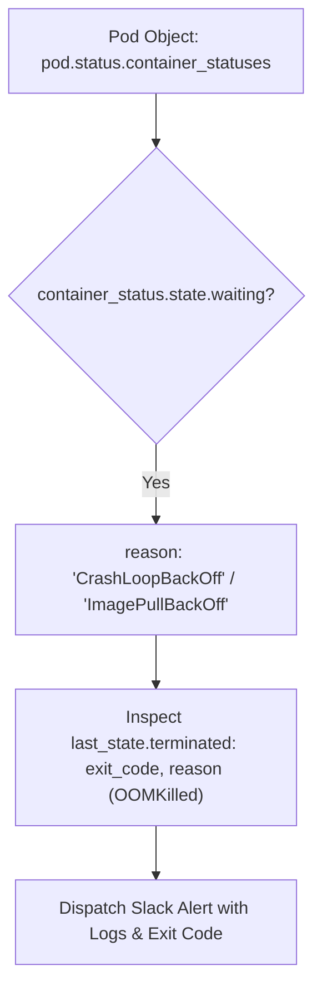

# Lesson 03 — Detecting CrashLoopBackOff and Pod Failures

## 🎯 What will I learn?
You will learn how to build an automated Kubernetes troubleshooting detector in Python: identifying pods stuck in **`CrashLoopBackOff`**, `ImagePullBackOff`, `OOMKilled`, or `Error` states, querying pod restart counts, and extracting container termination messages from `status.container_statuses`.

---

## 🤔 Why does a DevOps engineer need this?
When a bad release or database migration breaks a microservice:
- The pod continuously restarts with an escalating backoff delay (`CrashLoopBackOff`).
- Standard health checks often miss intermittent crashes.
- An automated Python watcher scans the cluster every 60 seconds, detects high restart counts (`restart_count > 5`), queries Kubernetes event logs, and alerts on-call engineers via Slack with the exact container exit code and root cause.

---

## 🧠 Mental model



---

## 📖 Concept

### Inspecting Container States in Python

```python
for c_status in pod.status.container_statuses:
    # Check if container is stuck in waiting state
    if c_status.state.waiting:
        reason = c_status.state.waiting.reason # 'CrashLoopBackOff'
        
    # Check restart count
    restart_count = c_status.restart_count
    
    # Check previous crash exit code
    if c_status.last_state.terminated:
        exit_code = c_status.last_state.terminated.exit_code
        term_reason = c_status.last_state.terminated.reason # 'OOMKilled'
```

---

## 💻 Simple example

```python
# Extracting crash reason from mock container status
mock_status = {
    "name": "app-container",
    "restart_count": 8,
    "waiting_reason": "CrashLoopBackOff",
    "last_exit_code": 137 # 137 = 128 + 9 (SIGKILL / OOMKilled)
}
if mock_status["last_exit_code"] == 137:
    print("Diagnosis: Container exceeded memory limit (OOMKilled).")
```

---

## 🔧 Real DevOps example (`example.py`)

```python
"""
DevOps Script: Kubernetes CrashLoopBackOff & OOMKilled Incident Detector
Scans the cluster, detects failing containers, and extracts termination root causes.
"""

def scan_for_crashlooping_pods():
    print("========================================")
    print("     K8S CRASHLOOP & OOM DETECTOR       ")
    print("========================================")
    
    try:
        from kubernetes import client, config
        try:
            config.load_incluster_config()
        except Exception:
            config.load_kube_config()
            
        v1 = client.CoreV1Api()
        pods = v1.list_pod_for_all_namespaces(timeout_seconds=5)
        
        incidents = []
        
        for pod in pods.items:
            ns = pod.metadata.namespace
            name = pod.metadata.name
            
            if not pod.status.container_statuses:
                continue
                
            for cs in pod.status.container_statuses:
                restarts = cs.restart_count
                waiting = cs.state.waiting
                
                if waiting and waiting.reason in ["CrashLoopBackOff", "ImagePullBackOff", "CreateContainerConfigError"]:
                    last_exit = "N/A"
                    if cs.last_state and cs.last_state.terminated:
                        last_exit = cs.last_state.terminated.exit_code
                        
                    incidents.append({
                        "namespace": ns,
                        "pod": name,
                        "container": cs.name,
                        "reason": waiting.reason,
                        "restarts": restarts,
                        "last_exit_code": last_exit
                    })
                    
        print(f"Total Failing Pods Identified: {len(incidents)}\n")
        for inc in incidents:
            print(f"[!] INCIDENT DETECTED:")
            print(f"    Namespace    : {inc['namespace']}")
            print(f"    Pod Name     : {inc['pod']}")
            print(f"    Container    : {inc['container']}")
            print(f"    Failure State: {inc['reason']}")
            print(f"    Restart Count: {inc['restarts']}")
            print(f"    Last ExitCode: {inc['last_exit_code']}\n")
            
    except Exception as err:
        print(f"[*] Simulating crash detection (Cluster offline: {err})\n")
        # Mock incident output
        print("[!] [SIMULATED INCIDENT]:")
        print("    Namespace    : production")
        print("    Pod Name     : payment-worker-88da-99bf")
        print("    Container    : worker")
        print("    Failure State: CrashLoopBackOff")
        print("    Restart Count: 14")
        print("    Last ExitCode: 137 (OOMKilled - Out Of Memory)")
        
    print("========================================")

if __name__ == "__main__":
    scan_for_crashlooping_pods()
```

---

## 🖥️ Expected output

```text
$ python example.py
========================================
     K8S CRASHLOOP & OOM DETECTOR       
========================================
[!] [SIMULATED INCIDENT]:
    Namespace    : production
    Pod Name     : payment-worker-88da-99bf
    Container    : worker
    Failure State: CrashLoopBackOff
    Restart Count: 14
    Last ExitCode: 137 (OOMKilled - Out Of Memory)
========================================
```

---

## 🔍 Line-by-line explanation
- `cs.state.waiting.reason`: Returns Kubernetes status strings like `CrashLoopBackOff` or `ImagePullBackOff`.
- `last_exit_code == 137`: Standard Linux signal math ($128 + 9 = 137$). Indicates the container process received `SIGKILL` from the Linux kernel because it breached its cgroup memory limit (`OOMKilled`).

---

## 🐚 Shell equivalent

```bash
kubectl get pods --all-namespaces | grep -E 'CrashLoopBackOff|ImagePullBackOff|Error'
```

---

## ⚙️ Ansible equivalent

Ansible is not designed for real-time pod crash monitoring and continuous event streaming.

---

## 🏆 Which one should I use?
- Use **`kubectl get pods`** during immediate terminal triage.
- Use **Python CrashLoop Detectors** inside automated monitoring daemons, Slack on-call alert integrations, and automated rollback runners.

---

## ⚠️ Common mistakes
1. **Checking only `pod.status.phase`:**
   - A pod in `CrashLoopBackOff` often has `status.phase == "Running"` because the Kubernetes pod itself is still scheduled! You must inspect `container_statuses[].state.waiting`.

---

## 🧪 Practice (Exercise)
Open `exercise.py`. Write a function `diagnose_pod_exit_code(exit_code: int) -> str` that returns a human-readable diagnosis:
- `0`: `"Clean Exit"`
- `1`: `"Application Exception / Uncaught Error"`
- `137`: `"OOMKilled (Out of Memory - SIGKILL 9)"`
- `143`: `"Graceful SIGTERM (Container Stopped)"`
- Any other: `f"Unknown Exit Code ({exit_code})"`

---

## 💡 Hint
Use a dictionary mapping or `if/elif` statements.

---

## ✅ Solution
Check `solution.py` after your attempt.

---

## 🎯 Interview questions

### Q: "Why does `pod.status.phase` show 'Running' even when a container is in `CrashLoopBackOff`, and how do you detect it in Python?"
> **Interviewer Focus:** Testing deep understanding of Kubernetes pod lifecycle mechanics vs individual container lifecycle states.

---

## 🗣️ How to answer in an interview
> *"In Kubernetes, `pod.status.phase` reflects high-level cluster scheduling (Pending, Running, Succeeded, Failed). As long as the pod is assigned to a node and at least one container is attempting to initialize, the overall pod phase remains 'Running'. To accurately detect a crash loop, an automation script must drill down into `pod.status.container_statuses`. We inspect each container's `state.waiting` object for reasons like `CrashLoopBackOff` or `ImagePullBackOff`, and check `last_state.terminated.exit_code` to determine if it died due to application error (`code 1`) or memory exhaustion (`code 137 OOMKilled`)."*

---

## 📝 What I should remember
- Do not rely solely on `pod.status.phase`.
- Always inspect `pod.status.container_statuses[].state.waiting.reason`.
- Exit code 137 = OOMKilled (Out of Memory).
- Exit code 143 = SIGTERM.
