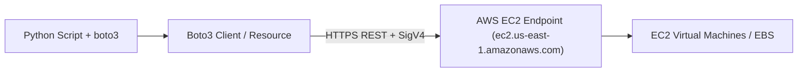

# Lesson 01 — AWS Automation with Boto3: EC2 Instance Management

## 🎯 What will I learn?
You will learn how to interact with Amazon Web Services (AWS) using Python's official SDK, **Boto3**. You will learn the difference between **Clients** (low-level 1:1 API mappings) and **Resources** (high-level object-oriented), how to filter EC2 instances by tags and state (`running`, `stopped`), and how to start/stop instances programmatically.

---

## 🤔 Why does a DevOps engineer need this?
Cloud automation scripts reduce cloud bills and enforce compliance:
- Automatically stopping non-production development EC2 instances every weekday at 7:00 PM (saving 60%+ on monthly dev compute costs).
- Auditing unencrypted EBS volumes attached to instances.
- Building custom AMI snapshotting and lifecycle rotation tools.

---

## 🧠 Mental model



---

## 📖 Concept

### Client vs Resource in Boto3

| Feature | `boto3.client('ec2')` | `boto3.resource('ec2')` |
| :--- | :--- | :--- |
| **API Layer** | Low-level direct JSON mapping | High-level Object-Oriented |
| **Speed / Coverage** | Always 100% up-to-date with newest AWS APIs | May lag slightly on brand new features |
| **Return Type** | Native Python Dictionaries | Rich Python Objects (`instance.start()`) |
| **Best Practice** | Used in most enterprise tooling | Great for quick object navigation |

---

## 💻 Simple example

```python
import boto3

# List regions using client
ec2 = boto3.client("ec2", region_name="us-east-1")
# response = ec2.describe_instances()
```

---

## 🔧 Real DevOps example (`example.py`)

```python
"""
DevOps Script: Non-Prod EC2 Nightly Cost-Saver & Tag Auditor
Queries EC2 instances, filters by Environment tags, and identifies running instances to stop.
"""
import sys

def audit_and_manage_ec2_instances(region="us-east-1", action="audit"):
    print("========================================")
    print("      AWS EC2 INSTANCE COST AUDITOR     ")
    print("========================================")
    print(f"Target AWS Region: {region}")
    print(f"Operational Mode : {action.upper()}\n")
    
    try:
        import boto3
        from botocore.exceptions import NoCredentialsError, ClientError
        ec2 = boto3.client("ec2", region_name=region)
        
        # Filter for instances tagged with Environment=development
        filters = [
            {"Name": "tag:Environment", "Values": ["development", "dev", "staging"]},
            {"Name": "instance-state-name", "Values": ["running", "stopped"]}
        ]
        
        response = ec2.describe_instances(Filters=filters)
        reservations = response.get("Reservations", [])
        
        instances = []
        for res in reservations:
            for inst in res.get("Instances", []):
                # Extract Name tag safely
                name_tag = next((t["Value"] for t in inst.get("Tags", []) if t["Key"] == "Name"), "Unnamed")
                instances.append({
                    "id": inst["InstanceId"],
                    "name": name_tag,
                    "type": inst["InstanceType"],
                    "state": inst["State"]["Name"],
                    "ip": inst.get("PrivateIpAddress", "N/A")
                })
                
        print(f"Total Filtered Instances: {len(instances)}\n")
        running_dev_ids = []
        for i in instances:
            status_tag = "[RUNNING]" if i["state"] == "running" else "[STOPPED]"
            print(f"{status_tag:<10} ID: {i['id']} | Type: {i['type']:<10} | Name: {i['name']:<20} | IP: {i['ip']}")
            if i["state"] == "running":
                running_dev_ids.append(i["id"])
                
        if action.lower() == "stop" and running_dev_ids:
            print(f"\n[*] Halting {len(running_dev_ids)} non-production instances for nightly savings...")
            ec2.stop_instances(InstanceIds=running_dev_ids)
            print("[+] Instances successfully stopped.")
            
    except Exception as err:
        print(f"[*] Simulating AWS EC2 inventory (AWS credentials/SDK offline: {err})\n")
        # Mock instances for offline demonstration
        mock_instances = [
            ("i-0a11223344", "dev-auth-api", "t3.medium", "running", "10.0.1.45"),
            ("i-0b55667788", "staging-redis", "t3.small", "running", "10.0.1.80"),
            ("i-0c99001122", "dev-test-runner", "t3.micro", "stopped", "10.0.2.12")
        ]
        for i_id, name, itype, state, ip in mock_instances:
            tag = f"[{state.upper()}]"
            print(f"{tag:<10} ID: {i_id} | Type: {itype:<10} | Name: {name:<20} | IP: {ip}")
        print("\n[+] [SIMULATED ACTION] Cost Saver: Would stop 2 running dev instances at 7 PM.")
        
    print("========================================")

if __name__ == "__main__":
    audit_and_manage_ec2_instances("us-east-1", action="audit")
```

---

## 🖥️ Expected output

```text
$ python example.py
========================================
      AWS EC2 INSTANCE COST AUDITOR     
========================================
Target AWS Region: us-east-1
Operational Mode : AUDIT

[RUNNING]  ID: i-0a11223344 | Type: t3.medium  | Name: dev-auth-api         | IP: 10.0.1.45
[RUNNING]  ID: i-0b55667788 | Type: t3.small   | Name: staging-redis        | IP: 10.0.1.80
[STOPPED]  ID: i-0c99001122 | Type: t3.micro   | Name: dev-test-runner      | IP: 10.0.2.12

[+] [SIMULATED ACTION] Cost Saver: Would stop 2 running dev instances at 7 PM.
========================================
```

---

## 🔍 Line-by-line explanation
- `boto3.client("ec2", region_name=region)`: Instantiates the AWS EC2 service client for the given region.
- `Filters=[{"Name": "tag:Environment", "Values": [...]}]`: Server-side filtering performed directly inside the AWS API, minimizing network transfer and latency.
- `next((t["Value"] for t in inst.get("Tags", []) if t["Key"] == "Name"), "Unnamed")`: Generator expression to safely extract the `Name` tag from AWS tag dictionaries.

---

## 🐚 Shell equivalent

```bash
aws ec2 describe-instances --region us-east-1 \
  --filters "Name=tag:Environment,Values=dev" "Name=instance-state-name,Values=running" \
  --query "Reservations[].Instances[].InstanceId" --output text
```

---

## ⚙️ Ansible equivalent

```yaml
- name: Stop development instances
  amazon.aws.ec2_instance:
    region: us-east-1
    filters:
      "tag:Environment": "development"
    state: stopped
```

---

## 🏆 Which one should I use?
- Use **`aws-cli`** for quick terminal checks.
- Use **Ansible** for infrastructure deployment playbooks.
- Use **Python `boto3`** for custom cost optimization Lambda functions, scheduled automated snapshots, and complex cross-account security audits.

---

## ⚠️ Common mistakes
1. **Filtering in client code instead of AWS server-side:**
   - Querying 1,000 instances and filtering with `if tag == 'dev'` transfers megabytes of JSON over WAN. Always use AWS API `Filters=[...]` for server-side filtering.
2. **Hardcoding AWS Access Keys in `boto3.client(aws_access_key_id=...)`:**
   - Never do this! Rely on standard AWS credential resolution (`~/.aws/credentials`, `os.environ`, or IAM EC2 Instance Roles / EKS IRSA).

---

## 🧪 Practice (Exercise)
Open `exercise.py`. Write a function `find_untagged_ec2_instances()` that lists all instances in a region that are missing the mandatory compliance tag `"Owner"` or `"Environment"`.

---

## 💡 Hint
Loop over instances, extract tag keys `existing_keys = {t["Key"] for t in inst.get("Tags", [])}`, and check `if "Owner" not in existing_keys:`.

---

## ✅ Solution
Check `solution.py` after your attempt.

---

## 🎯 Interview questions

### Q: "How does Boto3 locate AWS credentials, and what is the most secure way to authenticate automation scripts in production?"
> **Interviewer Focus:** Testing your understanding of the AWS credential provider chain and IAM roles for service accounts.

---

## 🗣️ How to answer in an interview
> *"Boto3 uses the AWS SDK credential provider chain, searching in this priority order: (1) Parameters passed to client constructor, (2) Environment variables (`AWS_ACCESS_KEY_ID`), (3) Local config file `~/.aws/credentials`, (4) Container credentials (ECS / EKS IAM Roles for Service Accounts - IRSA), and (5) EC2 Instance Metadata Service (IMDSv2). In production, we never hardcode or inject static API keys; we attach least-privilege IAM Roles directly to the EC2 host, ECS task, or Kubernetes ServiceAccount (IRSA), allowing Boto3 to obtain temporary, automatically-rotated credentials seamlessly."*

---

## 📝 What I should remember
- Use `boto3.client('ec2', region_name='...')`.
- Always use server-side `Filters=[...]` in `describe_instances()`.
- Use IAM roles / IRSA instead of static access keys.
