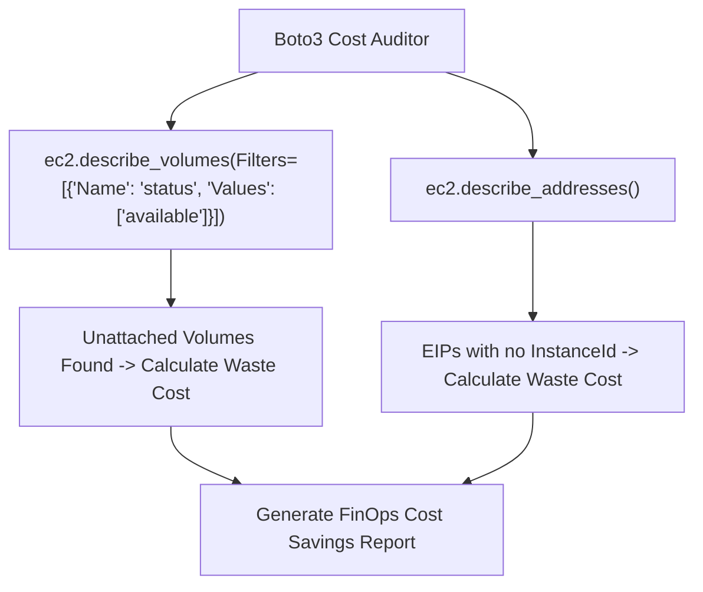

# Lesson 03 — Cloud Cost Optimization: Auditing Unattached EBS Volumes and Stale Elastic IPs

## 🎯 What will I learn?
You will learn how to build an automated AWS FinOps (Cloud Financial Operations) audit tool in Python: detecting unattached Elastic Block Store (EBS) volumes (`state == 'available'`), finding unassociated Elastic IP addresses (which incur hourly AWS charges when idle), and generating cost-savings reports.

---

## 🤔 Why does a DevOps engineer need this?
When engineers terminate EC2 instances, attached EBS volumes are often left behind unattached:

- An unattached 500 GB `gp3` or `io2` SSD volume costs $40 to $100+ per month while doing nothing.
- AWS charges for idle Elastic IPs to prevent IPv4 hoarding.
- An automated weekly Boto3 audit script identifies these orphaned resources and alerts the DevOps team, saving thousands of dollars in cloud waste.

---

## 🧠 Mental model



---

## 📖 Concept

### 1. Detecting Unattached EBS Volumes
```python
# status == 'available' means NOT attached to any instance
response = ec2.describe_volumes(Filters=[{"Name": "status", "Values": ["available"]}])
```

### 2. Detecting Idle Elastic IPs
```python
addresses = ec2.describe_addresses().get("Addresses", [])
idle_eips = [addr for addr in addresses if "InstanceId" not in addr and "NetworkInterfaceId" not in addr]
```

---

## 💻 Simple example

```python
import boto3

ec2 = boto3.client("ec2", region_name="us-east-1")
# available_vols = ec2.describe_volumes(Filters=[{"Name": "status", "Values": ["available"]}])
```

---

## 🔧 Real DevOps example (`example.py`)

```python
"""
DevOps Script: AWS FinOps Orphan Resource & Cost Waste Auditor
Detects unattached EBS volumes and idle Elastic IPs and calculates monthly wasted spend.
"""

def audit_wasted_cloud_resources(region="us-east-1"):
    print("========================================")
    print("     AWS CLOUD FINOPS & WASTE AUDITOR   ")
    print("========================================")
    print(f"Auditing Region: {region}\n")
    
    # Standard pricing approximations (us-east-1)
    EBS_GP3_PER_GB_MONTH = 0.08    # $0.08 per GB-month
    IDLE_EIP_PER_MONTH = 3.65      # ~$0.005/hr = $3.65/month
    
    try:
        import boto3
        ec2 = boto3.client("ec2", region_name=region)
        
        # 1. Query Unattached EBS Volumes
        vol_resp = ec2.describe_volumes(Filters=[{"Name": "status", "Values": ["available"]}])
        unattached_volumes = vol_resp.get("Volumes", [])
        
        # 2. Query Idle Elastic IPs
        eip_resp = ec2.describe_addresses()
        idle_eips = [
            a for a in eip_resp.get("Addresses", [])
            if "InstanceId" not in a and "NetworkInterfaceId" not in a
        ]
        
    except Exception as err:
        print(f"[*] Simulation Mode (AWS credentials/SDK offline: {err})\n")
        unattached_volumes = [
            {"VolumeId": "vol-0123456789abcdef0", "Size": 250, "VolumeType": "gp3", "CreateTime": "2026-06-01"},
            {"VolumeId": "vol-0fedcba9876543210", "Size": 500, "VolumeType": "gp3", "CreateTime": "2026-05-15"}
        ]
        idle_eips = [
            {"PublicIp": "54.210.45.12", "AllocationId": "eipalloc-0112233"},
            {"PublicIp": "34.195.88.90", "AllocationId": "eipalloc-0445566"}
        ]
        
    # Calculate EBS Waste
    total_unattached_gb = sum(v["Size"] for v in unattached_volumes)
    ebs_monthly_waste = total_unattached_gb * EBS_GP3_PER_GB_MONTH
    
    # Calculate EIP Waste
    eip_monthly_waste = len(idle_eips) * IDLE_EIP_PER_MONTH
    
    total_waste = ebs_monthly_waste + eip_monthly_waste
    
    print("1. Unattached EBS Volumes (Storage Waste):")
    for v in unattached_volumes:
        cost = v["Size"] * EBS_GP3_PER_GB_MONTH
        print(f"  [ORPHAN] ID: {v['VolumeId']} | Size: {v['Size']:>4} GB ({v['VolumeType']}) | Est: ${cost:.2f}/mo")
        
    print(f"\n2. Unassociated Idle Elastic IPs (IPv4 Waste):")
    for ip in idle_eips:
        print(f"  [IDLE]   IP: {ip['PublicIp']:<15} | Alloc: {ip['AllocationId']} | Est: ${IDLE_EIP_PER_MONTH:.2f}/mo")
        
    print("----------------------------------------")
    print(f"Total Unattached EBS Storage: {total_unattached_gb} GB")
    print(f"Total Idle Elastic IPs      : {len(idle_eips)}")
    print(f"ESTIMATED MONTHLY SAVINGS   : ${total_waste:.2f} / month")
    print("========================================")

if __name__ == "__main__":
    audit_wasted_cloud_resources()
```

---

## 🖥️ Expected output

```text
$ python example.py
========================================
     AWS CLOUD FINOPS & WASTE AUDITOR   
========================================
Auditing Region: us-east-1

1. Unattached EBS Volumes (Storage Waste):
  [ORPHAN] ID: vol-0123456789abcdef0 | Size:  250 GB (gp3) | Est: $20.00/mo
  [ORPHAN] ID: vol-0fedcba9876543210 | Size:  500 GB (gp3) | Est: $40.00/mo

2. Unassociated Idle Elastic IPs (IPv4 Waste):
  [IDLE]   IP: 54.210.45.12    | Alloc: eipalloc-0112233 | Est: $3.65/mo
  [IDLE]   IP: 34.195.88.90    | Alloc: eipalloc-0445566 | Est: $3.65/mo
----------------------------------------
Total Unattached EBS Storage: 750 GB
Total Idle Elastic IPs      : 2
ESTIMATED MONTHLY SAVINGS   : $67.30 / month
========================================
```

---

## 🔍 Line-by-line explanation
- `Filters=[{"Name": "status", "Values": ["available"]}]`: Queries EBS volumes that are detached.
- `"InstanceId" not in a and "NetworkInterfaceId" not in a`: Filters out Elastic IPs that are not mapped to an active EC2 virtual machine or NAT Gateway.

---

## 🐚 Shell equivalent

```bash
aws ec2 describe-volumes --filters Name=status,Values=available --query "Volumes[].VolumeId"
```

---

## ⚙️ Ansible equivalent

Ansible focuses on resource provisioning rather than real-time cost waste aggregation.

---

## 🏆 Which one should I use?
- Use **Python Boto3** for cost-saving AWS Lambda cron jobs that automatically tag, notify owners, and delete stale EBS volumes after 30 days of inactivity.

---

## ⚠️ Common mistakes
1. **Deleting EBS volumes immediately without creating a final snapshot:**

   - Always create a snapshot (`ec2.create_snapshot()`) before purging orphan volumes in production in case critical data was stored on the disk.

---

## 🧪 Practice (Exercise)
Open `exercise.py`. Write a function `calculate_ebs_waste(volumes_list, cost_per_gb=0.08)` that takes a list of volume dictionaries and returns `(total_gb, total_monthly_cost)`.

---

## 💡 Hint
`sum(v["Size"] for v in volumes_list)`.

---

## ✅ Solution
Check `solution.py` after your attempt.

---

## 🎯 Interview questions

### Q: "How would you design an automated cloud waste remediation system in AWS using Python?"
> **Interviewer Focus:** Testing your understanding of FinOps, safe lifecycle policies, and notification hooks.

---

## 🗣️ How to answer in an interview
> *"I implement a scheduled AWS Lambda function running Boto3. It scans all regions for unattached EBS volumes and unassociated Elastic IPs. When an orphan resource is identified, the script applies a tag `PendingDeletion: <timestamp + 7 days>` and posts a Slack message mentioning the creator based on CloudTrail event history. On day 7, a cleanup Lambda creates a safety snapshot of the volume and deletes the original, reclaiming storage costs while maintaining complete data recoverability."*

---

## 📝 What I should remember
- EBS volume `status == 'available'` means unattached.
- Idle Elastic IPs incur charges when not attached.
- Always snapshot before deleting cloud disks.
