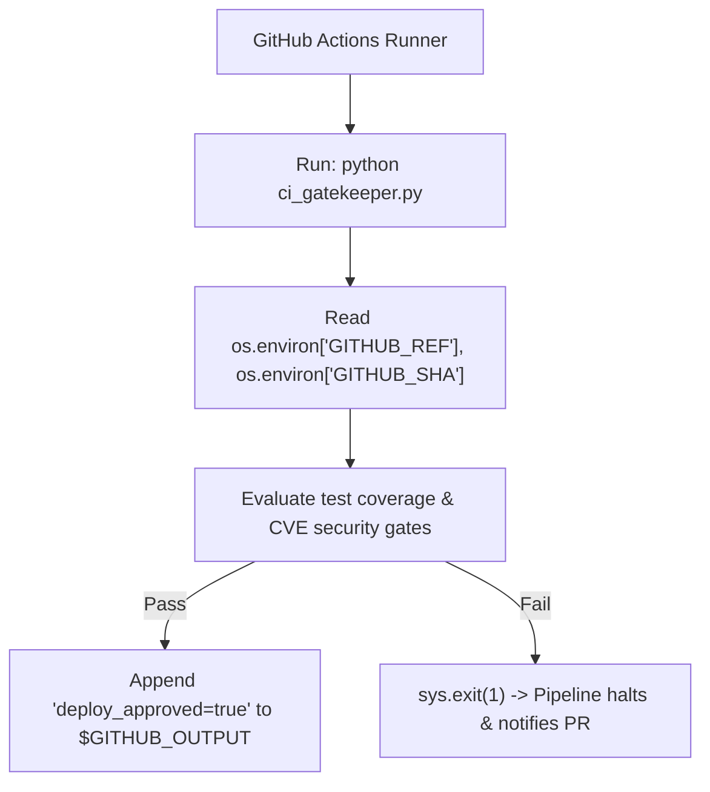

# Lesson 01 — Python in CI/CD: GitHub Actions, GitLab CI, and Jenkins

## 🎯 What will I learn?
You will learn how to embed and execute Python automation scripts inside modern CI/CD pipelines (GitHub Actions, GitLab CI, Jenkins): reading pipeline environment variables (`GITHUB_SHA`, `CI_COMMIT_REF_NAME`), setting workflow output parameters (`GITHUB_OUTPUT`), creating step summaries, and managing exit codes for automated pipeline gating.

---

## 🤔 Why does a DevOps engineer need this?
Complex CI/CD pipelines require sophisticated logic that YAML workflows cannot handle cleanly:
- Calculating dynamic build matrices or determining which microservices changed in a monorepo.
- Parsing test results (JUnit XML) and generating markdown summary tables on pull requests.
- Exporting dynamic outputs to subsequent workflow steps via `$GITHUB_OUTPUT`.

---

## 🧠 Mental model



---

## 📖 Concept

### Setting GitHub Actions Step Outputs via Python

In modern GitHub Actions, scripts set step outputs by appending to the file path specified in `os.environ["GITHUB_OUTPUT"]`:

```python
import os

output_file = os.environ.get("GITHUB_OUTPUT")
if output_file:
    with open(output_file, "a", encoding="utf-8") as f:
        f.write(f"image_tag=v2.1.0-sha.8f2a1b\n")
        f.write(f"deploy_status=APPROVED\n")
```

---

## 💻 Simple example

```python
import os
import sys

ref = os.environ.get("GITHUB_REF", "refs/heads/main")
branch = ref.replace("refs/heads/", "")
print(f"Active Pipeline Branch: {branch}")
```

---

## 🔧 Real DevOps example (`example.py`)

```python
"""
DevOps Script: CI/CD Monorepo Change Evaluator & Pipeline Gatekeeper
Determines which microservices require rebuilds based on modified files.
"""
import os
import sys

def evaluate_monorepo_pipeline(modified_files):
    print("========================================")
    print("     CI/CD MONOREPO BUILD EVALUATOR     ")
    print("========================================")
    
    # 1. Inspect CI Environment Context
    git_sha = os.environ.get("GITHUB_SHA", "a1b2c3d4e5f6")[:7]
    branch = os.environ.get("GITHUB_REF_NAME", "main")
    
    print(f"Pipeline Branch : {branch}")
    print(f"Commit Short SHA: {git_sha}")
    print(f"Modified Files  : {len(modified_files)}\n")
    
    # 2. Service Directory Mapping
    services_to_build = set()
    for filepath in modified_files:
        if filepath.startswith("services/auth/"):
            services_to_build.add("auth-service")
        elif filepath.startswith("services/payment/"):
            services_to_build.add("payment-service")
        elif filepath.startswith("services/frontend/"):
            services_to_build.add("frontend-web")
        elif filepath.startswith("common/"):
            # If shared library changed, trigger full rebuild
            services_to_build.update(["auth-service", "payment-service", "frontend-web"])
            
    print(f"Services Requiring Build ({len(services_to_build)}):")
    for svc in sorted(services_to_build):
        print(f"  [TRIGGER BUILD] -> {svc}")
        
    # 3. Export to GITHUB_OUTPUT if running inside GitHub Actions
    gh_output_path = os.environ.get("GITHUB_OUTPUT")
    if gh_output_path:
        with open(gh_output_path, "a", encoding="utf-8") as f:
            f.write(f"build_count={len(services_to_build)}\n")
            f.write(f"services_json={list(services_to_build)}\n")
        print(f"\n[+] Successfully exported build parameters to $GITHUB_OUTPUT")
        
    print("========================================")
    return list(services_to_build)

if __name__ == "__main__":
    sample_diff = [
        "services/payment/api.py",
        "services/payment/requirements.txt",
        "README.md"
    ]
    evaluate_monorepo_pipeline(sample_diff)
```

---

## 🖥️ Expected output

```text
$ python example.py
========================================
     CI/CD MONOREPO BUILD EVALUATOR     
========================================
Pipeline Branch : main
Commit Short SHA: a1b2c3d
Modified Files  : 3

Services Requiring Build (1):
  [TRIGGER BUILD] -> payment-service
========================================
```

---

## 🔍 Line-by-line explanation
- `os.environ.get("GITHUB_REF_NAME", "main")`: Pulls standard runner metadata automatically injected by GitHub Actions.
- `with open(gh_output_path, "a") as f: f.write(...)`: Exports key-value pairs that downstream workflow jobs can reference via `${{ steps.my_step.outputs.build_count }}`.

---

## 🐚 Shell equivalent

```bash
echo "build_count=1" >> "$GITHUB_OUTPUT"
```

---

## ⚙️ Ansible equivalent

Ansible sets workflow variables using `ansible.builtin.set_fact`.

---

## 🏆 Which one should I use?
- Use **Python** inside CI/CD steps whenever you need to compute dynamic matrix configurations, evaluate monorepo change sets, or parse code coverage outputs into pull request comments.

---

## ⚠️ Common mistakes
1. **Using deprecated `::set-output` syntax:**
   - GitHub Actions deprecated `echo "::set-output name=key::val"`. Always write to `$GITHUB_OUTPUT`.

---

## 🧪 Practice (Exercise)
Open `exercise.py`. Write a function `check_ci_security_gate(cve_report: dict)` that exports `deploy_allowed=true` or `deploy_allowed=false` to `$GITHUB_OUTPUT` based on whether critical CVEs are zero.

---

## 💡 Hint
Check `cve_report.get("critical", 0) == 0`.

---

## ✅ Solution
Check `solution.py` after your attempt.

---

## 🎯 Interview questions

### Q: "How do you pass dynamic outputs from a Python script to subsequent steps in a GitHub Actions workflow?"
> **Interviewer Focus:** Testing up-to-date knowledge of GitHub Actions environment files (`GITHUB_OUTPUT`, `GITHUB_STEP_SUMMARY`, `GITHUB_ENV`).

---

## 🗣️ How to answer in an interview
> *"In modern GitHub Actions runners, we read the `GITHUB_OUTPUT` environment variable, which contains a path to a temporary runner file. The Python script opens this file in append mode (`with open(os.environ['GITHUB_OUTPUT'], 'a') as f:`) and writes key-value pairs formatted as `name=value\n`. Subsequent steps in the workflow can then reference these values directly using `${{ steps.<step_id>.outputs.<name> }}`."*

---

## 📝 What I should remember
- Read pipeline context via `os.environ.get('GITHUB_SHA')`.
- Write step outputs to `os.environ['GITHUB_OUTPUT']`.
- Write rich PR summaries to `os.environ['GITHUB_STEP_SUMMARY']`.
