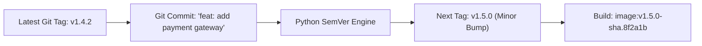

# Lesson 02 — Semantic Versioning and Automated Git Tagging

## 🎯 What will I learn?
You will learn how to build automated release versioning calculators in Python: parsing Git tags, calculating next **Semantic Versions (SemVer)** based on commit messages (`fix:` -> Patch `v1.0.1`, `feat:` -> Minor `v1.1.0`, `BREAKING CHANGE:` -> Major `v2.0.0`), and formatting immutable Docker image release tags.

---

## 🤔 Why does a DevOps engineer need this?
Automated CI/CD pipelines need deterministic, collision-free release versioning:

- Eliminating manual version bumping.
- Tagging container images with clean SemVer and Git commit SHAs: `registry.io/app:v1.4.0-a1b2c3d`.
- Automating GitHub Release creation from git history.

---

## 🧠 Mental model



---

## 📖 Concept

### Semantic Versioning Rules (SemVer)
`v<MAJOR>.<MINOR>.<PATCH>`
1. **PATCH** (`1.0.0` -> `1.0.1`): Backwards-compatible bug fixes (`fix:`).
2. **MINOR** (`1.0.0` -> `1.1.0`): Backwards-compatible new features (`feat:`).
3. **MAJOR** (`1.0.0` -> `2.0.0`): Breaking changes / API overhauls (`BREAKING:`).

---

## 💻 Simple example

```python
current_version = (1, 4, 2)
# Feature added -> bump minor
next_version = (current_version[0], current_version[1] + 1, 0)
print(f"v{next_version[0]}.{next_version[1]}.{next_version[2]}")  # 'v1.5.0'
```

---

## 🔧 Real DevOps example (`example.py`)

```python
"""
DevOps Script: Automated SemVer Release Calculator
Parses commit messages and computes next semantic release tag.
"""
import re

def compute_next_semver(current_tag, commit_messages):
    print("========================================")
    print("      AUTOMATED SEMVER RELEASE ENGINE   ")
    print("========================================")
    print(f"Current Base Tag: {current_tag}")
    print(f"Commits to Audit: {len(commit_messages)}\n")
    
    # 1. Parse current SemVer
    match = re.match(r"^v?(\d+)\.(\d+)\.(\d+)$", current_tag.strip())
    if not match:
        raise ValueError(f"Invalid SemVer tag: '{current_tag}'")
        
    major = int(match.group(1))
    minor = int(match.group(2))
    patch = int(match.group(3))
    
    # 2. Determine bump level based on Conventional Commits
    bump_type = "patch"
    
    for msg in commit_messages:
        msg_lower = msg.lower()
        if "breaking change" in msg_lower or "breaking:" in msg_lower:
            bump_type = "major"
            break  # Highest priority bump
        elif msg_lower.startswith("feat:") or "feature:" in msg_lower:
            if bump_type != "major":
                bump_type = "minor"
                
    # 3. Calculate next version
    if bump_type == "major":
        next_tag = f"v{major + 1}.0.0"
    elif bump_type == "minor":
        next_tag = f"v{major}.{minor + 1}.0"
    else:
        next_tag = f"v{major}.{minor}.{patch + 1}"
        
    print("Analyzed Commits:")
    for m in commit_messages:
        print(f"  - {m}")
        
    print("----------------------------------------")
    print(f"Detected Bump Type : {bump_type.upper()}")
    print(f"Calculated Next Tag: {next_tag}")
    print("========================================")
    return next_tag

if __name__ == "__main__":
    recent_commits = [
        "docs: update deployment architecture diagram",
        "fix: resolve connection timeout in redis pool",
        "feat: add Apple Pay checkout support"
    ]
    compute_next_semver("v1.4.2", recent_commits)
```

---

## 🖥️ Expected output

```text
$ python example.py
========================================
      AUTOMATED SEMVER RELEASE ENGINE   
========================================
Current Base Tag: v1.4.2
Commits to Audit: 3

Analyzed Commits:

  - docs: update deployment architecture diagram
  - fix: resolve connection timeout in redis pool
  - feat: add Apple Pay checkout support
----------------------------------------
Detected Bump Type : MINOR
Calculated Next Tag: v1.5.0
========================================
```

---

## 🔍 Line-by-line explanation
- `bump_type == "minor": next_tag = f"v{major}.{minor + 1}.0"`: Bumping minor automatically resets the patch counter to `0`.
- Conventional commit parsing allows deterministic semantic releases directly from git history without human intervention.

---

## 🐚 Shell equivalent

```bash
# In Bash, string splitting SemVer is cumbersome:
MAJOR=$(echo "$CURRENT_TAG" | cut -d. -f1 | tr -d 'v')
MINOR=$(echo "$CURRENT_TAG" | cut -d. -f2)
echo "v${MAJOR}.$((MINOR + 1)).0"
```

---

## ⚙️ Ansible equivalent

Ansible utilizes plugins or Python filters to evaluate SemVer numbers.

---

## 🏆 Which one should I use?
- Use **Python** for automated release calculation, changelog generation, and tagging logic in CI/CD pipelines.

---

## ⚠️ Common mistakes
1. **Bumping minor without resetting patch:**

   - `v1.2.5` bumped with a minor feature becomes `v1.3.0`, NOT `v1.3.5`.
2. **Accepting non-numeric tags:**

   - Always validate with regex before performing integer math on versions.

---

## 🧪 Practice (Exercise)
Open `exercise.py`. Write a function `bump_patch_version(tag: str) -> str` that increments only the patch number (e.g. `v2.0.8` -> `v2.0.9`).

---

## 💡 Hint
Parse with regex, increment `patch + 1`, and format `f"v{major}.{minor}.{patch}"`.

---

## ✅ Solution
Check `solution.py` after your attempt.

---

## 🎯 Interview questions

### Q: "How do you automate immutable Docker container tagging in CI/CD using Semantic Versioning?"
> **Interviewer Focus:** Testing knowledge of build reproducibility, avoiding `:latest` tag anti-patterns, and git metadata integration.

---

## 🗣️ How to answer in an interview
> *"In production CI/CD, we never deploy with mutable `:latest` tags because they obscure the exact code running in the cluster. Instead, we use a Python release calculator that computes the SemVer tag from Git Conventional Commits and appends the short commit SHA and build ID (`registry.io/app:v1.5.0-sha.8f2a1b`). This creates an immutable artifact tag that maps directly back to the exact Git commit, ensuring complete auditability and deterministic rollbacks."*

---

## 📝 What I should remember
- Major: breaking change, Minor: feature (resets patch), Patch: bug fix.
- Always reset patch to 0 when minor bumps.
- Combine SemVer with Git SHA for immutable container tags.
