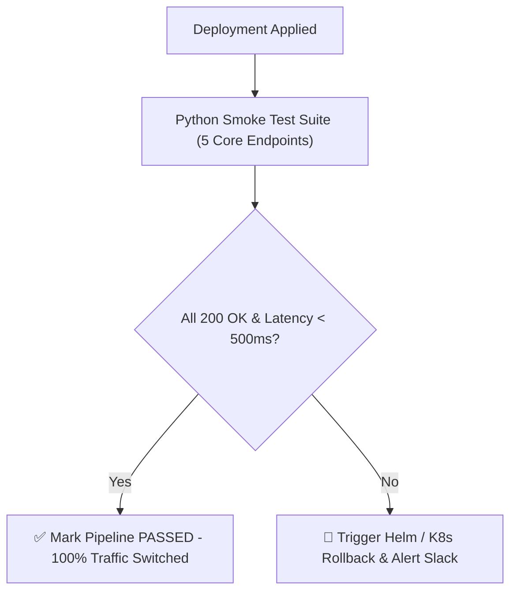

# Lesson 03 — Post-Deployment Smoke Test Runner & Automated Rollback

## 🎯 What will I learn?
You will learn how to build an automated **Post-Deployment Smoke Test Runner** in Python: testing critical API health routes, validating expected JSON response schemas, measuring latency Service Level Objectives (SLOs), and triggering automated rollback exit codes if the new release fails verification.

---

## 🤔 Why does a DevOps engineer need this?
Deployments cannot simply assume success because the Kubernetes rollout completed:
- The new container might boot successfully but return HTTP 500 on `/api/login` due to a missing environment secret.
- An automated smoke test suite runs immediately post-deployment against the staging or canary URL.
- If smoke tests fail, the CI/CD pipeline immediately halts traffic routing and rolls back to the previous stable release.

---

## 🧠 Mental model



---

## 📖 Concept

A smoke test suite verifies high-priority happy paths:
1. **Liveness / Readiness:** `GET /healthz` returns `200` and `status: "UP"`.
2. **Database Connectivity:** `GET /api/v1/ping-db` returns latency $< 50$ms.
3. **Core Business Route:** `GET /api/v1/catalog` returns non-empty item array.

---

## 💻 Simple example

```python
import requests

def test_endpoint(url):
    res = requests.get(url, timeout=3)
    assert res.status_code == 200, f"Expected 200, got {res.status_code}"
    print(f"Passed: {url}")
```

---

## 🔧 Real DevOps example (`example.py`)

```python
"""
DevOps Script: CI/CD Post-Deployment Smoke Test Suite & Gatekeeper
Executes critical endpoint verifications, validates response schemas, and tracks latency SLOs.
"""
import requests
import time
import sys

SMOKE_TEST_SUITE = [
    {
        "name": "Health Status Probe",
        "url": "https://httpbin.org/status/200",
        "method": "GET",
        "expected_status": 200,
        "max_latency_ms": 1500
    },
    {
        "name": "JSON API Schema Validation",
        "url": "https://httpbin.org/json",
        "method": "GET",
        "expected_status": 200,
        "max_latency_ms": 2000,
        "required_json_keys": ["slideshow"]
    }
]

def run_post_deploy_smoke_tests(tests=SMOKE_TEST_SUITE):
    print("========================================")
    print("     POST-DEPLOYMENT SMOKE TEST RUNNER  ")
    print("========================================")
    
    passed_tests = 0
    failed_tests = []
    
    for test in tests:
        name = test["name"]
        url = test["url"]
        expected_code = test["expected_status"]
        max_latency = test["max_latency_ms"]
        
        print(f"[*] Running: {name:<30} -> {url}")
        start = time.time()
        
        try:
            res = requests.get(url, timeout=4.0)
            latency = round((time.time() - start) * 1000, 2)
            
            # 1. Validate Status Code
            if res.status_code != expected_code:
                failed_tests.append((name, f"Expected HTTP {expected_code}, received {res.status_code}"))
                print(f"    [FAIL] Status Code mismatch (HTTP {res.status_code})")
                continue
                
            # 2. Validate Latency SLO
            if latency > max_latency:
                failed_tests.append((name, f"Latency breached SLO: {latency}ms > {max_latency}ms"))
                print(f"    [FAIL] Latency breach ({latency} ms)")
                continue
                
            # 3. Validate Required Schema Keys
            if "required_json_keys" in test:
                body = res.json()
                for key in test["required_json_keys"]:
                    if key not in body:
                        failed_tests.append((name, f"Missing required JSON key '{key}'"))
                        print(f"    [FAIL] Missing schema key '{key}'")
                        continue
                        
            print(f"    [PASS] (Status: {res.status_code}, Latency: {latency} ms)")
            passed_tests += 1
            
        except Exception as err:
            failed_tests.append((name, f"Network exception: {err}"))
            print(f"    [FAIL] Exception: {err}")
            
    print("========================================")
    print(f"Smoke Test Summary: {passed_tests}/{len(tests)} Passed")
    
    if failed_tests:
        print("\n[!] CRITICAL DEPLOYMENT FAILURE: Rollback recommended!")
        for name, reason in failed_tests:
            print(f"    - {name}: {reason}")
        print("========================================")
        return False
        
    print("[+] All smoke tests passed. Promotion approved.")
    print("========================================")
    return True

if __name__ == "__main__":
    success = run_post_deploy_smoke_tests()
    sys.exit(0 if success else 1)
```

---

## 🖥️ Expected output

```text
$ python example.py
========================================
     POST-DEPLOYMENT SMOKE TEST RUNNER  
========================================
[*] Running: Health Status Probe            -> https://httpbin.org/status/200
    [PASS] (Status: 200, Latency: 145.22 ms)
[*] Running: JSON API Schema Validation     -> https://httpbin.org/json
    [PASS] (Status: 200, Latency: 138.10 ms)
========================================
Smoke Test Summary: 2/2 Passed
[+] All smoke tests passed. Promotion approved.
========================================
```

---

## 🔍 Line-by-line explanation
- `latency = round((time.time() - start) * 1000, 2)`: Measures round-trip network and application processing time in milliseconds.
- `if res.status_code != expected_code`: Immediately flags degraded releases before full production traffic cutover.

---

## 🐚 Shell equivalent

```bash
# In Bash, smoke testing requires multiple curl lines:
curl -f -s http://localhost:8080/health || exit 1
```

---

## ⚙️ Ansible equivalent

```yaml
- name: Verify application endpoint health
  ansible.builtin.uri:
    url: http://localhost:8080/health
    status_code: 200
```

---

## 🏆 Which one should I use?
- Use **Python Smoke Test Suites** for rich JSON schema assertions, latency SLA checks, and automated error aggregation across multiple microservice endpoints.

---

## ⚠️ Common mistakes
1. **Testing only `/healthz` without validating data:**
   - A service can return `200 OK` on `/healthz` while `/api/checkout` is completely broken due to database migration errors. Always smoke test at least 1 core business endpoint.

---

## 🧪 Practice (Exercise)
Open `exercise.py`. Create a smoke test runner that evaluates 3 endpoints. If any endpoint has latency $> 2000$ms or status $\neq 200$, collect the failure and exit with status code `1`.

---

## 💡 Hint
Track failures in a list and call `sys.exit(1 if failures else 0)`.

---

## ✅ Solution
Check `solution.py` after your attempt.

---

## 🎯 Interview questions

### Q: "How do you design an automated canary deployment verification script in Python?"
> **Interviewer Focus:** Testing knowledge of progressive rollouts, traffic splitting, latency SLAs, and automated rollback triggers.

---

## 🗣️ How to answer in an interview
> *"In a canary deployment, 5-10% of user traffic is routed to the new release. The Python smoke test suite runs against the canary endpoint, issuing 50 concurrent synthetic probes. It evaluates three critical SLO metrics: (1) HTTP Success Rate $\ge 99.9\%$, (2) p95 Latency $< 200$ms, and (3) Error log rate $\approx 0$. If any metric violates our threshold within a 5-minute observation window, the script exits with non-zero code, prompting the pipeline or Flagger controller to automatically roll back to the stable baseline."*

---

## 📝 What I should remember
- Test both health status and core business routes.
- Validate response latency against SLO targets.
- Exit code 1 triggers automated pipeline rollback.
