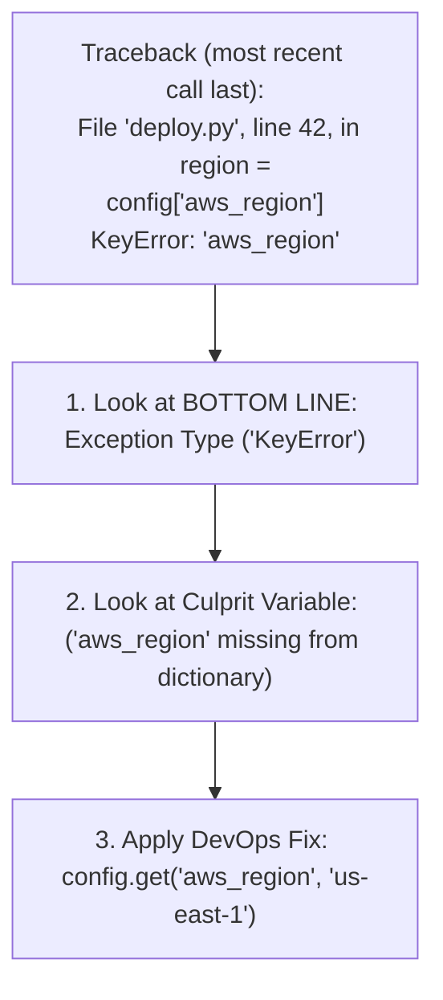

# Lesson 01 — Troubleshooting Common Python Errors in DevOps

## 🎯 What will I learn?
You will learn how to read, diagnose, and resolve the most common Python exceptions encountered in DevOps scripts: `KeyError`, `FileNotFoundError`, `TypeError`, `IndexError`, `PermissionError`, `ModuleNotFoundError`, and `subprocess.CalledProcessError`.

---

## 🤔 Why does a DevOps engineer need this?
When an automation script crashes at 3:00 AM during an automated release or pipeline run:
- A junior engineer panics at a 40-line traceback.
- A **Senior DevOps Engineer** looks directly at the bottom line of the traceback, identifies the exception class, and knows the exact root cause immediately.

---

## 🧠 Mental model



---

## 📖 Concept: The DevOps Error Taxonomy

| Error Name | What it means | Why it happens in DevOps | Production Fix |
| :--- | :--- | :--- | :--- |
| `KeyError` | Dict key doesn't exist | Cloud API or JSON omitted an optional field | Use `.get("key", default)` |
| `FileNotFoundError` | File path doesn't exist | Config file not mounted or path typo | Use `os.path.exists()` check |
| `PermissionError` | Access denied | Non-root script writing to `/var/log` or socket | Check file permissions / `chmod` |
| `TypeError` | Incompatible types | Concatenating string to int (`"8080" + 1`) | Explicit type casting `int(port)` |
| `IndexError` | List index out of range | `sys.argv[1]` without checking `len(sys.argv)` | Check length or use `argparse` |
| `ModuleNotFoundError`| Package missing | `requests` not installed in active `venv` | Add to `requirements.txt` & `pip install` |
| `json.JSONDecodeError`| Malformed JSON | API returned HTML error page instead of JSON | Inspect raw text before `.json()` |

---

## 💻 Simple example

```python
# Diagnosing KeyError
server = {"name": "web01"}
# print(server["ip"]) # ❌ KeyError: 'ip'
print(server.get("ip", "127.0.0.1")) # ✅ Safe fallback
```

---

## 🔧 Real DevOps example (`example.py`)

```python
"""
DevOps Script: Defensive Exception Handling & Triage Engine
Demonstrates defensive wrappers for common failure points.
"""

def safe_config_lookup(config_dict, key, default="DEFAULT_VAL"):
    """Demonstrates handling KeyError defensively."""
    try:
        return config_dict[key]
    except KeyError:
        print(f"[*] KeyError caught: '{key}' not in config. Falling back to '{default}'.")
        return default

def safe_file_reader(filepath):
    """Demonstrates handling FileNotFoundError and PermissionError."""
    try:
        with open(filepath, "r", encoding="utf-8") as f:
            return f.read().strip()
    except FileNotFoundError:
        print(f"[!] FileNotFoundError: '{filepath}' does not exist.")
        return None
    except PermissionError:
        print(f"[!] PermissionError: Insufficient privileges to read '{filepath}'.")
        return None

if __name__ == "__main__":
    print("========================================")
    print("      DEVOPS ERROR TRIAGE TEST          ")
    print("========================================")
    
    # 1. Test KeyError safety
    dummy_config = {"env": "prod", "cluster": "k8s-east"}
    region = safe_config_lookup(dummy_config, "aws_region", "us-east-1")
    print(f"Resolved Region: {region}\n")
    
    # 2. Test FileNotFoundError safety
    content = safe_file_reader("/etc/non_existent_secret.conf")
    print(f"File Content Result: {content}")
    print("========================================")
```

---

## 🖥️ Expected output

```text
$ python example.py
========================================
      DEVOPS ERROR TRIAGE TEST          
========================================
[*] KeyError caught: 'aws_region' not in config. Falling back to 'us-east-1'.
Resolved Region: us-east-1

[!] FileNotFoundError: '/etc/non_existent_secret.conf' does not exist.
File Content Result: None
========================================
```

---

## 🔍 Line-by-line explanation
- `try...except KeyError`: Catches missing keys specifically rather than using a blanket `except Exception:` which could hide real bugs.
- Returning `default` ensures calling functions don't crash down the line.

---

## 🐚 Shell equivalent

```bash
# In Bash:
if [ ! -f "/etc/config.conf" ]; then
    echo "File not found"
fi
```

---

## ⚙️ Ansible equivalent

Ansible uses `default()` filter: `{{ config.aws_region | default('us-east-1') }}`.

---

## 🏆 Which one should I use?
- In all Python automation scripts, **catch specific exceptions** (`FileNotFoundError`, `requests.Timeout`) rather than bare `except:`.

---

## ⚠️ Common mistakes
1. **Using bare `except:` without specifying the error class:**
   - Catches `KeyboardInterrupt` (Ctrl+C) and `SystemExit`, making it impossible to stop a stuck script! Always use `except SpecificError:` or `except Exception:`.

---

## 🧪 Practice (Exercise)
Open `exercise.py`. Fix a broken junior script that crashes with `IndexError`, `KeyError`, and `TypeError`.

---

## 💡 Hint
Add index bounds check on `sys.argv`, use `.get()` on dictionaries, and convert port strings to `int()`.

---

## ✅ Solution
Check `solution.py` after your attempt.

---

## 🎯 Interview questions

### Q: "Why is a bare `except:` clause considered a dangerous anti-pattern in Python automation scripts?"
> **Interviewer Focus:** Testing your understanding of Python exception hierarchy and process control signals.

---

## 🗣️ How to answer in an interview
> *"A bare `except:` catches all exceptions inheriting from `BaseException`, including `KeyboardInterrupt` (Ctrl+C signals from terminal users) and `SystemExit` (calls to `sys.exit()`). If you use bare `except:`, a user cannot stop a runaway script with Ctrl+C, and intentional pipeline aborts will be swallowed silently. Best practice is to catch the most specific exception possible (e.g. `FileNotFoundError`), or at most `except Exception:`, which catches standard runtime errors while still allowing system signals to pass through."*

---

## 📝 What I should remember
- Read tracebacks from bottom to top.
- Always catch specific exception classes.
- Use `.get()` to avoid `KeyError`.
- Never use bare `except:`.
