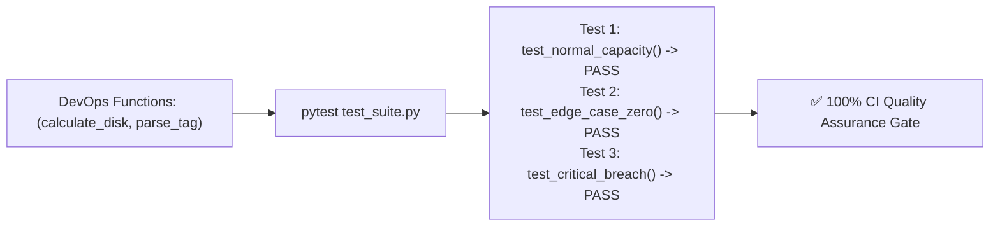

# Lesson 02 — Unit Testing DevOps Scripts with `pytest`

## 🎯 What will I learn?
You will learn how to write automated test suites for your DevOps scripts using **`pytest`**: writing test functions (`test_*`), using simple `assert` statements, test parameterization (`@pytest.mark.parametrize`), and running tests in CI/CD pipeline stages.

---

## 🤔 Why does a DevOps engineer need this?
Automation scripts control production infrastructure:

- If a disk cleanup script has a bug in its age calculation, it might delete active production databases instead of 30-day-old logs!
- Unit testing your utility functions with `pytest` guarantees that regex parsers, SemVer calculators, and capacity threshold algorithms work accurately before they ever run on a live server.

---

## 🧠 Mental model



---

## 📖 Concept

In `pytest`, any file named `test_*.py` and any function starting with `def test_*():` is automatically discovered and executed.

```python
# Reusable DevOps logic
def is_disk_critical(used_pct: float, threshold: float = 85.0) -> bool:
    return used_pct >= threshold

# Pytest test function
def test_disk_critical_breach():
    assert is_disk_critical(89.5, threshold=85.0) is True

def test_disk_healthy():
    assert is_disk_critical(45.0, threshold=85.0) is False
```

---

## 💻 Simple example

```python
# Running pytest from terminal
# $ pytest test_example.py -v
```

---

## 🔧 Real DevOps example (`example.py`)

```python
"""
DevOps Test Suite: Verification for Core Infrastructure Utilities
Executable via: pytest example.py -v OR python example.py
"""
import re

# 1. Functions under test
def calculate_required_nodes(total_workload_ram_gb: float, ram_per_node_gb: float = 16.0) -> int:
    """Calculates minimum worker nodes needed to host memory workloads."""
    import math
    if total_workload_ram_gb <= 0:
        return 0
    return math.ceil(total_workload_ram_gb / ram_per_node_gb)

def sanitize_docker_tag(branch_name: str) -> str:
    """Converts git branch names into valid Docker tags."""
    sanitized = branch_name.lower().replace("/", "-").replace("_", "-")
    return re.sub(r"[^a-z0-9.-]", "", sanitized)

# 2. Pytest test cases
def test_node_capacity_calculation():
    # 30 GB needed on 16 GB nodes -> requires 2 nodes
    assert calculate_required_nodes(30.0, 16.0) == 2
    # 34 GB needed on 16 GB nodes -> requires 3 nodes
    assert calculate_required_nodes(34.0, 16.0) == 3
    # 0 GB needed -> 0 nodes
    assert calculate_required_nodes(0.0, 16.0) == 0

def test_docker_tag_sanitization():
    assert sanitize_docker_tag("feature/user-auth") == "feature-user-auth"
    assert sanitize_docker_tag("BUGFIX/Fix_Issue#123") == "bugfix-fix-issue123"
    assert sanitize_docker_tag("release/v2.0.0") == "release-v2.0.0"

if __name__ == "__main__":
    print("========================================")
    print("      RUNNING MANUAL TEST RUNNER        ")
    print("========================================")
    test_node_capacity_calculation()
    print("[PASS] test_node_capacity_calculation")
    test_docker_tag_sanitization()
    print("[PASS] test_docker_tag_sanitization")
    print("----------------------------------------")
    print("[+] All unit tests executed successfully!")
    print("========================================")
```

---

## 🖥️ Expected output

```text
$ python example.py
========================================
      RUNNING MANUAL TEST RUNNER        
========================================
[PASS] test_node_capacity_calculation
[PASS] test_docker_tag_sanitization
----------------------------------------
[+] All unit tests executed successfully!
========================================
```

---

## 🔍 Line-by-line explanation
- `math.ceil(...)`: Guarantees round-up division so extra fractional demand provisions a complete new node.
- `assert ... == expected`: Pytest inspects `assert` expressions and provides rich diff output if a test fails.

---

## 🐚 Shell equivalent

```bash
# In Bash, bats (Bash Automated Testing System) is used:
@test "check disk returns true on 90" {
  result="$(is_disk_critical 90)"
  [ "$result" -eq 1 ]
}
```

---

## ⚙️ Ansible equivalent

Ansible uses `ansible-playbook --syntax-check` and `molecule` for testing roles.

---

## 🏆 Which one should I use?
- Use **`pytest`** for all Python infrastructure scripts, CLI tools, and data parser validation in CI/CD pipeline test stages.

---

## ⚠️ Common mistakes
1. **Naming test functions without `test_` prefix:**

   - Functions named `def verify_disk():` will be ignored by `pytest`. Always use `def test_*():`.

---

## 🧪 Practice (Exercise)
Open `exercise.py`. Write unit tests for a function `is_valid_ipv4(ip: str) -> bool`. Include tests for valid IPs (`"192.168.1.1"`), invalid strings (`"999.999.999.999"`, `"abc.def"`), and empty strings.

---

## 💡 Hint
Write `def test_valid_ips():` and `def test_invalid_ips():`.

---

## ✅ Solution
Check `solution.py` after your attempt.

---

## 🎯 Interview questions

### Q: "Why should DevOps engineers write unit tests for infrastructure automation scripts?"
> **Interviewer Focus:** Testing quality engineering mindset and preventing destructive automation bugs.

---

## 🗣️ How to answer in an interview
> *"Automation code runs with elevated cloud and root privileges. A small logic error in a retention script or Kubernetes autoscaler can cause catastrophic outages or unintended data deletion in production. Writing unit tests with `pytest` allows us to validate boundary conditions, edge cases, and string parsing algorithms in isolated CI test stages before any script is granted execution access against live cloud environments."*

---

## 📝 What I should remember
- Name test files `test_*.py` and test functions `test_*()`.
- Use simple `assert condition`.
- Run with `pytest -v` in CI pipelines.
