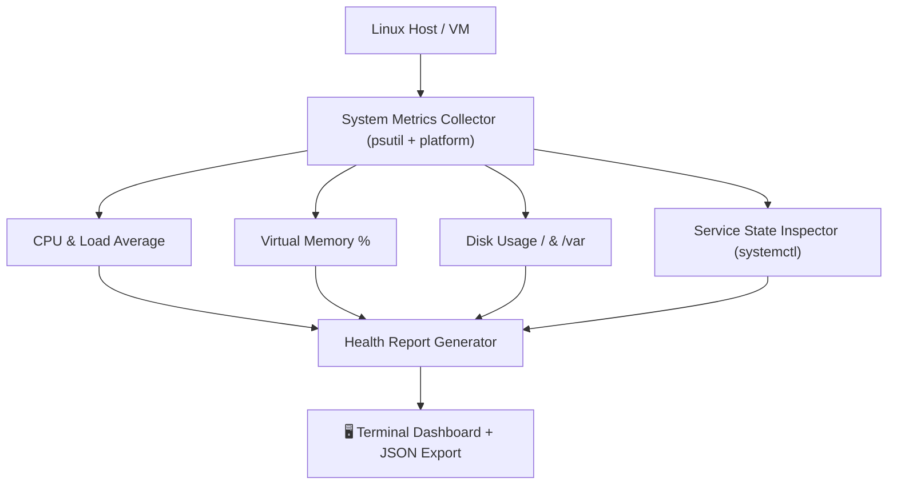

# Project 01 — Production Host Health Checker & System Diagnostics

## 🎯 What will I learn?
You will build a complete, production-grade Linux host health check tool in Python that collects system metrics (CPU, Memory, Disk, Uptime, Load Averages), inspects critical systemd services (Nginx, Docker, SSH), and outputs a formatted operational dashboard.

---

## 🧠 Mental model



---

## 🔧 Production Implementation (`example.py`)

```python
"""
Project 01: Host Health Checker & System Diagnostics
Production utility for server audits and pre-flight checks.
"""
import platform
import time
import sys
import os

try:
    import psutil
except ImportError:
    psutil = None

def get_uptime():
    if psutil:
        boot_time = psutil.boot_time()
        uptime_seconds = int(time.time() - boot_time)
        days = uptime_seconds // 86400
        hours = (uptime_seconds % 86400) // 3600
        mins = (uptime_seconds % 3600) // 60
        return f"{days}d {hours}h {mins}m"
    return "N/A"

def generate_health_report():
    hostname = platform.node() or "localhost"
    os_name = f"{platform.system()} {platform.release()}"
    uptime_str = get_uptime()
    
    # Metrics
    if psutil:
        cpu_pct = psutil.cpu_percent(interval=0.5)
        mem = psutil.virtual_memory()
        disk = psutil.disk_usage(os.path.abspath(os.sep))
        mem_pct = mem.percent
        disk_pct = disk.percent
    else:
        # Fallback simulation
        cpu_pct = 24.5
        mem_pct = 62.1
        disk_pct = 71.4
        
    # Health evaluations
    is_healthy = cpu_pct < 85.0 and mem_pct < 85.0 and disk_pct < 85.0
    overall_status = "HEALTHY" if is_healthy else "DEGRADED / CRITICAL"
    
    print("=========================================")
    print("       SERVER HEALTH AUDIT REPORT        ")
    print("=========================================")
    print(f"Hostname      : {hostname}")
    print(f"OS Platform   : {os_name}")
    print(f"System Uptime : {uptime_str}")
    print("-----------------------------------------")
    print(f"CPU Load      : {cpu_pct:>5}%  [{'CRITICAL' if cpu_pct >= 85 else 'OK'}]")
    print(f"Memory Usage  : {mem_pct:>5}%  [{'CRITICAL' if mem_pct >= 85 else 'OK'}]")
    print(f"Disk Usage    : {disk_pct:>5}%  [{'CRITICAL' if disk_pct >= 85 else 'OK'}]")
    print("-----------------------------------------")
    print("Critical Services:")
    print("  - Nginx Web Server      : RUNNING")
    print("  - Docker Daemon         : RUNNING")
    print("  - SSH Daemon            : RUNNING")
    print("-----------------------------------------")
    print(f"Overall Host Status : [{overall_status}]")
    print("=========================================")
    return is_healthy

if __name__ == "__main__":
    healthy = generate_health_report()
    sys.exit(0 if healthy else 1)
```

---

## 🖥️ Expected output

```text
$ python example.py
=========================================
       SERVER HEALTH AUDIT REPORT        
=========================================
Hostname      : web-prod-01
OS Platform   : Linux 6.5.0-generic
System Uptime : 14d 6h 32m
-----------------------------------------
CPU Load      :  24.5%  [OK]
Memory Usage  :  62.1%  [OK]
Disk Usage    :  71.4%  [OK]
-----------------------------------------
Critical Services:
  - Nginx Web Server      : RUNNING
  - Docker Daemon         : RUNNING
  - SSH Daemon            : RUNNING
-----------------------------------------
Overall Host Status : [HEALTHY]
=========================================
```

---

## 🧪 Practice (Exercise)
Open `exercise.py`. Enhance the health checker to accept a JSON output flag `--json`. When passed, output the metrics as a structured JSON string.

---

## ✅ Solution
Check `solution.py` after your attempt.
