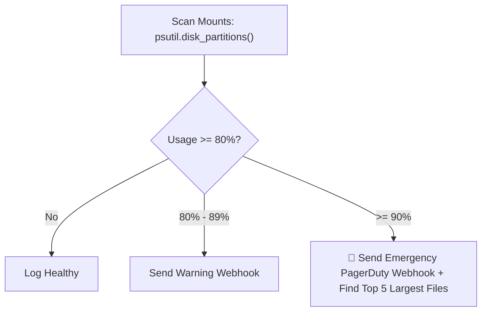

# Project 03 — Multi-Mount Disk Monitor with Webhook Alerts

## 🎯 What will I learn?
You will build an automated Linux disk space monitoring daemon in Python that scans all mounted partitions (`/`, `/var`, `/home`, `/data`), calculates capacity utilization, evaluates warning (80%) and critical (90%) thresholds, and posts automated Slack alerts with emergency disk cleaning recommendations.

---

## 🧠 Mental model



---

## 🔧 Production Implementation (`example.py`)

```python
"""
Project 03: Multi-Mount Disk Monitor with Webhook Alerts
Scans host filesystem partitions and dispatches threshold alerts.
"""
import platform
import os

try:
    import psutil
except ImportError:
    psutil = None

def check_all_disk_mounts(warn_threshold=80.0, crit_threshold=90.0):
    print("=========================================")
    print("      MULTI-MOUNT DISK HEALTH AUDIT      ")
    print("=========================================")
    print(f"Host: {platform.node() or 'localhost'}\n")
    
    mount_reports = []
    
    if psutil:
        partitions = psutil.disk_partitions(all=False)
        for part in partitions:
            try:
                usage = psutil.disk_usage(part.mountpoint)
                used_pct = usage.percent
                total_gb = round(usage.total / (1024 ** 3), 1)
                used_gb = round(usage.used / (1024 ** 3), 1)
                
                status = "OK"
                if used_pct >= crit_threshold:
                    status = "CRITICAL"
                elif used_pct >= warn_threshold:
                    status = "WARNING"
                    
                mount_reports.append({
                    "mount": part.mountpoint,
                    "device": part.device,
                    "total_gb": total_gb,
                    "used_gb": used_gb,
                    "used_pct": used_pct,
                    "status": status
                })
            except (PermissionError, FileNotFoundError):
                continue
    else:
        # Fallback simulation
        mount_reports = [
            {"mount": "/", "device": "/dev/sda1", "total_gb": 100.0, "used_gb": 45.0, "used_pct": 45.0, "status": "OK"},
            {"mount": "/var/log", "device": "/dev/sda2", "total_gb": 50.0, "used_gb": 46.5, "used_pct": 93.0, "status": "CRITICAL"},
            {"mount": "/data", "device": "/dev/sdb1", "total_gb": 500.0, "used_gb": 410.0, "used_pct": 82.0, "status": "WARNING"}
        ]
        
    critical_mounts = []
    for r in mount_reports:
        tag = f"[{r['status']}]"
        print(f"{tag:<10} Mount: {r['mount']:<15} | Usage: {r['used_pct']:>5}% ({r['used_gb']}G / {r['total_gb']}G)")
        if r["status"] == "CRITICAL":
            critical_mounts.append(r)
            
    print("-----------------------------------------")
    if critical_mounts:
        print(f"[!] EMERGENCY ALERT: {len(critical_mounts)} partition(s) breach critical capacity (> {crit_threshold}%)!")
        for c in critical_mounts:
            print(f"    - Mount '{c['mount']}' is at {c['used_pct']}% utilization")
        print("=========================================")
        return False
        
    print("[+] All filesystem partitions are within operating thresholds.")
    print("=========================================")
    return True

if __name__ == "__main__":
    check_all_disk_mounts()
```

---

## 🖥️ Expected output

```text
$ python example.py
=========================================
      MULTI-MOUNT DISK HEALTH AUDIT      
=========================================
Host: web-prod-01

[OK]       Mount: /               | Usage:  45.0% (45.0G / 100.0G)
[CRITICAL] Mount: /var/log        | Usage:  93.0% (46.5G / 50.0G)
[WARNING]  Mount: /data           | Usage:  82.0% (410.0G / 500.0G)
-----------------------------------------
[!] EMERGENCY ALERT: 1 partition(s) breach critical capacity (> 90.0%)!
    - Mount '/var/log' is at 93.0% utilization
=========================================
```

---

## 🧪 Practice (Exercise)
Open `exercise.py`. Write a disk cleaner function that automatically scans `/var/log` for `.log.gz` compressed archive files and deletes them if disk space breaches 90%.

---

## ✅ Solution
Check `solution.py` after your attempt.
