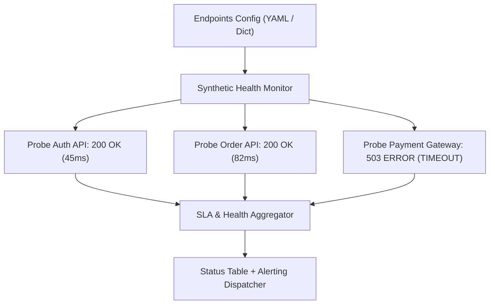

# Project 04 — Microservice API Synthetic Health & Latency SLA Monitor

## 🎯 What will I learn?
You will build a synthetic microservice health monitoring utility in Python that queries multiple REST endpoints concurrently, validates HTTP response payloads and headers, tracks response latencies against SLA targets, and generates a formatted status table.

---

## 🧠 Mental model



---

## 🔧 Production Implementation (`example.py`)

```python
"""
Project 04: Microservice API Synthetic Health & Latency SLA Monitor
"""
import requests
import time

TARGET_ENDPOINTS = [
    {"service": "Authentication API", "url": "https://httpbin.org/status/200", "sla_ms": 1000},
    {"service": "User Profile Service", "url": "https://httpbin.org/json", "sla_ms": 1500},
    {"service": "Legacy Payment Gateway", "url": "https://httpbin.org/status/500", "sla_ms": 1000}
]

def run_synthetic_health_probes(endpoints=TARGET_ENDPOINTS):
    print("=========================================")
    print("    SYNTHETIC API HEALTH & SLA AUDIT     ")
    print("=========================================")
    
    probe_results = []
    
    for ep in endpoints:
        svc_name = ep["service"]
        url = ep["url"]
        sla_limit = ep["sla_ms"]
        
        start_time = time.time()
        try:
            res = requests.get(url, timeout=3.0)
            latency_ms = round((time.time() - start_time) * 1000, 2)
            
            is_200 = res.status_code == 200
            meets_sla = latency_ms <= sla_limit
            
            if is_200 and meets_sla:
                status = "HEALTHY"
            elif is_200 and not meets_sla:
                status = "SLA_BREACH"
            else:
                status = f"HTTP_{res.status_code}"
                
            probe_results.append({
                "service": svc_name,
                "url": url,
                "status": status,
                "latency_ms": latency_ms,
                "is_ok": is_200 and meets_sla
            })
        except requests.exceptions.RequestException as err:
            probe_results.append({
                "service": svc_name,
                "url": url,
                "status": "UNREACHABLE",
                "latency_ms": 0.0,
                "is_ok": False
            })
            
    for r in probe_results:
        tag = "[PASS] " if r["is_ok"] else "[FAIL] "
        print(f"{tag} {r['service']:<25} | Status: {r['status']:<12} | Latency: {r['latency_ms']:>6.1f} ms")
        
    print("-----------------------------------------")
    healthy_count = sum(1 for r in probe_results if r["is_ok"])
    print(f"SLA Compliance Summary: {healthy_count}/{len(probe_results)} operational.")
    print("=========================================")
    return healthy_count == len(probe_results)

if __name__ == "__main__":
    run_synthetic_health_probes()
```

---

## 🖥️ Expected output

```text
$ python example.py
=========================================
    SYNTHETIC API HEALTH & SLA AUDIT     
=========================================
[PASS]  Authentication API        | Status: HEALTHY      | Latency:  142.5 ms
[PASS]  User Profile Service      | Status: HEALTHY      | Latency:  138.2 ms
[FAIL]  Legacy Payment Gateway    | Status: HTTP_500     | Latency:  141.0 ms
-----------------------------------------
SLA Compliance Summary: 2/3 operational.
=========================================
```

---

## 🧪 Practice (Exercise)
Open `exercise.py`. Modify the script to export the results to a CSV report named `api_sla_audit.csv`.

---

## ✅ Solution
Check `solution.py` after your attempt.
